# Family Expense Manager

Hệ thống quản lý chi tiêu gia đình, dùng thực tế hàng ngày, xây dựng theo kiến trúc microservices thật (không phải demo tối giản).

**Stack:** Spring Boot 3.3.5 + Doma 2 (không dùng JPA/Hibernate) · React (Vite) · MySQL + Flyway · Docker Compose · Kafka · Redis · Eureka · Spring Cloud Gateway **Server MVC** (servlet-based, không dùng WebFlux) · springdoc-openapi (Swagger UI).

> File này chỉ mô tả **cấu trúc project và lộ trình gen code**. Chưa có code nghiệp vụ nào được tạo — các thư mục source (`.java`, `.jsx`) hiện đang rỗng (giữ chỗ bằng `.gitkeep`), chỉ có sẵn `pom.xml` / `application.yml` / `package.json` / `docker-compose.yml` để định hình cấu trúc. Ngoại lệ duy nhất: schema bảng của 3 service đã được viết sẵn dưới dạng migration Flyway (`db/migration/V1__*.sql`, xem mục [Database Migrations](#database-migrations-flyway)) vì đây là phần hạ tầng dữ liệu, không phải logic nghiệp vụ.

## Kiến trúc

```
                        ┌───────────────┐
                        │   frontend     │  React + Vite
                        │  (port 5173)   │
                        └───────┬────────┘
                                │
                        ┌───────▼────────┐
                        │  api-gateway    │  Spring Cloud Gateway
                        │  (port 8080)    │  routes + JWT pre-filter
                        └───────┬────────┘
              ┌─────────────────┼─────────────────┐
              │                 │                 │
      ┌───────▼──────┐  ┌───────▼───────┐  ┌──────▼─────────────┐
      │ auth-service  │  │expense-service │  │notification-service│
      │ (port 8081)   │  │ (port 8082)    │  │ (port 8083)        │
      │ schema        │  │ schema         │  │ schema             │
      │ FEM_AUTH      │  │ FEM_EXPENSE    │  │ FEM_NOTIFY         │
      └───────┬───────┘  └──┬─────┬──────┘  └──────────▲─────────┘
              │             │     │                     │
              │        Redis│     │Kafka                │
              │        cache│     │(expense-events)──────┘
              │             │     │
      ┌───────▼─────────────▼─────▼──────┐
      │           MySQL DB                │
      └────────────────────────────────────┘

      Tất cả service đăng ký với eureka-server (port 8761)
```

Xem thêm mô tả chi tiết từng thành phần trong `docs/` (chưa tạo — có thể copy nội dung phần dưới vào đó nếu muốn tách riêng).

## Port & chạy service local

Mỗi service là một Spring Boot app **độc lập** — chạy riêng process/terminal (hoặc Run Configuration riêng nếu dùng IDE), không phải tuần tự trong 1 process.

| Service | Port | Lệnh chạy (khi đã có `Application.java`) |
|---|---|---|
| `eureka-server` | 8761 | `mvn -f backend/eureka-server spring-boot:run` |
| `api-gateway` | 8080 | `mvn -f backend/api-gateway spring-boot:run` |
| `auth-service` | 8081 | `mvn -f backend/auth-service spring-boot:run` |
| `expense-service` | 8082 | `mvn -f backend/expense-service spring-boot:run` |
| `notification-service` | 8083 | `mvn -f backend/notification-service spring-boot:run` |
| `frontend` (Vite dev) | 5173 | `npm run dev` (khi chạy qua Docker Compose, map ra port 3000 — xem `infra/docker-compose.yml`) |

Thứ tự khởi động: nên start `eureka-server` trước tiên (service registry), rồi tới `api-gateway` và 3 service còn lại (tự đăng ký vào Eureka khi start) — thứ tự giữa `auth-service`/`expense-service`/`notification-service` với nhau không quan trọng.

Đây cũng là lý do có `infra/docker-compose.yml` (Ngày 12 trong roadmap): thay vì mở tay nhiều terminal, `docker compose up` build và chạy tất cả cùng lúc, mỗi container vẫn giữ đúng port như bảng trên.

## Cấu trúc thư mục

```
family-expense-manager/
├── backend/
│   ├── pom.xml                      # Maven reactor cha (Spring Boot 3.3.5, Spring Cloud 2023.0.3, Doma 2.61.0, mysql-connector-j, Java 21)
│   ├── common/                      # JwtUtil, DTOs dùng chung, exception base, OpenApiConfig — dùng chung cho mọi service
│   ├── eureka-server/               # Service registry
│   ├── api-gateway/                 # Gateway + JWT pre-filter
│   ├── auth-service/                # Đăng ký/đăng nhập/JWT — schema FEM_AUTH
│   ├── expense-service/             # Ví/danh mục/giao dịch/ngân sách — schema FEM_EXPENSE
│   └── notification-service/        # Xử lý thông báo qua Kafka — schema FEM_NOTIFY
├── frontend/                        # React + Vite SPA
└── infra/
    ├── docker-compose.yml           # 9 container: mysql-db, kafka, redis, eureka-server, api-gateway, 3 service, frontend
    ├── mysql/init/                  # Script tạo database/user MySQL (chạy khi container MySQL khởi tạo lần đầu)
    └── .env.example                 # copy thành .env trước khi docker compose up
```

Mỗi service backend đi theo layout chuẩn của Doma:
```
<service>/src/main/java/.../domain/entity/*.java      # @Entity
<service>/src/main/java/.../dao/*.java                 # @Dao interface
<service>/src/main/resources/META-INF/com/family/expensemanager/<service>/dao/<DaoName>/<method>.sql
```

## Mô hình dữ liệu (tóm tắt)

**FEM_AUTH** — `FAMILIES(id, name, created_at)` · `USERS(id, family_id, email, password_hash, display_name, role, active)` · `REFRESH_TOKENS(id, user_id, token_hash, expires_at, revoked)`

**FEM_EXPENSE** — `WALLETS(id, family_id, name, currency, initial_balance)` · `CATEGORIES(id, family_id, name, type, icon, color)` · `TRANSACTIONS(id, wallet_id, category_id, family_id, user_id, type, amount, occurred_at, note)` · `BUDGETS(id, family_id, category_id, period_month, limit_amount)`

**FEM_NOTIFY** — `NOTIFICATIONS(id, family_id, user_id, type, title, message, payload_json, is_read)`

## Hợp đồng Kafka

Topic `expense-events`, key = `familyId`, phân biệt bằng field `eventType`.

- `EXPENSE_CREATED` — publish sau mỗi giao dịch được commit.
- `BUDGET_EXCEEDED` — chỉ publish khi tổng chi trong tháng của 1 category **vượt ngưỡng lần đầu** (không lặp lại ở các giao dịch vượt ngân sách tiếp theo trong cùng tháng).

`notification-service` chỉ xử lý `BUDGET_EXCEEDED` ở giai đoạn này.

**Lưu ý khi sửa `infra/docker-compose.yml`:** container `kafka` (image `apache/kafka`, KRaft mode) bắt buộc phải set `KAFKA_ADVERTISED_LISTENERS: PLAINTEXT://kafka:9092` — mặc định image tự advertise `localhost:9092`, chỉ đúng cho client chạy trong chính container đó. Nếu thiếu, `expense-service`/`notification-service` connect được bước bootstrap ban đầu (metadata) nhưng produce/consume thật sự sẽ fail liên tục với `Connection to node ... (localhost/127.0.0.1:9092) could not be established` — publish Kafka coi như im lặng không hoạt động, không thấy lỗi ở tầng HTTP vì `KafkaTemplate.send()` là async fire-and-forget.

## Redis

Cache 2 endpoint tổng hợp tốn chi phí: `GET /api/expenses/summary` và `GET /api/expenses/reports/category`, key `expense:summary:{familyId}:{yearMonth}` / `expense:report:category:{familyId}:{yearMonth}`, TTL 10 phút, evict chính xác khi có giao dịch mới trong tháng đó.

## Database Migrations (Flyway)

`auth-service`, `expense-service`, `notification-service` dùng Flyway (`flyway-core` + `flyway-mysql`) để tạo/versioning bảng — **không** dùng script SQL thủ công hay `ddl-auto`.

Phân chia trách nhiệm:
- `infra/mysql/init/` (chạy đúng 1 lần khi container MySQL khởi tạo lần đầu — data volume rỗng): chỉ `CREATE DATABASE` + `CREATE USER` + `GRANT` cho `fem_auth`/`fem_expense`/`fem_notify`. **Không** tạo bảng ở đây. `fem_auth` tự tạo qua biến `MYSQL_DATABASE`/`MYSQL_USER` của image `mysql`; `fem_expense`/`fem_notify` tạo bằng script [`01-create-expense-notify-databases.sh`](infra/mysql/init/01-create-expense-notify-databases.sh) (cần 4 biến `FEM_EXPENSE_DB_USER/PASSWORD`, `FEM_NOTIFY_DB_USER/PASSWORD` — đã khai trong `environment:` của service `mysql-db`).
- `<service>/src/main/resources/db/migration/` (Flyway, chạy tự động mỗi lần service khởi động, có version): sở hữu toàn bộ `CREATE TABLE`/`ALTER TABLE`. Đặt tên theo chuẩn Flyway `V<n>__<mo_ta>.sql`, ví dụ `V1__create_families_users_refresh_tokens.sql`.

Flyway tự dùng `spring.datasource.*` đã cấu hình sẵn trong mỗi `application.yml`, không cần khai báo thêm `spring.flyway.url/user/password`. Migration chạy trước khi Doma/DAO nào được gọi, nên chỉ cần `docker compose up` (hoặc chạy MySQL local) rồi start service — bảng sẽ tự có.

Cả 3 file `V1__*.sql` đã smoke-test chạy thật, và toàn bộ luồng (register → login → CRUD → vượt ngân sách → notification) đã chạy thật **end-to-end qua `docker compose up`** — không chỉ smoke-test riêng lẻ từng phần.

> ⚠️ Nếu xoá volume `mysql-data` (`docker compose down -v`) thì script `infra/mysql/init/` sẽ chạy lại từ đầu — bình thường. Nhưng nếu volume **đã tồn tại** (đã init trước đó) và bạn thêm/sửa script trong `infra/mysql/init/` sau này, nó **sẽ không tự chạy lại** (MySQL chỉ chạy init script khi data directory rỗng) — phải `docker compose down -v` rồi `up` lại, hoặc chạy SQL thủ công vào container đang chạy.

## API Docs (Swagger)

`auth-service`, `expense-service`, `notification-service` dùng springdoc-openapi (`spring-boot-starter-web` → webmvc-ui). Mỗi service tự phục vụ:
- Swagger UI: `http://localhost:<port>/swagger-ui.html`
- OpenAPI JSON: `http://localhost:<port>/v3/api-docs`

`OpenApiConfig` (trong `common`) set title = `spring.application.name` và đăng ký scheme `bearerAuth` (JWT) cho nút Authorize — mỗi service cần `@Import(OpenApiConfig.class)` trên class `@SpringBootApplication` vì `common` nằm ngoài package gốc của từng service nên không được component-scan tự động.

`api-gateway` có sẵn dependency `springdoc-openapi-starter-webmvc-ui` (gateway là servlet MVC, không phải WebFlux — xem mục "Spring Cloud Gateway Server MVC" bên dưới) để gộp cả 3 Swagger UI vào một trang tại `:8080/swagger-ui.html`; cấu hình `springdoc.swagger-ui.urls` đã cấu hình sẵn trong `api-gateway/application.yml`.

Khi viết `SecurityConfig` cho từng service (Ngày 3-4, 6-8, 9-10), nhớ `permitAll()` cho `/v3/api-docs/**` và `/swagger-ui/**` (`/swagger-ui.html`), nếu không Spring Security sẽ chặn luôn Swagger UI.

## Spring Cloud Gateway Server MVC

`api-gateway` dùng **Spring Cloud Gateway Server MVC** (`spring-cloud-starter-gateway-mvc`, servlet-based trên Spring MVC/Tomcat) thay vì bản reactive mặc định (`spring-cloud-starter-gateway`, chạy trên WebFlux/Netty) — vì rất ít dự án thực tế dùng kiểu reactive, và để đồng bộ mô hình lập trình (blocking/servlet) với 3 service còn lại.

Khác biệt quan trọng so với bản reactive cần lưu ý nếu sửa gateway sau này:
- **Không có route qua YAML** (`spring.cloud.gateway.routes` không được hỗ trợ ở bản MVC) — toàn bộ route định nghĩa bằng Java trong [`GatewayRoutesConfig`](backend/api-gateway/src/main/java/com/family/expensemanager/gateway/config/GatewayRoutesConfig.java), dùng `RouterFunction<ServerResponse>` bean (API `RouterFunctions.Builder` chuẩn của Spring MVC.fn).
- **Không có `GlobalFilter`** (bản MVC chưa hỗ trợ, xem [spring-cloud-gateway#3239](https://github.com/spring-cloud/spring-cloud-gateway/issues/3239) — đã đóng "wontfix"). [`JwtGatewayFilter`](backend/api-gateway/src/main/java/com/family/expensemanager/gateway/filter/JwtGatewayFilter.java) vì vậy là một `jakarta.servlet.Filter` (`OncePerRequestFilter`) bình thường thay vì implement `GlobalFilter` — cùng kiểu với `JwtAuthenticationFilter` trong `common`, order trước `FormFilter` của gateway.
- **Load balancing (`lb://`) không phải URI scheme** như bản reactive — mà là filter riêng: `.filter(LoadBalancerFilterFunctions.lb("auth-service"))`.
- **Route rewrite path** dùng `BeforeFilterFunctions.rewritePath(regex, replacement)` áp qua `.before(...)`.

## Bảo mật

JWT được xác thực **độc lập ở từng service** (qua `common`), không chỉ tin tưởng header do gateway set — gateway cũng xác thực để fail nhanh nhưng vẫn forward nguyên `Authorization` header xuống service. Access token 15 phút, refresh token 7 ngày. Chỉ `api-gateway`, `eureka-server`, `frontend` mở port ra ngoài; 3 service còn lại chỉ nằm trong mạng nội bộ Docker.

## Phạm vi KHÔNG làm ở giai đoạn này

CI/CD, Kubernetes, observability (Prometheus/Grafana), test suite đầy đủ, i18n, luồng mời thành viên qua invite-code, xác minh email/quên mật khẩu, rate-limiting, service mesh, admin UI riêng, tách compose dev/prod.

---

## Lộ trình gen code hàng ngày

Mỗi ngày làm đúng 1 mục, có bước verify cụ thể trước khi qua ngày tiếp theo. Thư mục/file liên quan đã được scaffold sẵn (rỗng), chỉ cần điền code vào.

### Ngày 1 — Nền tảng
- [ ] Kiểm tra `backend/pom.xml` (reactor cha) build được: `mvn -f backend/pom.xml validate`
- [ ] Viết `EurekaServerApplication.java` trong `backend/eureka-server/src/main/java/com/family/expensemanager/eureka/` với `@EnableEurekaServer`
- **Verify:** `mvn -f backend/eureka-server spring-boot:run` rồi mở `http://localhost:8761` — thấy dashboard registry rỗng.

### Ngày 2 — Thư viện dùng chung (`common`)
- [ ] `JwtUtil` (sign/verify/parse claims), `JwtAuthenticationFilter`, `ApiResponse`/`ErrorResponse` DTO, exception base — tất cả trong `backend/common/src/main/java/com/family/expensemanager/common/`
- [ ] `OpenApiConfig` đã có sẵn trong `common/.../config/` — mỗi service nhớ `@Import(OpenApiConfig.class)` khi viết class `@SpringBootApplication`
- **Verify:** `mvn -f backend/common install` chạy thành công, jar được cài vào local repo để các module khác dùng.

### Ngày 3-4 — Auth service
- [x] Migration Flyway `V1__create_families_users_refresh_tokens.sql` đã có sẵn trong `auth-service/src/main/resources/db/migration/` (tạo bảng `FAMILIES`/`USERS`/`REFRESH_TOKENS`, đã smoke-test chạy thật trên MySQL 8.4) — database `fem_auth` tự tạo qua biến `MYSQL_DATABASE`/`MYSQL_USER` trong docker-compose khi container MySQL khởi tạo lần đầu
- [ ] `@Entity` cho `FAMILIES`/`USERS`/`REFRESH_TOKENS` trong `auth-service/.../domain/entity/`
- [ ] `@Dao` tương ứng trong `auth-service/.../dao/` + file `.sql` trong `auth-service/src/main/resources/META-INF/.../dao/`
- [ ] `AuthController` (`POST /register`, `/login`, `/refresh`), `AuthService`, cấu hình Spring Security dùng `JwtAuthenticationFilter` từ `common`
- **Verify:** `curl -X POST localhost:8081/register` → `curl -X POST localhost:8081/login` → nhận JWT, decode kiểm tra claims (`sub`, `familyId`, `role`).

### Ngày 5 — API Gateway
- [x] 6 route (3 chính + 3 docs) định nghĩa dạng Java `RouterFunction` bean trong `GatewayRoutesConfig` (gateway dùng Spring Cloud Gateway Server MVC — servlet-based, không hỗ trợ route qua YAML, xem mục "Spring Cloud Gateway Server MVC" ở trên)
- [x] `JwtGatewayFilter` trong `api-gateway/.../gateway/filter/` (dùng `common`) — servlet `Filter` thường (không phải `GlobalFilter`), bỏ qua các route public (`/api/auth/register`, `/login`, `/refresh`)
- [x] `springdoc.swagger-ui.urls` đã cấu hình để gộp Swagger UI của 3 service vào `:8080/swagger-ui.html`
- **Verify:** gọi qua `:8080/api/auth/login` hoạt động; gọi 1 route cần bảo vệ không có token → 401; có token hợp lệ → forward thành công; mở `:8080/swagger-ui.html` thấy đủ 3 nhóm API.

### Ngày 6-8 — Expense service
- [x] Migration Flyway `V1__create_wallets_categories_transactions_budgets.sql` đã có sẵn trong `expense-service/src/main/resources/db/migration/` (tạo bảng `WALLETS`/`CATEGORIES`/`TRANSACTIONS`/`BUDGETS`, đã smoke-test chạy thật trên MySQL 8.4)
- [ ] Script tạo database `fem_expense` + user (`CREATE DATABASE` / `CREATE USER` / `GRANT`) trong `infra/mysql/init/`, vì chỉ `fem_auth` được tự tạo sẵn qua docker-compose
- [ ] `@Entity`/`@Dao` cho `WALLETS`/`CATEGORIES`/`TRANSACTIONS`/`BUDGETS`
- [ ] CRUD đầy đủ qua `TransactionController`/`TransactionService`, logic kiểm tra vượt ngân sách (so sánh tổng chi trước/sau giao dịch)
- **Verify:** CRUD qua curl trực tiếp `:8082` và qua gateway `:8080/api/expenses/...`.

### Ngày 9-10 — Luồng Kafka
- [x] Migration Flyway `V1__create_notifications.sql` đã có sẵn trong `notification-service/src/main/resources/db/migration/` (tạo bảng `NOTIFICATIONS`, đã smoke-test chạy thật trên MySQL 8.4)
- [ ] Script tạo database `fem_notify` + user trong `infra/mysql/init/` (tương tự `fem_expense` ở Ngày 6-8)
- [ ] `expense-service`: publish `EXPENSE_CREATED`/`BUDGET_EXCEEDED` vào topic `expense-events` (dùng class trong `expense-service/.../messaging/`) — publish sau khi transaction DB đã commit
- [ ] `notification-service`: `@Entity`/`@Dao` cho `NOTIFICATIONS`, `@KafkaListener` trong `notification-service/.../messaging/`, `GET /notifications`
- **Verify:** tạo giao dịch vượt ngân sách → kiểm tra `notification-service` lưu được bản ghi → `curl :8080/api/notifications` trả về đúng thông báo.

### Ngày 11 — Redis cache
- [ ] `@Cacheable` trên endpoint summary/report trong `expense-service`, `@CacheEvict` khi tạo/sửa/xoá giao dịch
- **Verify:** gọi lại endpoint summary 2 lần liên tiếp, lần 2 nhanh hơn rõ rệt (cache hit); tạo giao dịch mới → gọi lại → số liệu cập nhật đúng (cache đã evict).

### Ngày 12 — Docker Compose
- [ ] Viết `Dockerfile` cho từng service Java (`backend/<service>/Dockerfile`, build multi-stage: `mvn package` → copy jar → `java -jar`) và cho `frontend` (build Vite → serve bằng nginx)
- [ ] `cp infra/.env.example infra/.env` rồi điền giá trị thật
- **Verify:** `docker compose -f infra/docker-compose.yml --env-file infra/.env up --build`, chạy lại toàn bộ curl check của ngày 3-10 nhưng chỉ gọi qua gateway (`:8080`) để xác nhận service discovery hoạt động đúng trong container, không phải chỉ chạy local.

### Ngày 13+ — Frontend
- [ ] `src/main.jsx`, `src/App.jsx`, router (`react-router-dom`)
- [ ] `src/api/client.js` — 1 axios instance duy nhất, base URL = gateway, interceptor gắn `Authorization`, xử lý 401 refresh
- [ ] Từng trang trong `src/pages/`: `Login`, `Register`, `Dashboard`, `Transactions`, `Categories`, `Budgets`, `Notifications`, `Wallets` — làm lần lượt, mỗi trang xong thì thử thao tác thật trên UI trước khi qua trang tiếp theo
- **Verify:** đăng ký gia đình mới → đăng nhập → thêm ví/danh mục/giao dịch → thấy dashboard cập nhật → tạo giao dịch vượt ngân sách → thấy thông báo xuất hiện.

---

Sau khi hoàn thành lộ trình trên, hệ thống chạy được đầy đủ vòng đời: đăng ký gia đình → ghi nhận thu/chi → theo dõi ngân sách → nhận cảnh báo khi vượt ngân sách → xem báo cáo tổng hợp.

---

## Phụ lục: Port dịch vụ phổ biến (tham khảo chung, ngoài phạm vi project)

Bảng port của các service/tool phổ biến trong hạ tầng nói chung — không phải tất cả đều được dùng trong project này (xem [Port & chạy service local](#port--chạy-service-local) cho port thật của project).

| SERVICE | DESCRIPTION | PORT |
|---|---|---|
| HTTP | Web traffic (unsecured) | 80 |
| HTTPS | Secure web traffic (SSL) | 443 |
| SSH | Secure remote access | 22 |
| FTP | File Transfer Protocol | 21 |
| MySQL | Database service | 3306 |
| Kubernetes API Server | K8s cluster communication | 6443 |
| Docker Daemon API | Docker remote API | 2375 / 2376 |
| MongoDB | NoSQL database | 27017 |
| NGINX | Web server / reverse proxy | 80 / 443 |
| Grafana | Monitoring & dashboards | 3000 |
| Prometheus | Monitoring & alerting | 9090 |
| Tomcat | Java application server | 8080 |
| Apache Kafka | Event streaming platform | 9092 |
| Redis | In-memory data store | 6379 |
| RDP | Remote desktop access | 3389 |
| Elasticsearch API | Search & analytics engine | 9200 |
| Jenkins | CI/CD automation server | 8080 |

> Lưu ý: `Tomcat`/`Jenkins` (8080) trùng port với `api-gateway` của project này — nếu chạy chung máy, chỉ được bật một trong hai trên cùng port 8080.

======= DEPLOY BE====
                         INTERNET
                            │
                            ▼
              GitHub Pages - FE
              https://xxx.github.io
                            │
                            │ API
                            ▼
              Cloudflare Tunnel
              https://api-xxxxx.trycloudflare.com
                            │
                            ▼
                  localhost:8081
                            │
                            ▼
                    Spring Boot BE

## Task cần làm

### Thiếu — ảnh hưởng trực tiếp người dùng, đáng cân nhắc làm sớm

> **1. Phân trang/lọc chỉ làm ở frontend**
> API `GET /transactions` trả về toàn bộ giao dịch của cả gia đình mỗi lần gọi, lọc theo ví/danh mục/ngày chỉ là JS ở client. Data ít thì không sao, nhưng gia đình dùng lâu (hàng nghìn giao dịch) sẽ tải chậm dần. Đây là điểm kỹ thuật đáng sửa sớm nhất trong nhóm này.

> **2. Cảnh báo vượt ngân sách không gửi email**
> Hệ thống đã có event `BUDGET_EXCEEDED` và đã có sẵn hạ tầng gửi email (dùng cho verify/quên mật khẩu/mời thành viên), nhưng khi vượt ngân sách chỉ tạo thông báo trong app, không gửi email. Người dùng phải tự mở app mới biết.

> **3. Không có giao dịch định kỳ (recurring)**
> Tiền nhà, internet, subscription hàng tháng phải nhập tay lại mỗi lần.

> **4. Không đính kèm ảnh hoá đơn cho giao dịch**

> **5. Chỉ export, không import**
> Có xuất CSV/Excel (vừa làm) nhưng không có chiều ngược lại để nhập dữ liệu cũ hàng loạt.

> **6. 1 tài khoản chỉ thuộc đúng 1 gia đình**
> Không tham gia được nhiều gia đình, không "chuyển" gia đình.

> **7. Chỉ 1 loại tiền tệ/gia đình**
> Không quy đổi đa tiền tệ (đã có ràng buộc chặn chủ động, không phải bug).

### Thiếu — bảo mật tài khoản

> **8. Không quản lý được phiên đăng nhập**
> Không thấy đang login ở thiết bị nào, không đăng xuất từ xa được (dù có bảng `REFRESH_TOKENS` sẵn hạ tầng để làm).

> **9. Không có 2FA**

> **10. Xoá là mất vĩnh viễn (hard delete)**
> Xoá nhầm ví/giao dịch/danh mục không khôi phục lại được.

### Thiếu — chất lượng kỹ thuật (ít lộ ra ngoài, nhưng rủi ro dài hạn)

> **11. Chỉ có unit test (mock DAO), không có integration test chạm DB thật**
> Chính kiểu lỗ hổng này là lý do bug `is_system_admin` NULL tuần trước lọt qua hết test mà vẫn crash thật khi gọi API. Nên cân nhắc thêm ít nhất vài integration test cho các luồng insert quan trọng.

> **12. Observability sơ sài**
> Chỉ có Actuator (health/info), không có metrics tổng hợp (Prometheus/Grafana) hay log tập trung — khi chạy thật, lỗi production sẽ khó phát hiện/debug sớm.

> **13. Không i18n**
> Giao diện cứng tiếng Việt.

### Đã làm đầy đủ (không cần lo)

> Đăng ký/đăng nhập + xác thực email + quên mật khẩu, mời thành viên gia đình, OAuth2 (Google), rate-limit chống brute-force, phân quyền admin hệ thống, export báo cáo CSV/Excel, CI build+test tự động, deploy frontend GitHub Pages, Swagger đầy đủ cho mọi service.

## Luồng hoạt động của các mục 1–13 (đã hoàn thành)

> 13 mục ở phần [Task cần làm](#task-cần-làm) phía trên đều đã được code xong. Phần này vẽ lại **đường đi của request/dữ liệu** cho từng mục để dễ hình dung (sơ đồ Mermaid, GitHub tự render).

### Bản đồ tổng quan: mục nào nằm ở đâu

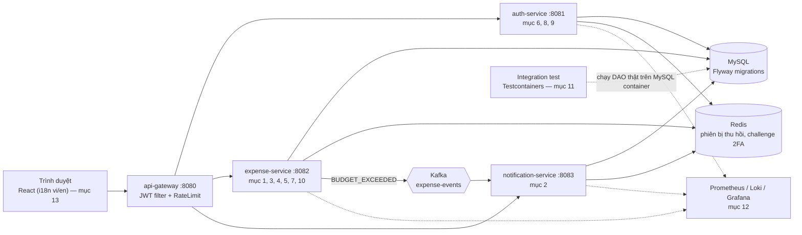

### Mục 1 — Phân trang/lọc chạy ở backend (dùng chung cho mọi danh sách, 5 dòng/trang)

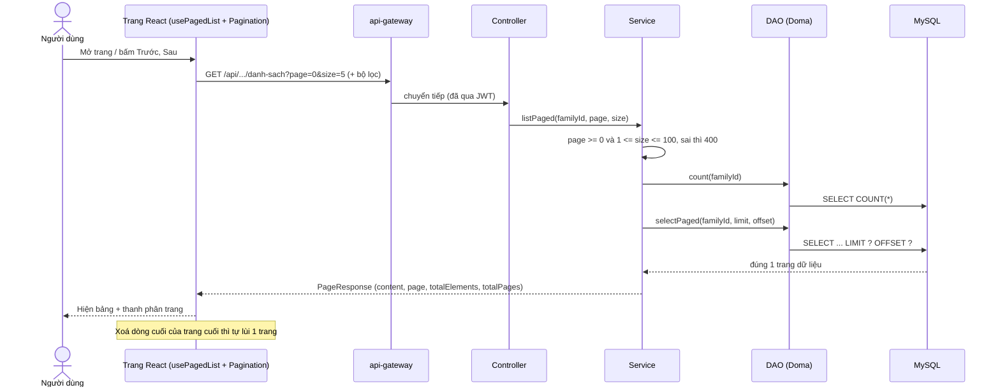

Áp dụng cho: Giao dịch, Ngân sách, Giao dịch định kỳ, 3 bảng Thùng rác, Thông báo, Admin (gia đình/người dùng), Thành viên gia đình, Phiên đăng nhập. **Ví và Danh mục cố ý không phân trang** vì còn làm dữ liệu cho dropdown ở các trang khác.

### Mục 2 — Cảnh báo vượt ngân sách gửi cả email

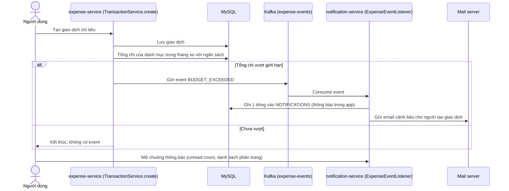

### Mục 3 — Giao dịch định kỳ (tự sinh giao dịch hàng tháng)

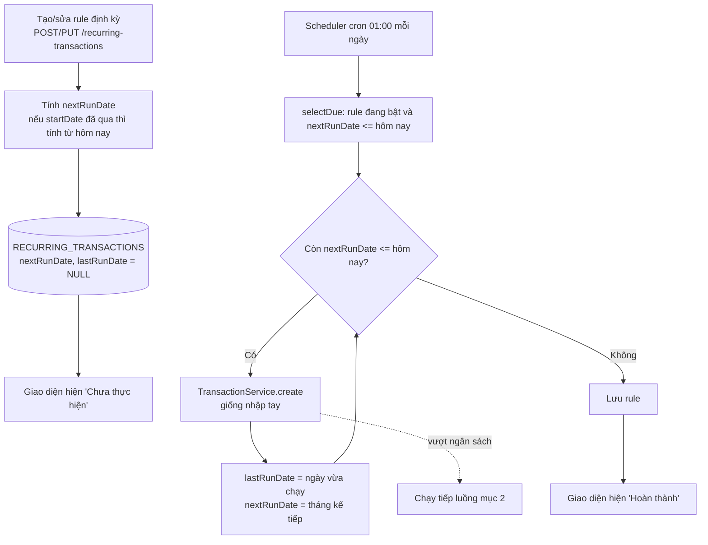

Nếu server tắt vài tháng thì vòng lặp `Còn nextRunDate <= hôm nay` sẽ sinh bù đủ các tháng bị lỡ. Rule mới tạo không bị bù vì `nextRunDate` luôn tính từ hôm nay trở đi.

### Mục 4 — Ảnh hoá đơn cho giao dịch

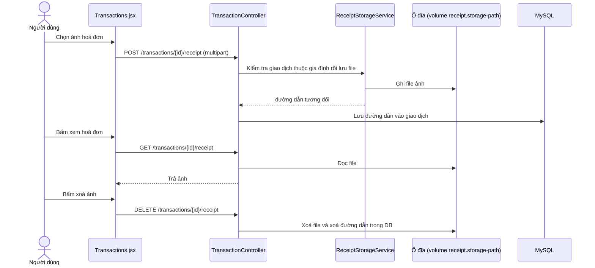

### Mục 5 — Import (chiều ngược lại của Export)

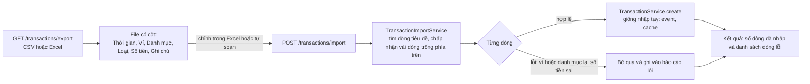

### Mục 6 — Một tài khoản thuộc nhiều gia đình

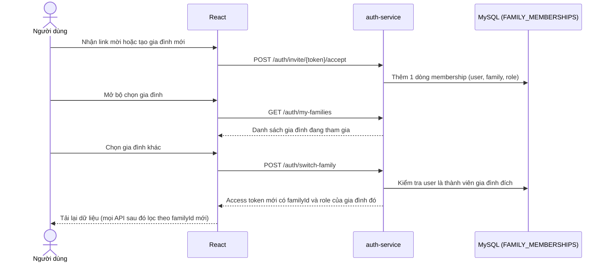

### Mục 7 — Một loại tiền tệ cho mỗi gia đình (ràng buộc chủ động)

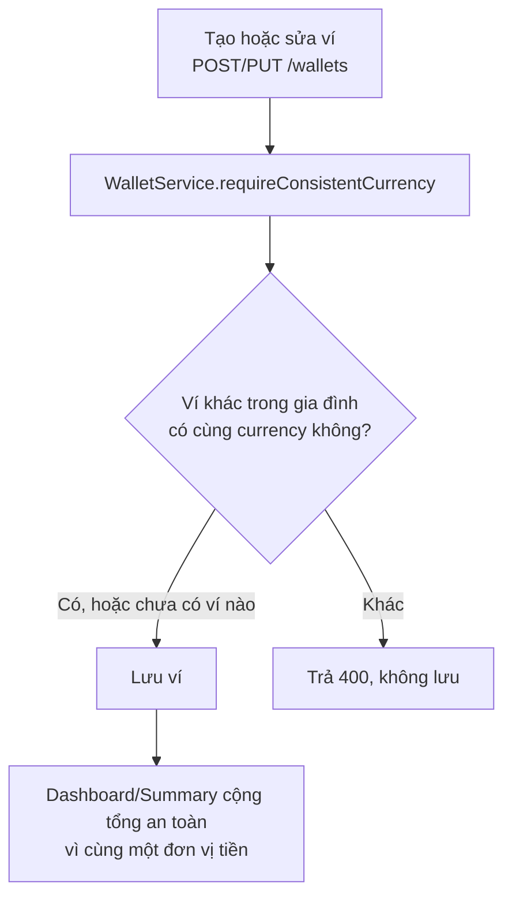

### Mục 8 — Quản lý phiên đăng nhập, đăng xuất từ xa

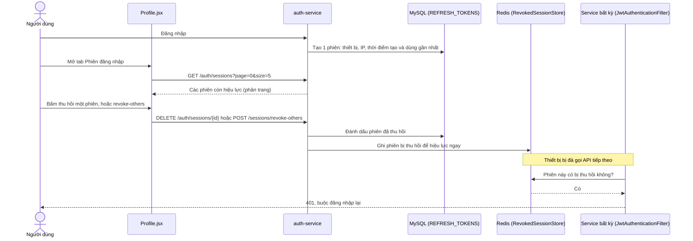

### Mục 9 — Xác thực 2 lớp (TOTP)

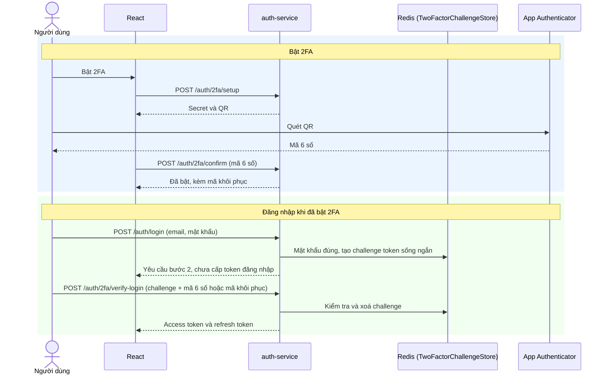

#### Cấu trúc chi tiết của 2FA

**a) Thành phần và nơi lưu dữ liệu**

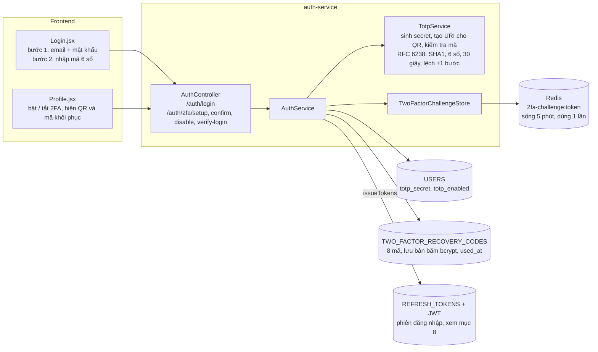

**b) Trạng thái 2FA của một tài khoản**

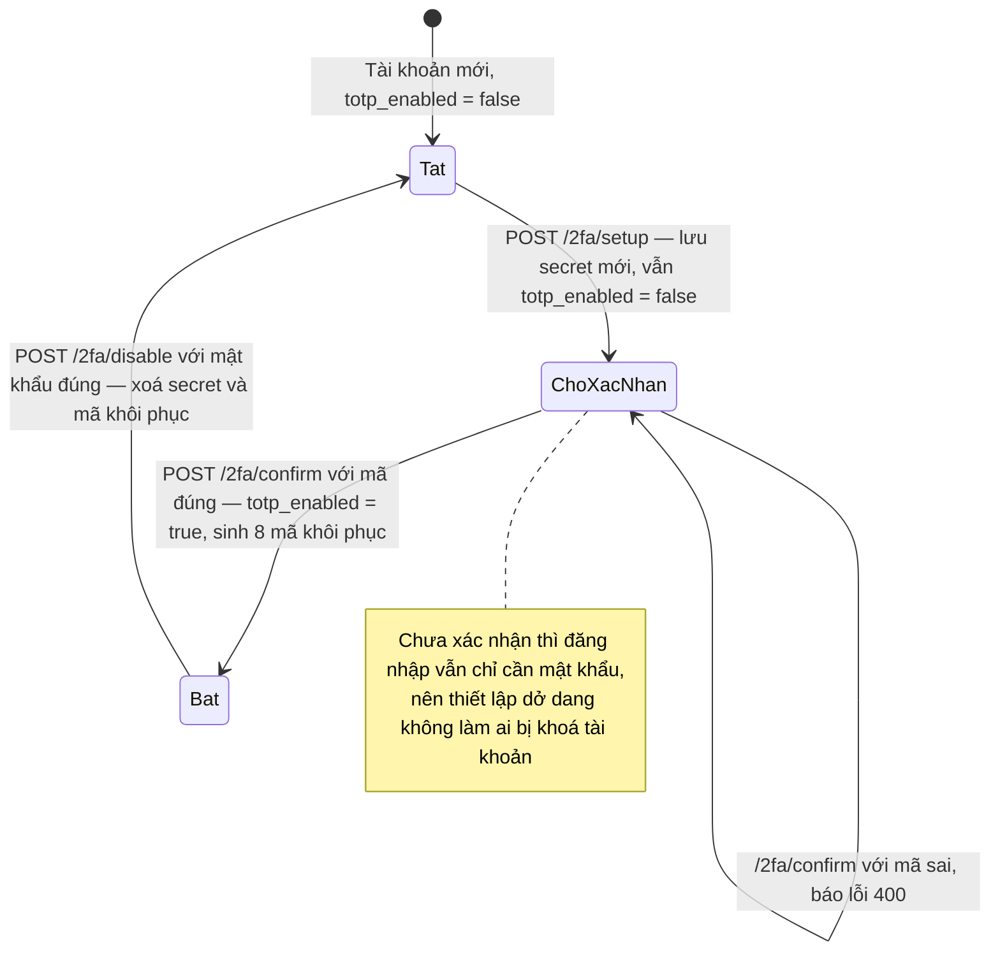

**c) Luồng đăng nhập có 2FA**

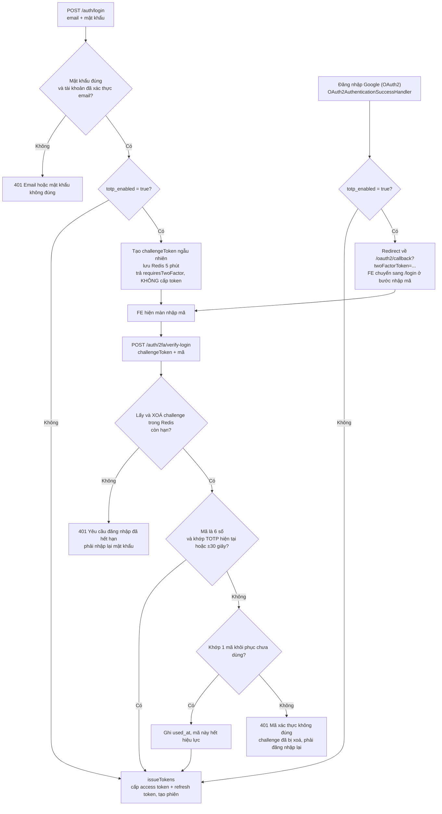

**Điểm cần lưu ý khi đọc code:**

- `challengeToken` là chuỗi ngẫu nhiên lưu ở Redis, không phải JWT, nên không dùng được để gọi API khác. Mỗi challenge chỉ dùng được một lần, kể cả khi nhập sai mã.
- Mã khôi phục lưu dạng băm bcrypt, chỉ hiện dạng gốc đúng một lần lúc `confirm`. Bật lại 2FA sẽ xoá bộ mã cũ và sinh bộ mới.
- Đăng nhập Google/Facebook cũng phải qua bước 2FA nếu tài khoản đã bật (sơ đồ c): server không cấp token mà redirect kèm `twoFactorToken`, FE chuyển sang màn nhập mã rồi gọi `/2fa/verify-login` như đăng nhập thường.
- `POST /2fa/setup` bị từ chối (400) khi 2FA đang bật. Muốn thiết lập lại phải tắt trước bằng `/2fa/disable` (cần mật khẩu), nên chỉ có access token thì không gỡ được 2FA.
- Tài khoản chỉ đăng nhập bằng Google (chưa có mật khẩu) sau khi bật 2FA sẽ chưa tắt được, vì `/2fa/disable` yêu cầu mật khẩu.
- `totp_secret` đang lưu dạng thô trong DB, chưa mã hoá.

### Mục 10 — Xoá mềm và thùng rác

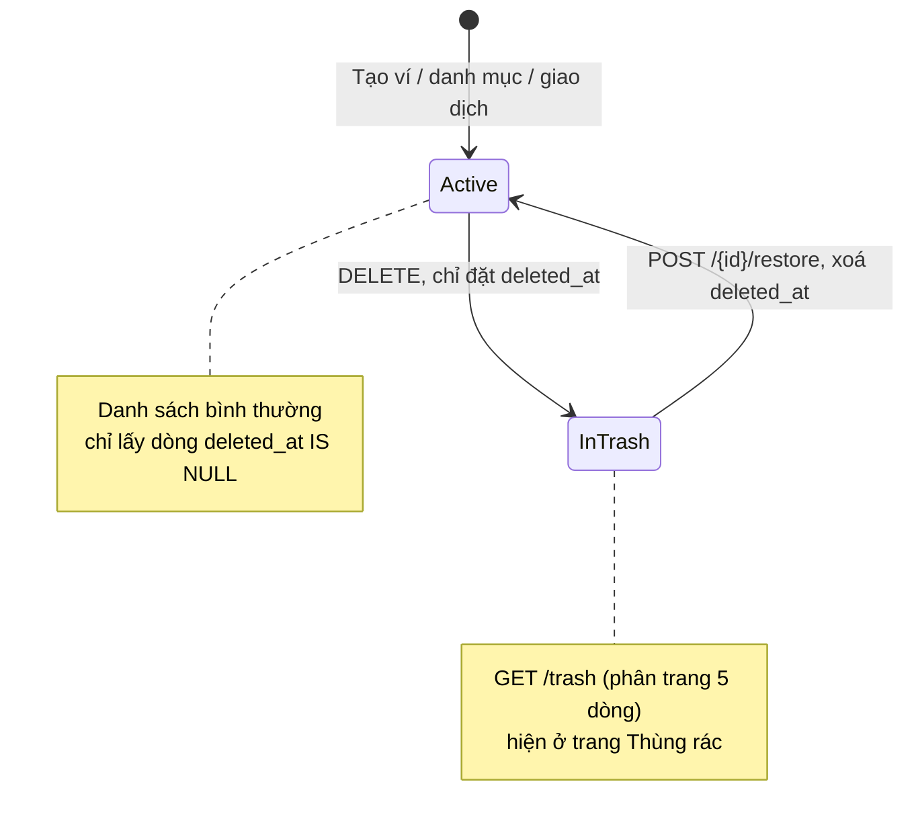

### Mục 11 — Integration test chạm DB thật

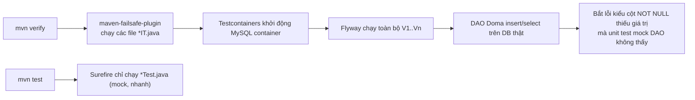

Cần Docker chạy được với JVM. Trên máy Windows dùng Docker Desktop hiện tại Testcontainers chưa kết nối được (lỗi named pipe), nên `*IT.java` cần được chạy thử ở máy khác hoặc CI.

### Mục 12 — Observability (metrics và log tập trung)

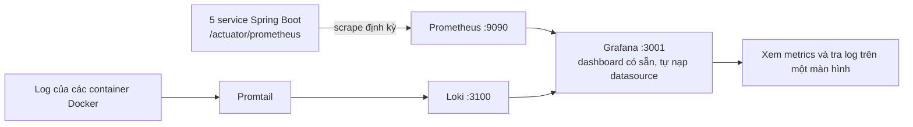

### Mục 13 — Đa ngôn ngữ (vi/en)

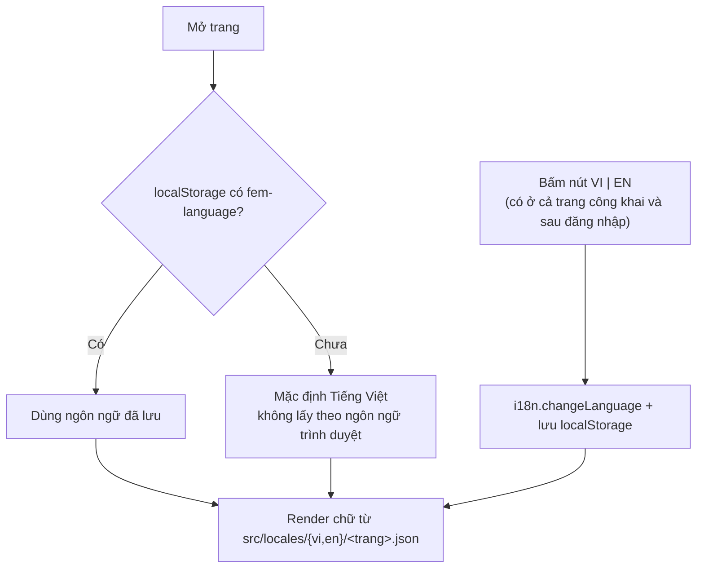

Thêm trang mới chỉ cần tạo file `locales/vi/<tên>.json` và `locales/en/<tên>.json`, i18n tự nhận (`import.meta.glob`).
