# Family Expense Manager

Hệ thống quản lý chi tiêu gia đình, dùng thực tế hàng ngày, xây dựng theo kiến trúc microservices thật (không phải demo tối giản).

**Stack:** Spring Boot 3.3.5 + Doma 2 (không dùng JPA/Hibernate) · React (Vite) · MySQL + Flyway · Docker Compose · Kafka · Redis · Eureka · Spring Cloud Gateway **Server MVC** (servlet-based, không dùng WebFlux) · springdoc-openapi (Swagger UI).

> Tài liệu mô tả **kiến trúc, cách chạy và toàn bộ tính năng đã làm** theo từng mục (mỗi mục có sơ đồ luồng, xem [Tính năng theo từng mục](#tính-năng-theo-từng-mục)). Schema bảng do Flyway quản lý (`db/migration/V*__*.sql`, xem [Database Migrations](#database-migrations-flyway)).

## Kiến trúc

```
                        ┌───────────────┐
                        │   frontend     │  React + Vite
                        │  (port 5173)   │
                        └───────┬────────┘
                                │
                        ┌───────▼────────┐
                        │  api-gateway    │  Spring Cloud Gateway
                        │  (port 8080)    │  routes + JWT pre-filter
                        └───────┬────────┘
              ┌─────────────────┼─────────────────┐
              │                 │                 │
      ┌───────▼──────┐  ┌───────▼───────┐  ┌──────▼─────────────┐
      │ auth-service  │  │expense-service │  │notification-service│
      │ (port 8081)   │  │ (port 8082)    │  │ (port 8083)        │
      │ schema        │  │ schema         │  │ schema             │
      │ FEM_AUTH      │  │ FEM_EXPENSE    │  │ FEM_NOTIFY         │
      └───────┬───────┘  └──┬─────┬──────┘  └──────────▲─────────┘
              │             │     │                     │
              │        Redis│     │Kafka                │
              │        cache│     │(expense-events)──────┘
              │             │     │
      ┌───────▼─────────────▼─────▼──────┐
      │           MySQL DB                │
      └────────────────────────────────────┘

      Tất cả service đăng ký với eureka-server (port 8761)
```

Xem thêm mô tả chi tiết từng thành phần trong `docs/` (chưa tạo — có thể copy nội dung phần dưới vào đó nếu muốn tách riêng).

## Port & chạy service local

Mỗi service là một Spring Boot app **độc lập** — chạy riêng process/terminal (hoặc Run Configuration riêng nếu dùng IDE), không phải tuần tự trong 1 process.

| Service | Port | Lệnh chạy (khi đã có `Application.java`) |
|---|---|---|
| `eureka-server` | 8761 | `mvn -f backend/eureka-server spring-boot:run` |
| `api-gateway` | 8080 | `mvn -f backend/api-gateway spring-boot:run` |
| `auth-service` | 8081 | `mvn -f backend/auth-service spring-boot:run` |
| `expense-service` | 8082 | `mvn -f backend/expense-service spring-boot:run` |
| `notification-service` | 8083 | `mvn -f backend/notification-service spring-boot:run` |
| `frontend` (Vite dev) | 5173 | `npm run dev` (khi chạy qua Docker Compose, map ra port 3000 — xem `infra/docker-compose.yml`) |

Thứ tự khởi động: nên start `eureka-server` trước tiên (service registry), rồi tới `api-gateway` và 3 service còn lại (tự đăng ký vào Eureka khi start) — thứ tự giữa `auth-service`/`expense-service`/`notification-service` với nhau không quan trọng.

Đây cũng là lý do có `infra/docker-compose.yml`: thay vì mở tay nhiều terminal, `docker compose up` build và chạy tất cả cùng lúc, mỗi container vẫn giữ đúng port như bảng trên.

## Cấu trúc thư mục

```
family-expense-manager/
├── backend/
│   ├── pom.xml                      # Maven reactor cha (Spring Boot 3.3.5, Spring Cloud 2023.0.3, Doma 2.61.0, mysql-connector-j, Java 21)
│   ├── common/                      # JwtUtil, DTOs dùng chung, exception base, OpenApiConfig — dùng chung cho mọi service
│   ├── eureka-server/               # Service registry
│   ├── api-gateway/                 # Gateway + JWT pre-filter
│   ├── auth-service/                # Đăng ký/đăng nhập/JWT — schema FEM_AUTH
│   ├── expense-service/             # Ví/danh mục/giao dịch/ngân sách — schema FEM_EXPENSE
│   └── notification-service/        # Xử lý thông báo qua Kafka — schema FEM_NOTIFY
├── frontend/                        # React + Vite SPA
└── infra/
    ├── docker-compose.yml           # 9 container: mysql-db, kafka, redis, eureka-server, api-gateway, 3 service, frontend
    ├── mysql/init/                  # Script tạo database/user MySQL (chạy khi container MySQL khởi tạo lần đầu)
    └── .env.example                 # copy thành .env trước khi docker compose up
```

Mỗi service backend đi theo layout chuẩn của Doma:
```
<service>/src/main/java/.../domain/entity/*.java      # @Entity
<service>/src/main/java/.../dao/*.java                 # @Dao interface
<service>/src/main/resources/META-INF/com/family/expensemanager/<service>/dao/<DaoName>/<method>.sql
```

## Mô hình dữ liệu (tóm tắt)

**FEM_AUTH** — `FAMILIES(id, name, created_at)` · `USERS(id, family_id, email, password_hash, display_name, role, active, provider, provider_id, is_system_admin, relationship, totp_secret, totp_enabled, totp_last_step, locked, locked_at, pending_email, ...)` · `FAMILY_MEMBERSHIPS(user_id, family_id, role)` · `FAMILY_INVITES(id, family_id, email, token, expires_at, accepted_at)` · `REFRESH_TOKENS(id, user_id, token_hash, expires_at, revoked, device_info, ip_address, last_used_at)` · `TWO_FACTOR_RECOVERY_CODES(id, user_id, code_hash, used_at)`

**FEM_EXPENSE** — `WALLETS(id, family_id, name, currency, initial_balance, deleted_at)` · `CATEGORIES(id, family_id, name, type, icon, color, deleted_at)` · `TRANSACTIONS(id, wallet_id, category_id, family_id, user_id, created_by_name, type, amount, occurred_at, note, receipt_path, receipt_content_type, deleted_at)` · `WALLET_TRANSFERS(id, family_id, from_wallet_id, to_wallet_id, amount, note, occurred_at, created_by_user_id)` · `BUDGETS(id, family_id, category_id (NULL = ngân sách tổng), period_month, limit_amount)` · `RECURRING_TRANSACTIONS(id, family_id, wallet_id, category_id, type, amount, note, frequency, day_of_month, day_of_week, month_of_year, start_date, end_date, next_run_date, last_run_date, active, created_by_user_id)`

**FEM_NOTIFY** — `NOTIFICATIONS(id, family_id, user_id, type, title, message, payload_json, is_read)` · `NOTIFICATION_PREFERENCES(user_id, type, in_app_enabled, email_enabled)`

### Sơ đồ quan hệ giữa các bảng (ERD)

Gộp cả 3 database vào một sơ đồ để thấy toàn cảnh. Mỗi service sở hữu database riêng (`FEM_AUTH`/`FEM_EXPENSE`/`FEM_NOTIFY`), nên chỉ những đường **nét liền** là khoá ngoại SQL thật (cùng database). Những đường **nét đứt** là `family_id`/`user_id`/`created_by_user_id` trỏ sang bảng ở database khác — MySQL không cho tạo khoá ngoại giữa 2 database, nên các quan hệ này chỉ được đảm bảo ở tầng ứng dụng (qua `familyId`/`userId` trong JWT, xem mục "Bảo mật"), không có ràng buộc `FOREIGN KEY` nào ở DB.

```mermaid
erDiagram
    %% ===== FEM_AUTH — khoá ngoại thật trong cùng database =====
    FAMILIES ||--o{ USERS : family_id
    FAMILIES ||--o{ FAMILY_MEMBERSHIPS : family_id
    FAMILIES ||--o{ FAMILY_INVITES : family_id
    USERS ||--o{ FAMILY_MEMBERSHIPS : user_id
    USERS ||--o{ FAMILY_INVITES : invited_by_user_id
    USERS ||--o{ REFRESH_TOKENS : user_id
    USERS ||--o{ TWO_FACTOR_RECOVERY_CODES : user_id

    %% ===== FEM_EXPENSE — khoá ngoại thật trong cùng database =====
    WALLETS ||--o{ TRANSACTIONS : wallet_id
    CATEGORIES ||--o{ TRANSACTIONS : category_id
    WALLETS ||--o{ RECURRING_TRANSACTIONS : wallet_id
    CATEGORIES ||--o{ RECURRING_TRANSACTIONS : category_id
    CATEGORIES ||--o{ BUDGETS : "category_id (NULL = ngân sách tổng)"
    WALLETS ||--o{ WALLET_TRANSFERS : from_wallet_id
    WALLETS ||--o{ WALLET_TRANSFERS : to_wallet_id

    %% ===== Khác database — chỉ ràng buộc ở tầng ứng dụng =====
    FAMILIES ..o{ WALLETS : family_id
    FAMILIES ..o{ CATEGORIES : family_id
    FAMILIES ..o{ TRANSACTIONS : family_id
    FAMILIES ..o{ BUDGETS : family_id
    FAMILIES ..o{ RECURRING_TRANSACTIONS : family_id
    FAMILIES ..o{ WALLET_TRANSFERS : family_id
    FAMILIES ..o{ NOTIFICATIONS : family_id
    USERS ..o{ TRANSACTIONS : "user_id (người tạo)"
    USERS ..o{ RECURRING_TRANSACTIONS : created_by_user_id
    USERS ..o{ WALLET_TRANSFERS : created_by_user_id
    USERS ..o{ NOTIFICATIONS : user_id
    USERS ..o{ NOTIFICATION_PREFERENCES : user_id
```


## Hợp đồng Kafka

Topic `expense-events`, key = `familyId`, phân biệt bằng field `eventType`:

- `EXPENSE_CREATED` — publish sau mỗi giao dịch được commit (notification-service bỏ qua).
- `BUDGET_WARNING` — chi chạm 80% ngân sách (danh mục hoặc tổng) lần đầu, chưa vượt 100%. Chỉ tạo thông báo trong app.
- `BUDGET_EXCEEDED` — chi **vượt 100% lần đầu** (không lặp lại ở các giao dịch vượt tiếp theo). Thông báo trong app và email cho người tạo giao dịch.
- `RECURRING_EXECUTED`, `RECURRING_FAILED` — scheduler giao dịch định kỳ ghi thành công hoặc gặp lỗi. Chỉ trong app.
- `WALLET_TRANSFERRED` — publish sau khi ghi `WALLET_TRANSFERRED` (mục 14). Một dòng thông báo trong app dùng chung cho cả gia đình (ví không có chủ sở hữu riêng, nên không có "người nhận" theo user). Về email, `notification-service` gửi hai kiểu khác nhau: người tạo giao dịch nhận email "đã trừ" (địa chỉ có sẵn trong event, do expense-service đọc từ JWT lúc publish), còn **mỗi thành viên khác trong gia đình** nhận email "đã cộng, ai chuyển" — địa chỉ của họ được tra cứu qua endpoint nội bộ `GET /internal/families/{familyId}/members` của auth-service (xem "Bảo mật" bên dưới), vì notification-service không có sẵn USERS. Lỗi gửi email (kể cả `BUDGET_EXCEEDED`) chỉ được log, không throw lại — tránh Kafka redeliver event và ghi trùng dòng thông báo trong app.

Các topic khác (khai báo dưới `kafka.topic.*` trong `application.yml`): `user-verification` và `password-reset` (email xác thực, đặt lại mật khẩu, cả xác nhận đổi email), `family-invite` (email mời thành viên), `family-member-events` (`MEMBER_JOINED`, `MEMBER_LEFT`, `MEMBER_REMOVED`, do auth-service phát), `user-registered` (có tài khoản mới, kèm danh sách email admin nhận, xem mục 25).

**Lưu ý khi sửa `infra/docker-compose.yml`:** container `kafka` (image `apache/kafka`, KRaft mode) bắt buộc phải set `KAFKA_ADVERTISED_LISTENERS: PLAINTEXT://kafka:9092` — mặc định image tự advertise `localhost:9092`, chỉ đúng cho client chạy trong chính container đó. Nếu thiếu, `expense-service`/`notification-service` connect được bước bootstrap ban đầu (metadata) nhưng produce/consume thật sự sẽ fail liên tục với `Connection to node ... (localhost/127.0.0.1:9092) could not be established` — publish Kafka coi như im lặng không hoạt động, không thấy lỗi ở tầng HTTP vì `KafkaTemplate.send()` là async fire-and-forget.

## Redis

- **Cache** 2 endpoint tổng hợp tốn chi phí: `GET /api/expenses/summary` và `GET /api/expenses/reports/category`, key `expense:summary:{familyId}:{yearMonth}` / `expense:report:category:{familyId}:{yearMonth}`, TTL 10 phút, evict chính xác khi có giao dịch mới trong tháng đó. Các endpoint báo cáo mới (mục 21) cố ý không cache.
- **Phiên bị thu hồi** (`RevokedSessionStore`): để đăng xuất từ xa và khoá tài khoản có hiệu lực ngay (mục 8, 23).
- **Challenge 2FA** (`2fa-challenge:<token>`, 5 phút, dùng 1 lần): mục 9.
- **Bộ đếm đăng nhập sai** (`login-fail:<email>`): mục 22.

## Database Migrations (Flyway)

`auth-service`, `expense-service`, `notification-service` dùng Flyway (`flyway-core` + `flyway-mysql`) để tạo/versioning bảng — **không** dùng script SQL thủ công hay `ddl-auto`.

Phân chia trách nhiệm:
- `infra/mysql/init/` (chạy đúng 1 lần khi container MySQL khởi tạo lần đầu — data volume rỗng): chỉ `CREATE DATABASE` + `CREATE USER` + `GRANT` cho `fem_auth`/`fem_expense`/`fem_notify`. **Không** tạo bảng ở đây. `fem_auth` tự tạo qua biến `MYSQL_DATABASE`/`MYSQL_USER` của image `mysql`; `fem_expense`/`fem_notify` tạo bằng script [`01-create-expense-notify-databases.sh`](infra/mysql/init/01-create-expense-notify-databases.sh) (cần 4 biến `FEM_EXPENSE_DB_USER/PASSWORD`, `FEM_NOTIFY_DB_USER/PASSWORD` — đã khai trong `environment:` của service `mysql-db`).
- `<service>/src/main/resources/db/migration/` (Flyway, chạy tự động mỗi lần service khởi động, có version): sở hữu toàn bộ `CREATE TABLE`/`ALTER TABLE`. Đặt tên theo chuẩn Flyway `V<n>__<mo_ta>.sql`, ví dụ `V1__create_families_users_refresh_tokens.sql`.

Flyway tự dùng `spring.datasource.*` đã cấu hình sẵn trong mỗi `application.yml`, không cần khai báo thêm `spring.flyway.url/user/password`. Migration chạy trước khi Doma/DAO nào được gọi, nên chỉ cần `docker compose up` (hoặc chạy MySQL local) rồi start service — bảng sẽ tự có.

Cả 3 file `V1__*.sql` đã smoke-test chạy thật, và toàn bộ luồng (register → login → CRUD → vượt ngân sách → notification) đã chạy thật **end-to-end qua `docker compose up`** — không chỉ smoke-test riêng lẻ từng phần.

> ⚠️ Nếu xoá volume `mysql-data` (`docker compose down -v`) thì script `infra/mysql/init/` sẽ chạy lại từ đầu — bình thường. Nhưng nếu volume **đã tồn tại** (đã init trước đó) và bạn thêm/sửa script trong `infra/mysql/init/` sau này, nó **sẽ không tự chạy lại** (MySQL chỉ chạy init script khi data directory rỗng) — phải `docker compose down -v` rồi `up` lại, hoặc chạy SQL thủ công vào container đang chạy.

## API Docs (Swagger)

`auth-service`, `expense-service`, `notification-service` dùng springdoc-openapi (`spring-boot-starter-web` → webmvc-ui). Mỗi service tự phục vụ:
- Swagger UI: `http://localhost:<port>/swagger-ui.html`
- OpenAPI JSON: `http://localhost:<port>/v3/api-docs`

`OpenApiConfig` (trong `common`) set title = `spring.application.name` và đăng ký scheme `bearerAuth` (JWT) cho nút Authorize — mỗi service cần `@Import(OpenApiConfig.class)` trên class `@SpringBootApplication` vì `common` nằm ngoài package gốc của từng service nên không được component-scan tự động.

`api-gateway` có sẵn dependency `springdoc-openapi-starter-webmvc-ui` (gateway là servlet MVC, không phải WebFlux — xem mục "Spring Cloud Gateway Server MVC" bên dưới) để gộp cả 3 Swagger UI vào một trang tại `:8080/swagger-ui.html`; cấu hình `springdoc.swagger-ui.urls` đã cấu hình sẵn trong `api-gateway/application.yml`.

Khi viết `SecurityConfig` cho từng service, nhớ `permitAll()` cho `/v3/api-docs/**` và `/swagger-ui/**` (`/swagger-ui.html`), nếu không Spring Security sẽ chặn luôn Swagger UI.

## Spring Cloud Gateway Server MVC

`api-gateway` dùng **Spring Cloud Gateway Server MVC** (`spring-cloud-starter-gateway-mvc`, servlet-based trên Spring MVC/Tomcat) thay vì bản reactive mặc định (`spring-cloud-starter-gateway`, chạy trên WebFlux/Netty) — vì rất ít dự án thực tế dùng kiểu reactive, và để đồng bộ mô hình lập trình (blocking/servlet) với 3 service còn lại.

Khác biệt quan trọng so với bản reactive cần lưu ý nếu sửa gateway sau này:
- **Không có route qua YAML** (`spring.cloud.gateway.routes` không được hỗ trợ ở bản MVC) — toàn bộ route định nghĩa bằng Java trong [`GatewayRoutesConfig`](backend/api-gateway/src/main/java/com/family/expensemanager/gateway/config/GatewayRoutesConfig.java), dùng `RouterFunction<ServerResponse>` bean (API `RouterFunctions.Builder` chuẩn của Spring MVC.fn).
- **Không có `GlobalFilter`** (bản MVC chưa hỗ trợ, xem [spring-cloud-gateway#3239](https://github.com/spring-cloud/spring-cloud-gateway/issues/3239) — đã đóng "wontfix"). [`JwtGatewayFilter`](backend/api-gateway/src/main/java/com/family/expensemanager/gateway/filter/JwtGatewayFilter.java) vì vậy là một `jakarta.servlet.Filter` (`OncePerRequestFilter`) bình thường thay vì implement `GlobalFilter` — cùng kiểu với `JwtAuthenticationFilter` trong `common`, order trước `FormFilter` của gateway.
- **Load balancing (`lb://`) không phải URI scheme** như bản reactive — mà là filter riêng: `.filter(LoadBalancerFilterFunctions.lb("auth-service"))`.
- **Route rewrite path** dùng `BeforeFilterFunctions.rewritePath(regex, replacement)` áp qua `.before(...)`.

## Bảo mật

JWT được xác thực **độc lập ở từng service** (qua `common`), không chỉ tin tưởng header do gateway set — gateway cũng xác thực để fail nhanh nhưng vẫn forward nguyên `Authorization` header xuống service. Access token 15 phút, refresh token 7 ngày. Ngoài ra: đăng xuất từ xa tức thì (mục 8), 2FA (mục 9), khoá đăng nhập tạm và khoá tài khoản (mục 22, 23), IP máy khách đáng tin cậy (mục 24), phân quyền OWNER/MEMBER kiểm tra ở backend (mục 17).

Mạng: 3 service nghiệp vụ không publish port HTTP ra host; chỉ `api-gateway` (8080), `eureka-server` và `frontend` là điểm vào. Lưu ý `infra/docker-compose.yml` bản dev còn publish thêm port debug JDWP (5005-5009), Redis 6379 và Kafka 9092 ra máy host — không dùng nguyên bản này khi triển khai thật.

**Gọi service-to-service (`/internal/**`):** ngoại lệ duy nhất cho quy tắc "mọi thứ giữa các service là Kafka bất đồng bộ" (xem `ExpenseEvent`'s javadoc) là `notification-service` gọi thẳng `GET /internal/families/{familyId}/members` của auth-service để lấy email các thành viên gia đình cho email "nhận được tiền" (mục 14). `api-gateway` không có route cho `/internal/**` nên chỉ gọi được trong mạng Docker nội bộ; đồng thời `InternalController` yêu cầu JWT có `role = SERVICE` (`@PreAuthorize("hasRole('SERVICE')")`) — `FamilyMemberDirectory` tự ký một JWT ngắn hạn (60 giây) bằng `JWT_SECRET` dùng chung cho mục đích này, một token của user thường (dù role gì) bị từ chối 403. Lỗi gọi (auth-service down, timeout...) chỉ log và coi như không có người nhận, không throw — không làm hỏng phần còn lại của event.

## Tính năng theo từng mục

Mỗi mục gồm: mục tiêu, **sơ đồ luồng di chuyển** (Mermaid, GitHub tự render), endpoint và quy tắc chính.

- **Nền tảng (N1–N4):** luồng cốt lõi từ ngày đầu — đăng ký/đăng nhập, quên mật khẩu, Google, ghi chi tiêu.
- **Mục 1–13:** danh sách task ban đầu, đã hoàn thành (nội dung được cập nhật theo hiện trạng).
- **Mục 14–25:** các nghiệp vụ bổ sung sau khi rà soát còn thiếu.

### Bản đồ tổng quan: mục nào nằm ở đâu

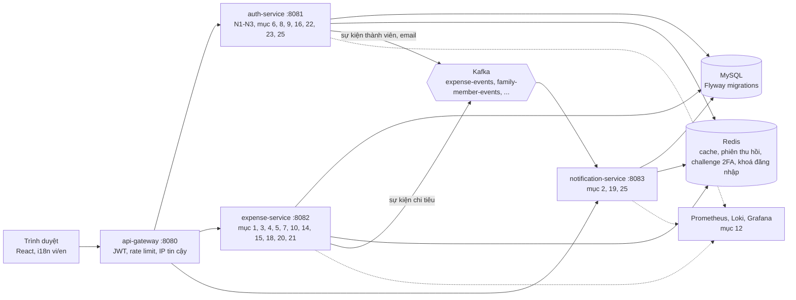

| Mục | Tính năng | Service chính | Trang frontend |
|---|---|---|---|
| N1–N4 | Đăng ký/đăng nhập (kể cả email chưa xác thực), quên mật khẩu, Google, ghi chi tiêu | auth, expense | Login, Register, Verify, Transactions |
| 1 | Phân trang chung 5 dòng/trang | mọi service | mọi danh sách |
| 2 | Cảnh báo vượt ngân sách (app và email) | expense, notification | Notifications |
| 3 | Giao dịch định kỳ (tháng, tuần, năm) | expense | RecurringTransactions |
| 4 | Ảnh hoá đơn | expense | Transactions |
| 5 | Import và Export CSV/Excel | expense | Transactions |
| 6 | Một tài khoản, nhiều gia đình | auth | Layout, Profile |
| 7 | Một loại tiền tệ cho mỗi gia đình | expense | Wallets |
| 8 | Quản lý phiên đăng nhập | auth | Profile |
| 9 | Xác thực 2 lớp (TOTP) | auth | Login, Profile |
| 10 | Xoá mềm và thùng rác | expense | Trash |
| 11 | Integration test chạm DB thật | mọi service | không có |
| 12 | Observability | hạ tầng | không có |
| 13 | Đa ngôn ngữ vi/en | frontend | mọi trang |
| 14 | Chuyển tiền giữa các ví | expense | Wallets |
| 15 | Dữ liệu mẫu cho gia đình mới | expense | Wallets, Categories, Transactions |
| 16 | Quản lý gia đình | auth | Profile |
| 17 | Phân quyền OWNER và MEMBER | expense, auth | mọi trang |
| 18 | Ngân sách tổng, cảnh báo 80%, sao chép | expense | Budgets |
| 19 | Thông báo mở rộng và tuỳ chọn | notification | Notifications |
| 20 | Tìm kiếm, xoá hàng loạt, sao chép giao dịch | expense | Transactions |
| 21 | Báo cáo nâng cao | expense | Reports |
| 22 | Tài khoản: đổi email, xoá, xuất dữ liệu, khoá đăng nhập tạm | auth | Profile, Verify |
| 23 | Quản trị hệ thống, khoá người dùng | auth | AdminPanel |
| 24 | IP máy khách đáng tin cậy | gateway | không có |
| 25 | Email báo admin khi có tài khoản mới | auth, notification | không có |

---

### Nền tảng

#### N1 — Đăng ký, xác thực email, đăng nhập, làm mới token

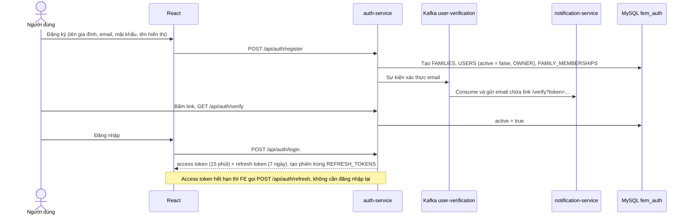

Access token là JWT mang `sub` (userId), `familyId`, `role`. Mọi service tự xác thực JWT độc lập, gateway chỉ kiểm tra sớm để trả 401 nhanh.

#### N1b — Email chưa xác thực: đăng ký lại, gửi lại link, tự dọn

Khi đăng ký xong mà chưa bấm link xác thực (hoặc link đã hết hạn), tài khoản ở trạng thái `active = false` và email vẫn nằm trong DB. Người dùng không bị kẹt:

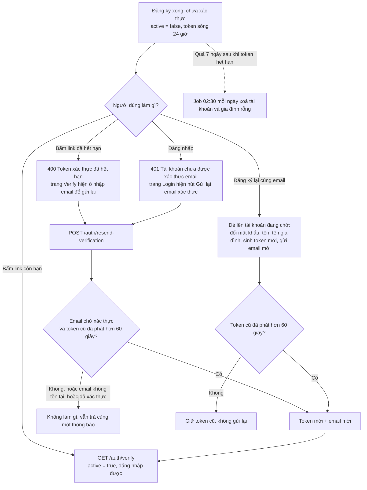

- **Đăng ký lại đè lên tài khoản chưa xác thực** (chỉ khi tài khoản thường, chưa kích hoạt, chưa bị khoá và có mật khẩu). Người lạ đăng ký bằng email của bạn cũng không xác thực được vì không có hộp thư, nên đè lên không gây hại. Tài khoản đã xác thực, đăng ký qua Google hoặc bị khoá vẫn nhận 409.
- **`POST /api/auth/resend-verification`** (công khai, body `{email}`) luôn trả cùng một thông báo dù email có tồn tại hay không, để không lộ email nào đã đăng ký. Gateway giới hạn 3 lần/phút, và mỗi tài khoản chỉ được gửi lại sau 60 giây kể từ email trước.
- **Tự dọn:** mặc định 02:30 mỗi ngày, xoá tài khoản chưa xác thực đã quá **7 ngày sau khi token hết hạn**, kèm gia đình rỗng của nó (bỏ qua nếu tài khoản đang là chủ hộ của gia đình có thành viên khác). Đổi bằng biến môi trường `AUTH_UNVERIFIED_CLEANUP_CRON` và `AUTH_UNVERIFIED_CLEANUP_RETENTION_DAYS` trong `infra/.env`.
- Không gửi lại email báo admin (mục 25) khi đăng ký lại đè lên tài khoản đang chờ, để admin không bị báo trùng.

#### N2 — Quên và đặt lại mật khẩu

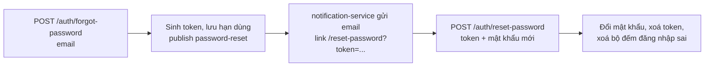

#### N3 — Đăng nhập Google (OAuth2)

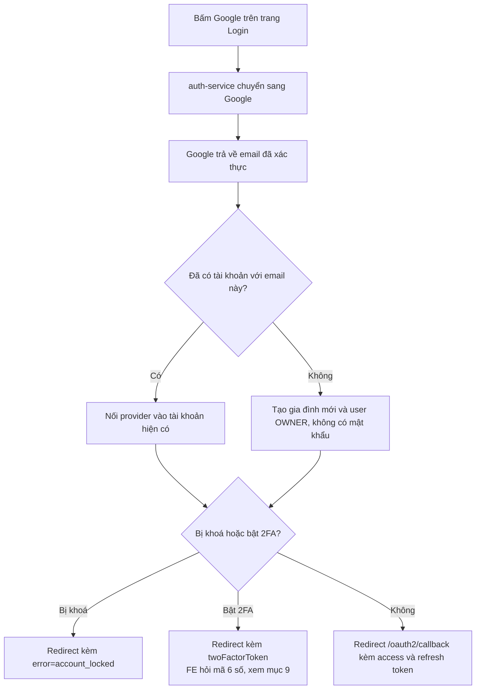

#### N4 — Ghi chi tiêu và cập nhật dữ liệu liên quan

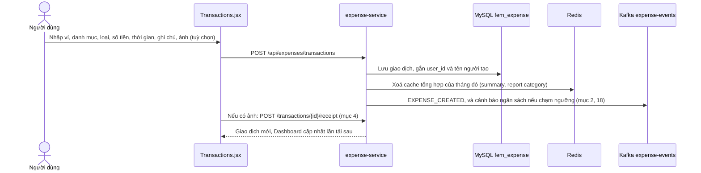

Cache Redis chỉ áp dụng cho `GET /api/expenses/summary` và `GET /api/expenses/reports/category` (TTL 10 phút, khoá theo `familyId` và `yearMonth`).

---

### Mục 1 — Phân trang chạy ở backend (dùng chung, 5 dòng/trang)

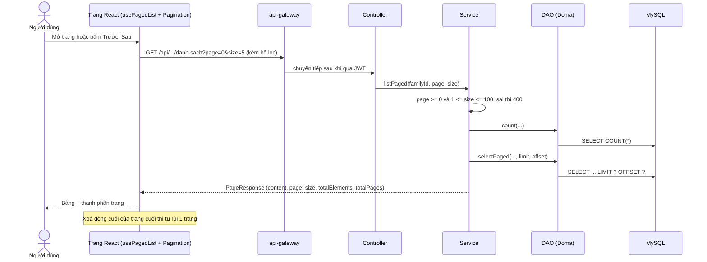

Áp dụng cho: Giao dịch, Ngân sách, Giao dịch định kỳ, Chuyển ví, 3 bảng Thùng rác, Thông báo, Admin (gia đình, người dùng), Thành viên gia đình, Lời mời đang chờ, Phiên đăng nhập. **Ví và Danh mục cố ý không phân trang** vì còn làm dữ liệu cho dropdown ở các trang khác. Component dùng chung: `frontend/src/components/Pagination.jsx` và `hooks/usePagedList.js`.

### Mục 2 — Cảnh báo ngân sách (trong app và email)

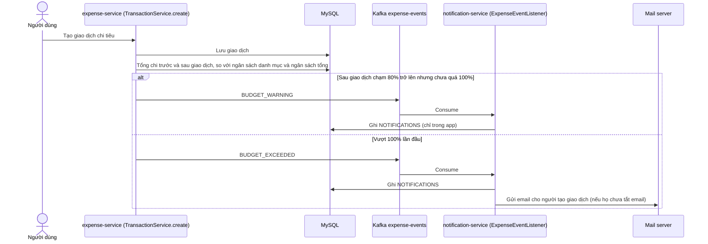

Luật kích hoạt: cảnh báo 80% khi `trước < 80% và sau >= 80% và sau <= giới hạn`; vượt ngân sách khi `trước <= giới hạn và sau > giới hạn`. Nếu một giao dịch nhảy từ dưới 80% qua luôn 100% thì chỉ có "vượt ngân sách". Mỗi ngưỡng chỉ báo một lần cho mỗi lần chạm.

### Mục 3 — Giao dịch định kỳ (tháng, tuần, năm)

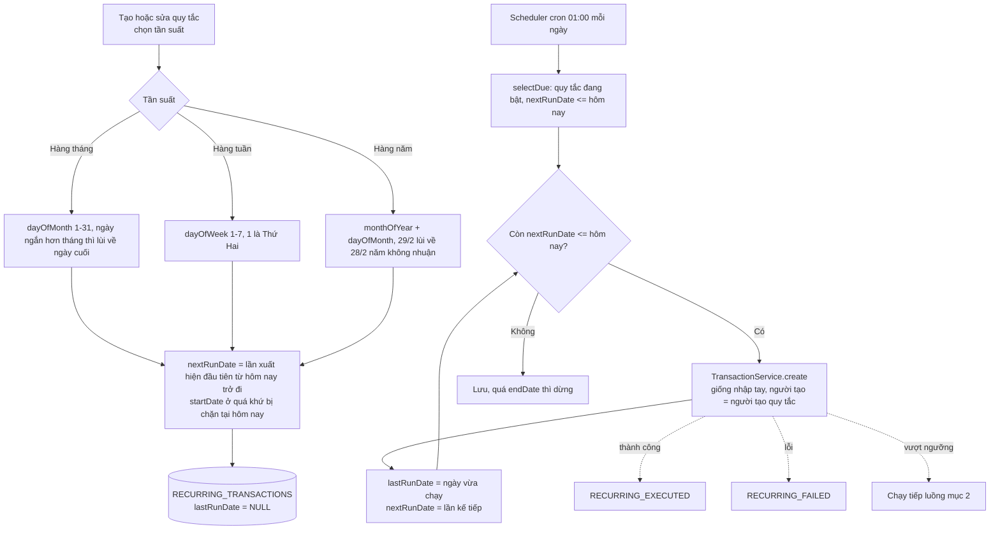

- Server tắt vài kỳ thì vòng lặp `Còn nextRunDate <= hôm nay` sinh bù đủ các kỳ bị lỡ. Quy tắc mới tạo không bị bù vì `nextRunDate` luôn tính từ hôm nay.
- Quyền: ai cũng tạo được quy tắc; chỉ người tạo quy tắc hoặc OWNER được sửa, bật/tắt, xoá (403 nếu vi phạm).
- Endpoint: `POST/GET /api/expenses/recurring-transactions`, `PUT /{id}`, `PUT /{id}/active`, `DELETE /{id}`.

### Mục 4 — Ảnh hoá đơn cho giao dịch

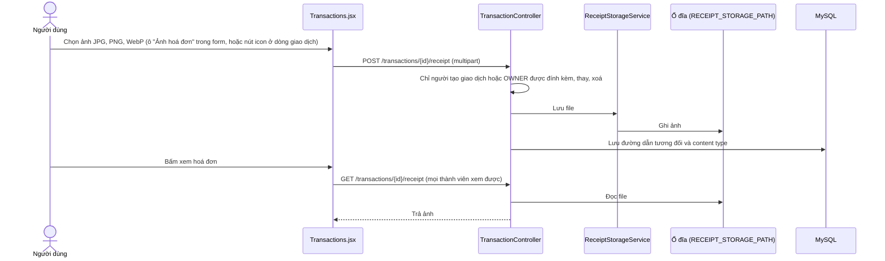

Xoá ảnh: `DELETE /transactions/{id}/receipt`. Ảnh mới thay ảnh cũ thì file cũ bị xoá.

### Mục 5 — Import và Export CSV/Excel

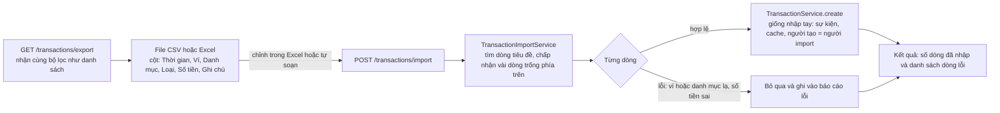

### Mục 6 — Một tài khoản thuộc nhiều gia đình

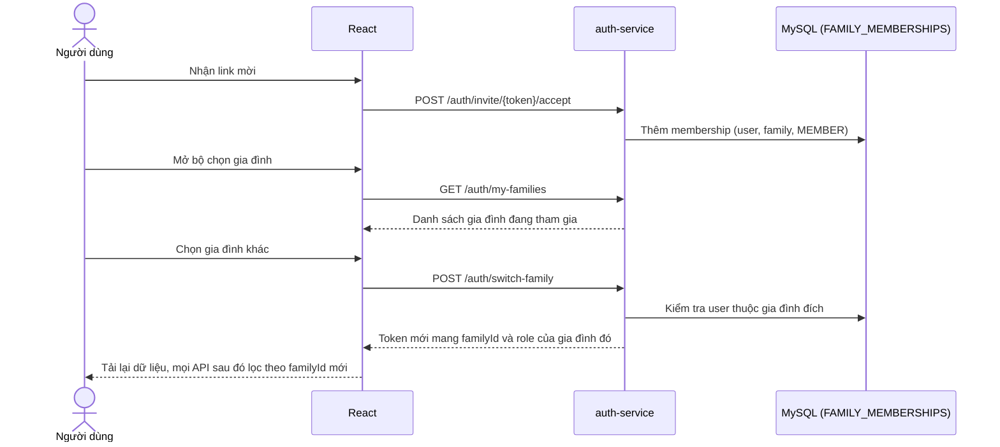

`USERS.family_id` và `USERS.role` chỉ lưu gia đình đang hoạt động; danh sách đầy đủ nằm ở `FAMILY_MEMBERSHIPS`. Quản lý gia đình xem mục 16.

### Mục 7 — Một loại tiền tệ cho mỗi gia đình

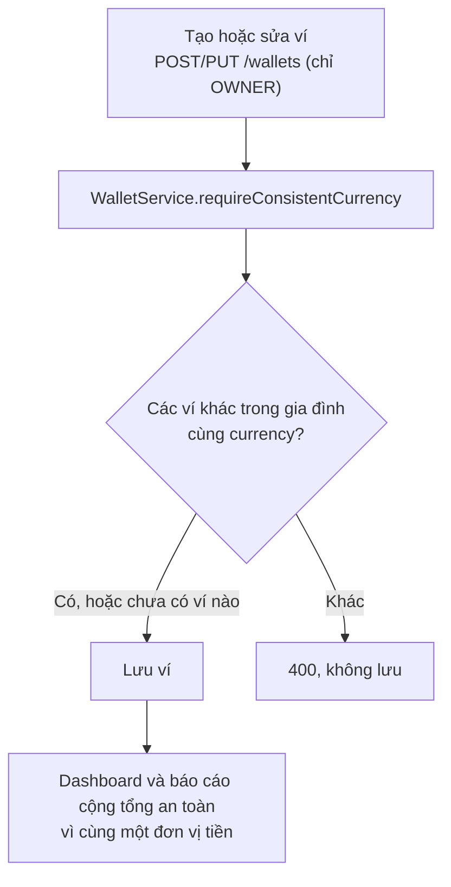

Số dư hiện tại của ví = số dư đầu + thu − chi + chuyển vào − chuyển ra (xem mục 14).

### Mục 8 — Quản lý phiên đăng nhập, đăng xuất từ xa

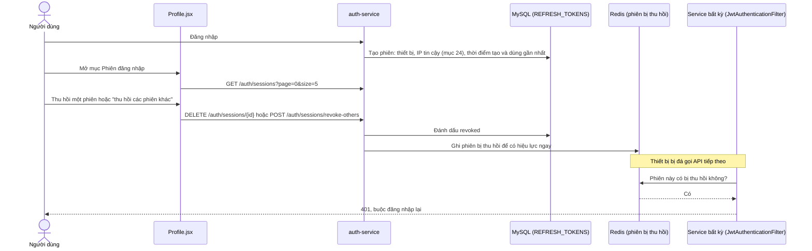

Thời gian hiển thị: backend trả `LocalDateTime` theo giờ UTC không kèm múi giờ, frontend đổi sang giờ máy người xem bằng `formatServerDateTime` (`frontend/src/utils/format.js`).

**Xoay và phát hiện dùng lại refresh token** (`AuthService#refresh`): mỗi lần refresh, token cũ bị thu hồi **nguyên tử** ngay trước khi phát token mới (`RefreshTokenDao#revokeById` chỉ update khi `revoked = false`, trả về số dòng bị ảnh hưởng) — hai request refresh song song cùng một token chỉ một request thắng, request còn lại nhận 401 thay vì cả hai cùng phát được token mới. Nếu một refresh token **đã bị thu hồi** lại được gửi lên lần nữa (dấu hiệu kinh điển của việc token bị đánh cắp và dùng song song với chủ tài khoản thật), toàn bộ phiên đăng nhập của user đó bị thu hồi ngay (`revokeAllByUserId`), buộc đăng nhập lại ở mọi thiết bị. `refresh` cũng kiểm tra tài khoản còn `active` (đã xác thực email), giống điều kiện ở `login`.

### Mục 9 — Xác thực 2 lớp (TOTP)

**Thành phần và nơi lưu dữ liệu**

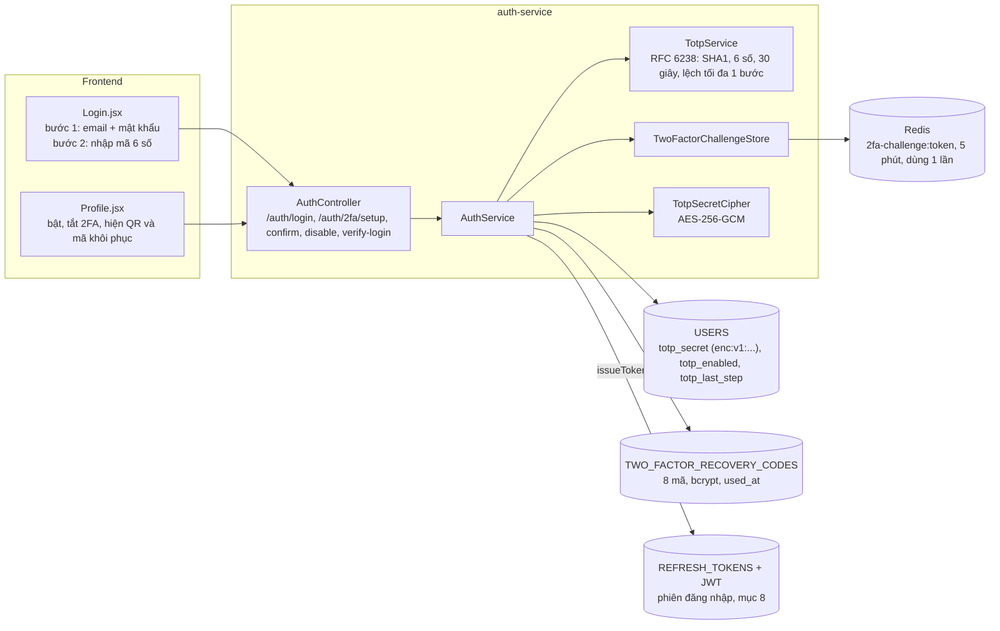

**Trạng thái 2FA của một tài khoản**

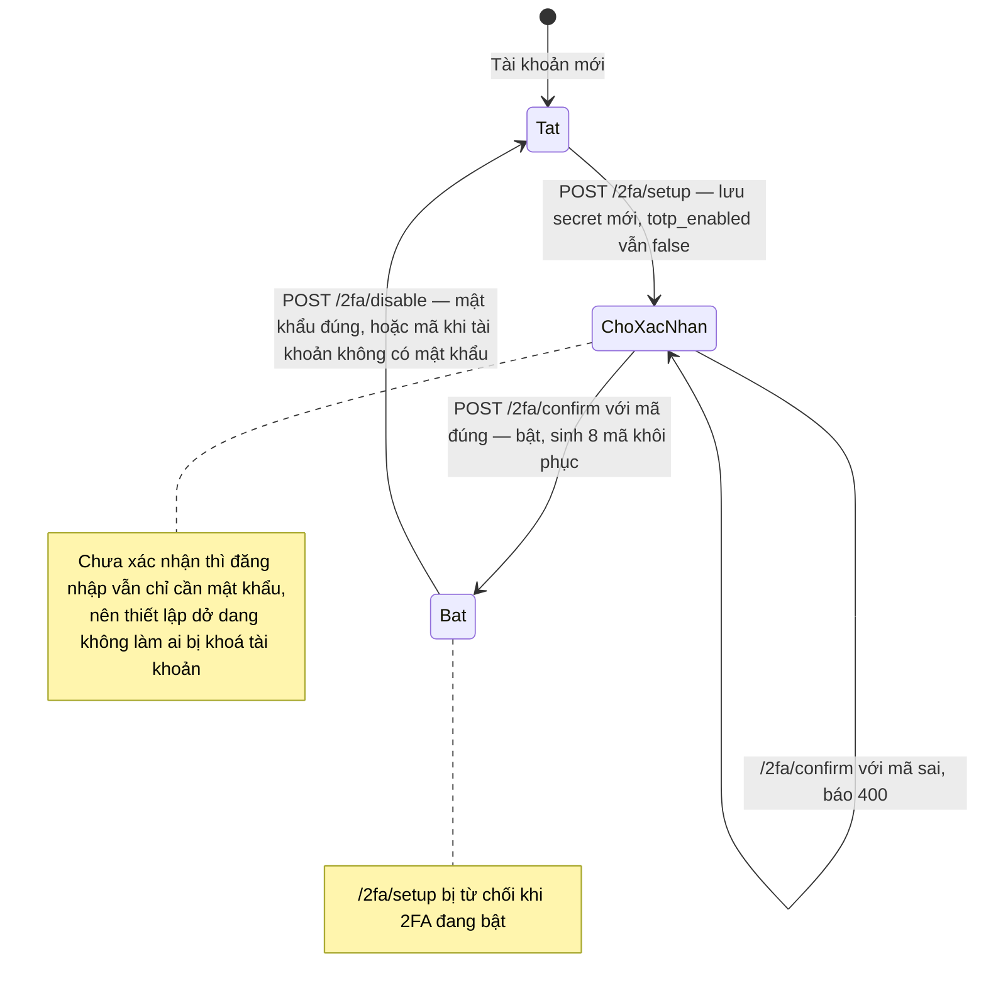

**Luồng đăng nhập có 2FA**

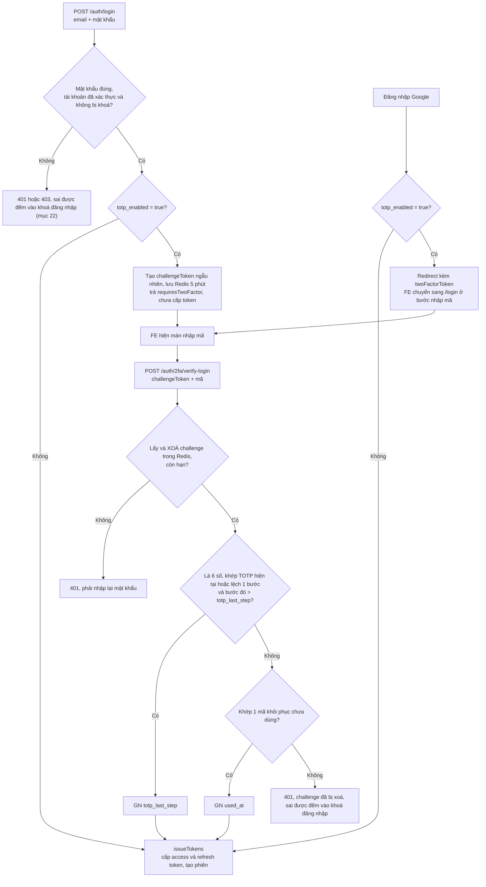

Điểm chính:
- Mã 6 số **không được lưu ở đâu**: server tính lại từ secret và giờ hiện tại mỗi lần kiểm tra, rồi so với mã người dùng nhập. Chỉ secret, mốc `totp_last_step` và bản băm mã khôi phục được lưu.
- Mã đã dùng không dùng lại được (`totp_last_step` chỉ tăng).
- QR do frontend vẽ bằng thư viện `qrcode` từ chuỗi `otpauth://`; không có dịch vụ ngoài nào. TOTP tự cài bằng JDK, không dùng thư viện TOTP.
- Khoá mã hoá secret lấy từ biến môi trường `TOTP_ENCRYPTION_KEY` (compose có giá trị mặc định chỉ dùng cho dev, khi triển khai thật phải đặt khoá riêng). Secret cũ dạng thô vẫn đọc được và được mã hoá lại lần ghi kế tiếp.

### Mục 10 — Xoá mềm và thùng rác

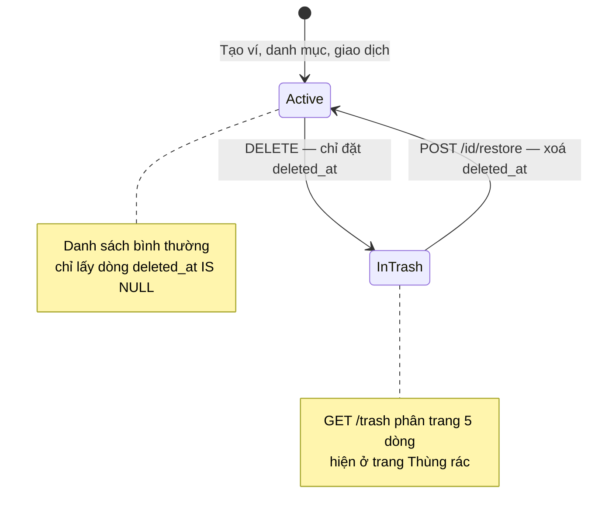

Quyền xoá và khôi phục: ví và danh mục chỉ OWNER; giao dịch thì người tạo hoặc OWNER. Khoản chuyển giữa các ví bị xoá cứng, không đi qua thùng rác. Ví đã có lịch sử chuyển thì không xoá được.

### Mục 11 — Integration test chạm DB thật

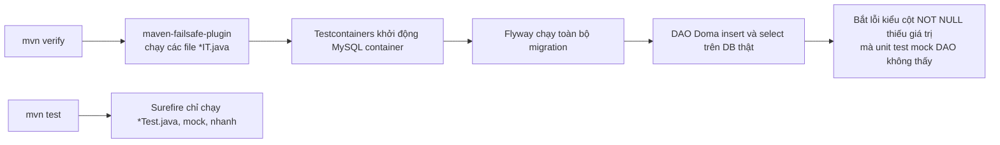

Cần Docker chạy được với JVM. Trên máy Windows dùng Docker Desktop hiện tại Testcontainers chưa kết nối được (lỗi named pipe), nên các `*IT.java` cần chạy ở máy khác hoặc CI. Ngoài ra nên `EXPLAIN` toàn bộ file `.sql` mới trên MySQL thật sau mỗi lần thêm truy vấn, vì unit test dùng DAO giả không bắt được lỗi SQL.

### Mục 12 — Observability

```mermaid
flowchart LR
    SV["5 service Spring Boot<br/>/actuator/prometheus"] -->|"scrape định kỳ"| P["Prometheus :9090"]
    CT["Log của các container Docker"] --> PT["Promtail"] --> L["Loki :3100"]
    P --> G["Grafana :3001<br/>dashboard có sẵn, tự nạp datasource"]
    L --> G
    G --> V["Xem metrics và tra log trên một màn hình"]
```

### Mục 13 — Đa ngôn ngữ (vi/en)

```mermaid
flowchart TD
    A["Mở trang"] --> B{"localStorage có fem-language?"}
    B -- "Có" --> C["Dùng ngôn ngữ đã lưu"]
    B -- "Chưa" --> D["Mặc định Tiếng Việt,<br/>không lấy theo ngôn ngữ trình duyệt"]
    C --> R["Render chữ từ src/locales/vi hoặc en / tên-trang.json"]
    D --> R
    S["Bấm nút VI | EN<br/>có ở cả trang công khai và sau đăng nhập"] --> W["i18n.changeLanguage và lưu localStorage"]
    W --> R
```

Thêm trang mới chỉ cần tạo `locales/vi/<tên>.json` và `locales/en/<tên>.json`, i18n tự nhận qua `import.meta.glob`. Thông báo lỗi do backend trả về (validation, nghiệp vụ) hiện là tiếng Việt cố định, chưa dịch theo ngôn ngữ giao diện.

---

### Mục 14 — Chuyển tiền giữa các ví

```mermaid
sequenceDiagram
    actor U as Người dùng (OWNER hoặc MEMBER)
    participant FE as Wallets.jsx
    participant EX as WalletTransferService
    participant DB as MySQL
    participant K as Kafka expense-events
    participant N as notification-service
    participant AU as auth-service (internal)

    U->>FE: Chọn ví nguồn, ví đích, số tiền, thời gian, ghi chú
    FE->>EX: POST /api/expenses/transfers
    EX->>DB: Kiểm tra 2 ví thuộc gia đình, chưa xoá, khác nhau, cùng loại tiền, số tiền >= 0.01
    EX->>DB: Số tiền phải <= số dư hiện tại của VÍ NGUỒN (đầu + thu − chi + chuyển vào − chuyển ra)
    EX->>DB: Ghi WALLET_TRANSFERS (không tạo giao dịch thu hoặc chi)
    EX->>K: Publish WALLET_TRANSFERRED (sau khi commit)
    EX-->>FE: OK, FE tải lại lịch sử chuyển và số dư ví
    K->>N: WALLET_TRANSFERRED
    N->>DB: 1 dòng thông báo trong app, dùng chung cho cả gia đình
    N-->>U: Email "đã trừ" cho người tạo giao dịch (nếu chưa tắt)
    N->>AU: GET /internal/families/{id}/members (JWT role SERVICE)
    N-->>U: Email "đã cộng, ai chuyển" cho từng thành viên khác (nếu chưa tắt)
    U->>FE: Sửa hoặc xoá một khoản chuyển
    FE->>EX: PUT hoặc DELETE /transfers/id (người tạo hoặc OWNER)
    Note over EX,DB: Khi sửa, số tiền cũ của chính khoản đang sửa được cộng/trừ lại trước khi so với số dư mới — tránh báo "vượt số dư" oan khi chỉ sửa ghi chú
```

Khoản chuyển **không** tính vào báo cáo thu chi, biểu đồ xu hướng hay ngân sách, nên tổng thu chi không bị sai. Endpoint: `POST/GET /api/expenses/transfers` (phân trang), `PUT /{id}`, `DELETE /{id}`.

### Mục 15 — Dữ liệu mẫu cho gia đình mới

```mermaid
flowchart TD
    A["Trang Ví, Danh mục hoặc Giao dịch<br/>gia đình chưa có ví hoặc danh mục"] --> B{"Người dùng là OWNER?"}
    B -- "Không" --> C["Hiện dòng 'Hãy nhờ chủ hộ tạo ví và danh mục'"]
    B -- "Có" --> D["Nút 'Tạo ví & danh mục mẫu'"]
    D --> E["POST /api/expenses/onboarding/seed-defaults"]
    E --> F{"Gia đình chưa có danh mục?"}
    F -- "Có" --> G["Tạo 8 danh mục chi: Ăn uống, Đi lại, Nhà cửa & hoá đơn, Mua sắm, Sức khoẻ, Giáo dục, Giải trí, Khác<br/>và 3 danh mục thu: Lương, Thưởng, Thu nhập khác"]
    F -- "Không" --> H["Bỏ qua phần danh mục"]
    G --> I{"Gia đình chưa có ví?"}
    H --> I
    I -- "Có" --> J["Tạo ví 'Tiền mặt', VND, số dư 0"]
    I -- "Không" --> K["Bỏ qua phần ví"]
```

Mỗi phần làm độc lập và làm lại nhiều lần không tạo trùng.

### Mục 16 — Quản lý gia đình

```mermaid
flowchart TD
    subgraph OWNER["Chỉ OWNER"]
        R["PUT /auth/family<br/>đổi tên gia đình"]
        T["POST /auth/family/transfer-ownership<br/>chuyển quyền chủ hộ cho 1 thành viên"]
        I1["GET /auth/invites<br/>lời mời đang chờ, phân trang"]
        I2["DELETE /auth/invites/id<br/>huỷ lời mời"]
        I3["POST /auth/invites/id/resend<br/>token mới, gia hạn, gửi lại email"]
        RM["DELETE /auth/family/members/userId<br/>xoá thành viên"]
    end
    subgraph MEMBER["Thành viên (không phải chủ hộ)"]
        L["POST /auth/family/leave<br/>rời gia đình"]
    end
    T --> TK["Trả token mới cho người gọi vì role đã đổi"]
    L --> L2{"Còn gia đình khác?"}
    L2 -- "Có" --> L3["Chuyển sang gia đình đầu tiên còn lại"]
    L2 -- "Không" --> L4["Tạo gia đình cá nhân mới, người này là OWNER"]
    L3 --> TK2["Trả token mới"]
    L4 --> TK2
    OWNER_LEAVE["OWNER gọi /family/leave"] --> ERR["400: phải chuyển quyền chủ hộ trước"]
```

Rời gia đình, chuyển quyền, xoá thành viên đều phát sự kiện thành viên (mục 19). Gia đình luôn còn ít nhất một OWNER. **Chưa có** chức năng xoá gia đình.

### Mục 17 — Phân quyền OWNER và MEMBER

```mermaid
flowchart LR
    A["Yêu cầu từ người dùng"] --> B{"Đối tượng"}
    B -- "Ví, danh mục, ngân sách,<br/>dữ liệu mẫu" --> C["Chỉ OWNER được tạo, sửa, xoá, khôi phục<br/>MEMBER chỉ xem"]
    B -- "Giao dịch" --> D["MEMBER: chỉ sửa, xoá, khôi phục,<br/>đính kèm ảnh của chính mình<br/>OWNER: tất cả"]
    B -- "Giao dịch định kỳ" --> E["Ai cũng tạo được<br/>sửa, bật/tắt, xoá: người tạo quy tắc hoặc OWNER"]
    B -- "Chuyển ví" --> F["Ai cũng tạo được<br/>sửa, xoá: người tạo hoặc OWNER"]
    B -- "Gia đình, lời mời, xoá thành viên" --> G["Chỉ OWNER"]
    C --> H["Vi phạm: 403 Bạn không có quyền thực hiện thao tác này"]
    D --> H
    E --> H
    F --> H
    G --> H
```

Frontend **ẩn** (không chỉ vô hiệu hoá) form và nút mà người dùng không có quyền; backend vẫn kiểm tra lại. Bảng giao dịch có cột "Người tạo" (tên được lưu kèm giao dịch lúc tạo nên người đã rời gia đình vẫn hiện tên, giao dịch cũ chưa có tên hiện "Thành viên cũ").

### Mục 18 — Ngân sách tổng, cảnh báo và sao chép

```mermaid
flowchart TD
    A["Tạo ngân sách<br/>chọn danh mục hoặc 'Tất cả danh mục'"] --> B{"Chọn gì?"}
    B -- "Một danh mục" --> C["Chi của danh mục đó trong tháng<br/>mỗi danh mục và tháng chỉ có 1 ngân sách"]
    B -- "Tất cả danh mục" --> D["categoryId = null: tổng mọi khoản CHI trong tháng<br/>mỗi tháng chỉ có 1 ngân sách tổng"]
    C --> E["Mỗi giao dịch chi: so tổng trước và sau"]
    D --> E
    E --> F["Chạm 80%: BUDGET_WARNING, chỉ trong app"]
    E --> G["Vượt 100%: BUDGET_EXCEEDED, trong app và email"]

    S["POST /budgets/copy<br/>fromMonth, toMonth"] --> S1["Sao chép mọi ngân sách của tháng nguồn sang tháng đích<br/>bỏ qua cái đã có ở tháng đích"]
    S1 --> S2["Trả copied và skipped"]
```

Chỉ OWNER tạo, sửa, xoá, sao chép ngân sách. Ngân sách trùng (cùng danh mục hoặc cùng tổng trong một tháng) trả 400 với thông báo tiếng Việt.

### Mục 19 — Thông báo mở rộng và tuỳ chọn

```mermaid
flowchart LR
    subgraph EXP["expense-service, topic expense-events"]
        E1["BUDGET_WARNING"]
        E2["BUDGET_EXCEEDED"]
        E3["RECURRING_EXECUTED"]
        E4["RECURRING_FAILED"]
        E5["WALLET_TRANSFERRED"]
    end
    subgraph AUTHS["auth-service, topic family-member-events"]
        A1["MEMBER_JOINED"]
        A2["MEMBER_LEFT"]
        A3["MEMBER_REMOVED"]
    end
    E1 --> N["notification-service<br/>ghi NOTIFICATIONS theo gia đình"]
    E2 --> N
    E3 --> N
    E4 --> N
    E5 --> N
    A1 --> N
    A2 --> N
    A3 --> N
    E2 -->|"nếu người tạo chưa tắt email"| M["Email cảnh báo vượt ngân sách"]
    E5 -->|"nếu chưa tắt email"| W1["Email 'đã trừ' cho người tạo"]
    E5 -->|"tra email qua auth-service /internal, nếu chưa tắt"| W2["Email 'đã cộng' cho từng thành viên khác"]
    N --> UI["Trang Notifications + chuông báo chưa đọc"]
    P["Tuỳ chọn của từng người dùng<br/>hiện trong app theo loại, email cho BUDGET_EXCEEDED/WALLET_TRANSFERRED"] -.->|"lọc lúc đọc danh sách và đếm chưa đọc"| UI
```

Endpoint: `GET /api/notifications` (phân trang), `GET /unread-count`, `PUT /{id}/read`, `PUT /read-all`, `DELETE /{id}`, `DELETE /read` (xoá mọi thông báo đã đọc), `GET/PUT /preferences`. Vì thông báo được lưu theo gia đình, việc tắt hiển thị một loại chỉ ảnh hưởng người tắt (lọc lúc đọc), không mất thông báo của người khác. Quy tắc định kỳ đang lỗi sẽ báo lỗi mỗi ngày cho đến khi được sửa.

`GET /api/notifications` **không** trả `payloadJson` — dữ liệu đó là nguyên văn event Kafka gốc (gồm cả email người thực hiện) và mọi thành viên gia đình đều đọc được danh sách này, nên trường này bị bỏ khỏi `NotificationResponse` để không lộ email giữa các thành viên với nhau. Cột `payload_json` vẫn còn trong DB, chỉ không trả ra qua API.

### Mục 20 — Tìm kiếm, xoá hàng loạt, sao chép giao dịch

```mermaid
flowchart TD
    A["Trang Giao dịch"] --> B["Bộ lọc: ví, danh mục, loại, từ ngày, đến ngày<br/>ghi chú (q), số tiền tối thiểu, tối đa"]
    B --> C["GET /transactions?...&page=0&size=5<br/>q không phân biệt hoa thường, ký tự % và _ được thoát đúng<br/>min lớn hơn max trả 400"]
    C --> D["Bảng kết quả có cột chọn"]
    D --> E["Chọn nhiều dòng<br/>dòng không có quyền thì ô chọn bị vô hiệu"]
    E --> F["POST /transactions/bulk-delete<br/>ids tối đa 100"]
    F --> G["Mỗi id xử lý như xoá 1 giao dịch (xoá mềm, sự kiện, cache)"]
    G --> H["Trả deleted, skipped (không tồn tại), forbidden (không có quyền)"]
    D --> I["Nút Sao chép: điền sẵn form bằng ví, danh mục, loại, số tiền, ghi chú<br/>của dòng đó, thời gian = bây giờ, chưa lưu cho đến khi bấm Thêm"]
```

Bộ lọc `q`, `minAmount`, `maxAmount` áp dụng cho cả `GET /transactions/export` (mục 5).

### Mục 21 — Báo cáo nâng cao

```mermaid
flowchart LR
    P["Trang Báo cáo /reports"] --> T1["Khoảng ngày tuỳ chọn<br/>GET /reports/range?from&to"]
    P --> T2["Theo năm<br/>GET /reports/year?year"]
    P --> T3["Theo thành viên<br/>GET /reports/by-member?from&to"]
    P --> T4["So sánh tháng<br/>GET /reports/compare?month&withMonth"]
    T1 --> R1["Tổng thu, chi, chênh lệch, theo danh mục<br/>gom theo ngày nếu khoảng tối đa 62 ngày, ngược lại theo tháng<br/>khoảng tối đa 366 ngày"]
    T2 --> R2["12 tháng, tháng không có dữ liệu = 0"]
    T3 --> R3["Thu và chi của từng người, sắp theo chi giảm dần"]
    T4 --> R4["Tổng thu chi hai tháng, chi theo danh mục và chênh lệch"]
    P --> PR["Nút In / Lưu PDF<br/>window.print(), CSS @media print ẩn menu và nút"]
```

Các báo cáo bỏ qua giao dịch đã xoá mềm và không tính khoản chuyển ví. Dashboard vẫn dùng bộ endpoint cũ `summary`, `reports/category`, `reports/trend`, `reports/wallet-category` (có cache Redis). Không có PDF phía server, PDF là in từ trình duyệt.

### Mục 22 — Quản lý tài khoản

**Khoá đăng nhập tạm**

```mermaid
flowchart TD
    A["POST /auth/login (hoặc nhập mã 2FA sai)"] --> B{"Đã sai 5 lần liên tiếp trong 15 phút<br/>với email này? (Redis login-fail:email)"}
    B -- "Có" --> X["429 Tài khoản tạm khoá, thử lại sau N phút"]
    B -- "Không" --> C{"Đúng?"}
    C -- "Không" --> D["Tăng bộ đếm, 401 (email không tồn tại cũng đếm như sai mật khẩu, cùng thông báo)"]
    C -- "Có" --> E["Xoá bộ đếm, tiếp tục đăng nhập"]
```

**Đổi email**

```mermaid
sequenceDiagram
    actor U as Người dùng
    participant FE as Profile.jsx
    participant AU as auth-service
    participant NO as notification-service
    participant MB as Hộp thư email mới

    U->>FE: Nhập email mới + mật khẩu (tài khoản chỉ dùng Google thì dùng mã 2FA)
    FE->>AU: POST /auth/me/email
    AU->>AU: Kiểm tra mật khẩu, email chưa bị dùng
    AU->>AU: Lưu pending_email, token có tiền tố ec., hạn dùng
    AU->>NO: Sự kiện xác thực email gửi tới email MỚI
    NO->>MB: Email chứa link /verify?token=ec....
    U->>AU: Bấm link, GET /auth/verify (nhận ra tiền tố ec.)
    AU->>AU: Đổi email, xoá pending, thu hồi các phiên khác
```

Email xác nhận đổi email hiện dùng lại mẫu email "Xác thực tài khoản"; muốn câu chữ đúng ngữ cảnh cần thêm mẫu riêng ở notification-service.

**Xuất dữ liệu và xoá tài khoản**

```mermaid
flowchart TD
    X1["GET /auth/me/export"] --> X2["JSON: hồ sơ, gia đình tham gia, phiên<br/>không có mật khẩu hay secret<br/>FE tải về thành file .json"]

    D1["DELETE /auth/me<br/>mật khẩu hoặc mã 2FA"] --> D2{"Là OWNER của gia đình<br/>còn thành viên khác?"}
    D2 -- "Có" --> D3["400: phải chuyển quyền chủ hộ trước"]
    D2 -- "Không" --> D4["Xoá phiên, mã khôi phục 2FA, membership, lời mời đã gửi, rồi xoá user"]
    D4 --> D5{"Gia đình nào còn 0 thành viên?"}
    D5 -- "Có" --> D6["Xoá dòng gia đình bên auth-service<br/>dữ liệu chi tiêu và thông báo của gia đình đó vẫn còn (mồ côi)"]
    D5 -- "Không" --> D7["Xong, FE xoá token và về trang đăng nhập"]
    D6 --> D7
```

### Mục 23 — Quản trị hệ thống

```mermaid
flowchart TD
    A["Người dùng có is_system_admin<br/>trang /admin"] --> B["GET /admin/families, /admin/users (phân trang)"]
    A --> C["PUT /admin/users/id/system-admin<br/>cấp hoặc thu quyền quản trị"]
    A --> D["PUT /admin/users/id/locked<br/>khoá hoặc mở khoá"]
    D --> E{"Điều kiện"}
    E -- "Khoá chính mình<br/>hoặc khoá admin khác" --> X["Từ chối"]
    E -- "Hợp lệ" --> F["Đặt locked = true và thu hồi ngay mọi phiên của người đó"]
    F --> G["Từ đó login, refresh, 2FA, chuyển gia đình, Google đều bị từ chối<br/>403 Tài khoản đã bị khoá bởi quản trị viên<br/>Google: redirect kèm error=account_locked"]
```

### Mục 24 — IP máy khách đáng tin cậy

```mermaid
flowchart TD
    A["Request vào api-gateway"] --> B{"remoteAddr là địa chỉ riêng<br/>(private, loopback, link-local)?"}
    B -- "Không, kết nối trực tiếp từ ngoài" --> C["IP = remoteAddr<br/>bỏ qua mọi header chuyển tiếp"]
    B -- "Có, đi qua proxy tin cậy<br/>(nginx, cloudflared, mạng Docker)" --> D["IP = phần tử NGOÀI CÙNG BÊN PHẢI của X-Forwarded-For<br/>do proxy gần nhất thêm vào"]
    C --> E["ClientIpFilter xoá X-Client-Ip do client gửi<br/>rồi đặt X-Client-Ip = IP đã tính"]
    D --> E
    E --> F["RateLimitFilter dùng IP này để đếm"]
    E --> G["auth-service đọc X-Client-Ip để ghi IP vào phiên"]
```

Trước đây hệ thống tin phần tử **đầu** của `X-Forwarded-For` (client giả được). Qua Cloudflare, IP thật là phần tử cuối vì Cloudflare thêm vào sau giá trị client gửi. Giới hạn còn lại: khi gọi thẳng vào cổng 8080 từ máy host trong môi trường Docker Desktop, địa chỉ nguồn là dải riêng nên vẫn giả được bằng header; nên chỉ để cổng 8080 truy cập được qua nginx hoặc Cloudflare khi triển khai thật.

### Mục 25 — Email báo cho admin khi có tài khoản mới

```mermaid
sequenceDiagram
    actor U as Người dùng mới
    participant AU as auth-service (AuthService)
    participant DB as MySQL fem_auth
    participant KF as Kafka user-registered
    participant NO as notification-service (NewUserRegisteredEventListener)
    participant SMTP as Mail server
    actor AD as Admin hệ thống

    alt Đăng ký bằng form
        U->>AU: POST /auth/register
        AU->>DB: Tạo gia đình và user (chưa xác thực email)
    else Đăng nhập Google lần đầu
        U->>AU: OAuth2 thành công, chưa có tài khoản
        AU->>DB: Tạo gia đình và user (đã xác thực)
    else Nhận lời mời bằng tài khoản mới
        U->>AU: POST /auth/invite/token/accept
        AU->>DB: Tạo user thành viên (đã xác thực)
    end
    AU->>DB: SELECT email của admin hệ thống đang hoạt động và chưa bị khoá
    alt Có ít nhất 1 admin
        AU->>KF: NewUserRegisteredEvent (sau khi commit), kèm adminEmails
        KF->>NO: Consume
        loop Mỗi admin
            NO->>SMTP: Gửi email riêng: tên, email, gia đình, đăng ký qua đâu, trạng thái, thời điểm
            SMTP-->>AD: Email "Có người dùng mới đăng ký"
        end
    else Chưa có admin nào
        AU->>AU: Ghi log cảnh báo, không phát sự kiện
    end
```

- Người nhận là mọi người dùng có `is_system_admin`, `active` và chưa bị khoá, lấy tại thời điểm tạo tài khoản. Cấp hoặc thu quyền admin ở trang quản trị (mục 23) thì danh sách người nhận đổi theo.
- Mỗi admin nhận một email riêng (không lộ địa chỉ của nhau). Giá trị người dùng nhập (tên, tên gia đình) được escape HTML trước khi chèn vào email.
- Sự kiện chỉ được gửi sau khi giao dịch tạo tài khoản commit. Gửi mail lỗi (SMTP chưa cấu hình hoặc một địa chỉ hỏng) chỉ ghi log, không làm Kafka gửi lại sự kiện.
- Mẫu email: `notification-service/src/main/resources/mail-templates/new-user-registered-email.html`. Link "Mở trang quản trị" trỏ tới `FRONTEND_BASE_URL/admin`.

---

## Phụ lục: Port dịch vụ phổ biến (tham khảo chung, ngoài phạm vi project)

Bảng port của các service/tool phổ biến trong hạ tầng nói chung — không phải tất cả đều được dùng trong project này (xem [Port & chạy service local](#port--chạy-service-local) cho port thật của project).

| SERVICE | DESCRIPTION | PORT |
|---|---|---|
| HTTP | Web traffic (unsecured) | 80 |
| HTTPS | Secure web traffic (SSL) | 443 |
| SSH | Secure remote access | 22 |
| FTP | File Transfer Protocol | 21 |
| MySQL | Database service | 3306 |
| Kubernetes API Server | K8s cluster communication | 6443 |
| Docker Daemon API | Docker remote API | 2375 / 2376 |
| MongoDB | NoSQL database | 27017 |
| NGINX | Web server / reverse proxy | 80 / 443 |
| Grafana | Monitoring & dashboards | 3000 |
| Prometheus | Monitoring & alerting | 9090 |
| Tomcat | Java application server | 8080 |
| Apache Kafka | Event streaming platform | 9092 |
| Redis | In-memory data store | 6379 |
| RDP | Remote desktop access | 3389 |
| Elasticsearch API | Search & analytics engine | 9200 |
| Jenkins | CI/CD automation server | 8080 |

> Lưu ý: `Tomcat`/`Jenkins` (8080) trùng port với `api-gateway` của project này — nếu chạy chung máy, chỉ được bật một trong hai trên cùng port 8080.

## Hiện trạng deploy (dev/demo, chưa phải VPS)

```
                         INTERNET
                            │
                            ▼
              GitHub Pages - FE
              https://xxx.github.io
                            │
                            │ API
                            ▼
              Cloudflare Tunnel
              https://api-xxxxx.trycloudflare.com
                            │
                            ▼
                  localhost:8081
                            │
                            ▼
                    Spring Boot BE
```

Tức là hệ thống **chưa chạy trên VPS nào** — backend đang chạy trên máy local, lộ ra ngoài qua Cloudflare Quick Tunnel (URL ngẫu nhiên, đổi mỗi lần container `cloudflared` restart). Đây là mô hình để demo/test, chưa phải production.

### Việc cần làm khi có VPS (chưa làm — TODO)

**Phải sửa trước khi mở ra ngoài Internet (bảo mật nghiêm trọng):**
- [ ] Bỏ toàn bộ cổng debug JDWP (`JAVA_TOOL_OPTIONS: -agentlib:jdwp=...` và `ports: "500x:500x"`) khỏi mọi service trong `docker-compose.yml` bản chạy thật — JDWP không xác thực mở ra Internet là đường RCE tức thời. Nên tách một `docker-compose.prod.yml` không có các dòng này thay vì sửa trực tiếp file dev.
- [ ] Bỏ `ports:` publish ra host của `mysql-db` (3307), `kafka` (9092), `redis` (6379) — Docker tự chèn luật iptables NAT nên UFW/firewall thường không chặn được, kể cả khi tưởng đã đóng cổng ở tầng OS. Chỉ nên giao tiếp qua mạng nội bộ `fem-network`.
- [ ] Bỏ publish cổng Eureka Dashboard (8761) ra ngoài.
- [ ] Thêm `restart: unless-stopped` cho mọi service (hiện chỉ `cloudflared` có) — VPS reboot hoặc container crash thì cả hệ thống không tự dậy lại.

**Cần có trước khi chạy thật:**
- [ ] TLS/HTTPS thật qua Nginx/Caddy/Traefik + Let's Encrypt + tên miền riêng (hiện dựa vào HTTPS do Cloudflare Tunnel cấp sẵn).
- [ ] Đổi `APP_BASE_URL`, `OAUTH2_SUCCESS_REDIRECT_URL` trong `.env` từ `localhost` sang domain thật, đồng thời cập nhật lại Redirect URI ở Google/Facebook Console.
- [ ] Giới hạn tài nguyên container (`mem_limit`/`deploy.resources.limits`) cho từng service, tương xứng cấu hình VPS — hiện không giới hạn, nhiều JVM cùng chạy có thể chiếm hết RAM khi traffic tăng.
- [ ] Cấu hình log rotation cho Docker (`logging: driver: json-file, options: {max-size, max-file}`) — mặc định log tích luỹ vô hạn, dễ đầy đĩa VPS.
- [ ] Có backup định kỳ cho MySQL (`mysqldump` theo lịch, hoặc snapshot volume `mysql-data`) — hiện chưa có.
- [ ] Ghim version cụ thể cho `grafana/grafana`, `prom/prometheus`, `grafana/loki` (đang dùng `:latest`, không tái lập được).
- [ ] Chặn `/actuator/**` của `api-gateway` ở tầng reverse proxy/firewall, chỉ cho phép truy cập nội bộ — hiện `/actuator/health` và `/actuator/prometheus` public không cần đăng nhập trên cổng 8080 publish ra ngoài.
- [ ] CI/CD deploy tự động lên VPS (hiện chỉ có CI build/test — `backend-ci.yml`, `frontend-ci.yml` — chưa có bước SSH/push image + `docker compose pull && up -d` trên VPS; deploy đang hoàn toàn thủ công).
