# Family Expense Manager

Hệ thống quản lý chi tiêu gia đình, dùng thực tế hàng ngày, xây dựng theo kiến trúc microservices thật (không phải demo tối giản).

**Stack:** Spring Boot 3.3.5 + Doma 2 (không dùng JPA/Hibernate) · React (Vite) · MySQL + Flyway · Docker Compose · Kafka · Redis · Eureka · Spring Cloud Gateway **Server MVC** (servlet-based, không dùng WebFlux) · springdoc-openapi (Swagger UI).

> Tài liệu mô tả **kiến trúc, cách chạy và toàn bộ tính năng đã làm** theo từng mục (mỗi mục có sơ đồ luồng, xem [Tính năng theo từng mục](#tính-năng-theo-từng-mục)). Schema bảng do Flyway quản lý (`db/migration/V*__*.sql`, xem [Database Migrations](#database-migrations-flyway)). Production chạy tại **https://quanlychitieu.online** (xem [Triển khai và CI/CD](#triển-khai-và-cicd)). Mọi việc chưa làm nằm ở [Việc cần làm (TODO)](#việc-cần-làm-todo). Hướng dẫn cho người dùng cuối: menu **Hướng dẫn** trong ứng dụng (`/guide`), nội dung ở **[frontend/src/content/huong-dan-su-dung.md](frontend/src/content/huong-dan-su-dung.md)**.

## Kiến trúc

```
                        ┌───────────────┐
                        │   frontend     │  React + Vite
                        │  (port 5173)   │
                        └───────┬────────┘
                                │
                        ┌───────▼────────┐
                        │  api-gateway    │  Spring Cloud Gateway
                        │  (port 8080)    │  routes + JWT pre-filter
                        └───────┬────────┘
              ┌─────────────────┼─────────────────┐
              │                 │                 │
      ┌───────▼──────┐  ┌───────▼───────┐  ┌──────▼─────────────┐
      │ auth-service  │  │expense-service │  │notification-service│
      │ (port 8081)   │  │ (port 8082)    │  │ (port 8083)        │
      │ schema        │  │ schema         │  │ schema             │
      │ FEM_AUTH      │  │ FEM_EXPENSE    │  │ FEM_NOTIFY         │
      └───────┬───────┘  └──┬─────┬──────┘  └──────────▲─────────┘
              │             │     │                     │
              │        Redis│     │Kafka                │
              │        cache│     │(expense-events)──────┘
              │             │     │
      ┌───────▼─────────────▼─────▼──────┐
      │           MySQL DB                │
      └────────────────────────────────────┘

      Tất cả service đăng ký với eureka-server (port 8761)
```

Sơ đồ trên là môi trường dev. Trên production có thêm **nginx** đứng trước (HTTPS, `/api/*` → api-gateway, còn lại → frontend), xem [Triển khai và CI/CD](#triển-khai-và-cicd). `auth-service` cũng publish Kafka (email, sự kiện thành viên), xem [Hợp đồng Kafka](#hợp-đồng-kafka).

## Port & chạy service local

Mỗi service là một Spring Boot app **độc lập** — chạy riêng process/terminal (hoặc Run Configuration riêng nếu dùng IDE), không phải tuần tự trong 1 process.

| Service | Port | Lệnh chạy |
|---|---|---|
| `eureka-server` | 8761 | `mvn -f backend/eureka-server spring-boot:run` |
| `api-gateway` | 8080 | `mvn -f backend/api-gateway spring-boot:run` |
| `auth-service` | 8081 | `mvn -f backend/auth-service spring-boot:run` |
| `expense-service` | 8082 | `mvn -f backend/expense-service spring-boot:run` |
| `notification-service` | 8083 | `mvn -f backend/notification-service spring-boot:run` |
| `frontend` (Vite dev) | 5173 | `npm run dev` (khi chạy qua Docker Compose, map ra port 3000 — xem `infra/docker-compose.yml`) |

Thứ tự khởi động: nên start `eureka-server` trước tiên (service registry), rồi tới `api-gateway` và 3 service còn lại (tự đăng ký vào Eureka khi start) — thứ tự giữa `auth-service`/`expense-service`/`notification-service` với nhau không quan trọng.

Đây cũng là lý do có `infra/docker-compose.yml`: thay vì mở tay nhiều terminal, `docker compose up` build và chạy tất cả cùng lúc, mỗi container vẫn giữ đúng port như bảng trên.

## Cấu trúc thư mục

```
family-expense-manager/
├── backend/
│   ├── pom.xml                      # Maven reactor cha (Spring Boot 3.3.5, Spring Cloud 2023.0.3, Doma 2.61.0, mysql-connector-j, Java 21)
│   ├── common/                      # JwtUtil, DTOs dùng chung, exception base, OpenApiConfig — dùng chung cho mọi service
│   ├── eureka-server/               # Service registry
│   ├── api-gateway/                 # Gateway + JWT pre-filter
│   ├── auth-service/                # Đăng ký/đăng nhập/JWT — schema FEM_AUTH
│   ├── expense-service/             # Ví/danh mục/giao dịch/ngân sách — schema FEM_EXPENSE
│   └── notification-service/        # Xử lý thông báo qua Kafka — schema FEM_NOTIFY
├── frontend/                        # React + Vite SPA
├── loadtest/fem-load.jmx            # Kịch bản kiểm thử tải JMeter (xem Kiểm thử tải)
├── .github/workflows/               # backend-ci.yml, frontend-ci.yml (CI), deploy.yml (CD lên VPS)
└── infra/
    ├── docker-compose.yml           # Dev: app + monitoring + cloudflared, mở cổng debug JDWP 5005-5009
    ├── docker-compose-dev.yml       # Dev: như trên nhưng monitoring tách vào profile "monitoring"
    ├── docker-compose.prod.yml      # Production trên VPS (xem Triển khai và CI/CD)
    ├── .env.prod.example            # Mẫu biến môi trường production (copy thành .env.prod)
    ├── DEPLOY.md                    # Hướng dẫn cài VPS từng bước
    ├── deploy.sh                    # Script deploy, được workflow deploy.yml gọi trên VPS
    ├── backup-mysql.sh              # mysqldump 3 database
    ├── init-letsencrypt.sh          # Lấy chứng chỉ HTTPS lần đầu
    ├── nginx/templates/             # Cấu hình nginx production
    ├── prometheus/ loki/ promtail/ grafana/   # Cấu hình monitoring (mục 12)
    └── mysql/init/                  # Script tạo database/user MySQL (chạy khi container MySQL khởi tạo lần đầu)
```

Môi trường dev đọc biến từ `infra/.env` (không commit, không có file mẫu riêng; các biến giống `.env.prod.example`).

Mỗi service backend đi theo layout chuẩn của Doma:
```
<service>/src/main/java/.../domain/entity/*.java      # @Entity
<service>/src/main/java/.../dao/*.java                 # @Dao interface
<service>/src/main/resources/META-INF/com/family/expensemanager/<service>/dao/<DaoName>/<method>.sql
```

## Mô hình dữ liệu (tóm tắt)

**FEM_AUTH** — `FAMILIES(id, name, created_at)` · `USERS(id, family_id, email, phone, password_hash, display_name, role, active, provider, provider_id, is_system_admin, relationship, totp_secret, totp_enabled, totp_last_step, locked, locked_at, pending_email, pending_email_token, ...)` · `FAMILY_MEMBERSHIPS(user_id, family_id, role)` · `FAMILY_INVITES(id, family_id, email, token, expires_at, accepted_at)` · `REFRESH_TOKENS(id, user_id, token_hash, expires_at, revoked, device_info, ip_address, last_used_at, rotated_at)` · `TWO_FACTOR_RECOVERY_CODES(id, user_id, code_hash, used_at)`

Mọi token gửi qua email (xác thực, đặt lại mật khẩu, đổi email, lời mời) chỉ được lưu dạng **SHA-256** (migration V13), DB bị lộ cũng không dùng được link.

**FEM_EXPENSE** — `WALLETS(id, family_id, owner_user_id (NULL = ví chung), name, currency, initial_balance, deleted_at)` · `CATEGORIES(id, family_id, name, type, icon, color, deleted_at)` · `TRANSACTIONS(id, wallet_id, category_id, family_id, user_id, created_by_name, type, amount, occurred_at, note, is_private, receipt_path, receipt_content_type, deleted_at, deleted_by_user_id, deleted_by_name, version)` · `TRANSACTION_AUDIT_LOGS(id, family_id, transaction_id, action, actor_user_id, actor_name, before_json, after_json, created_at)` · `WALLET_TRANSFERS(id, family_id, from_wallet_id, to_wallet_id, amount, note, occurred_at, created_by_user_id)` · `TRANSFER_REQUESTS(id, family_id, requester_user_id, approver_user_id, from_wallet_id, to_wallet_id, amount, note, status, decided_by_user_id, decided_at, transfer_id, created_at)` · `BUDGETS(id, family_id, category_id (NULL = ngân sách tổng), period_month, limit_amount, version)` · `RECURRING_TRANSACTIONS(id, family_id, wallet_id, category_id, type, amount, note, frequency, day_of_month, day_of_week, month_of_year, start_date, end_date, next_run_date, last_run_date, active, created_by_user_id)` · `IDEMPOTENCY_KEYS(id, family_id, scope, idempotency_key, response_json, created_at)` · `WALLET_ADJUSTMENTS(id, family_id, wallet_id, amount (có dấu), balance_before, balance_after, note, occurred_at, created_by_user_id, created_by_name, created_at)` · `PERIOD_LOCKS(family_id, period_month, locked_by_user_id, locked_by_name, locked_at)` · `PERIOD_LOCK_LOGS(id, family_id, period_month, action, actor_user_id, actor_name, created_at)` · `ENTITY_AUDIT_LOGS` (A3) · `RECURRING_DRAFTS` (A4) · `MEMBER_SPENDING_LIMITS`, `FAMILY_SETTINGS`, `TRANSACTION_APPROVALS` (A5) · `LOANS`, `LOAN_PAYMENTS` (B3) · `SAVINGS_GOALS` (C1) · `TRANSACTION_SPLITS` và view `TRANSACTION_CATEGORY_LINES` (C5) · `TAGS`, `TRANSACTION_TAGS` (C6) · `MONTHLY_SUMMARY_RUNS` (C7). Cột mới: `WALLETS.wallet_type, credit_limit, statement_day, payment_due_day, interest_rate, maturity_date` (C3), `RECURRING_TRANSACTIONS.mode, remind_days_before` (A4, C2), `BUDGETS.wallet_id, user_id, period_type, rollover` (A6), `TRANSACTIONS.refund_of_id` (C4), `CATEGORIES.parent_id` (C6). Chi tiết từng bảng ở các mục 32–44.

Cột `version` (V10) là **optimistic locking**: hai người cùng sửa một giao dịch hoặc ngân sách thì người lưu sau nhận 409 thay vì âm thầm ghi đè. `IDEMPOTENCY_KEYS` (V11): client gửi lại `POST /transactions` hoặc `POST /transfers` với cùng header `Idempotency-Key` (ví dụ sau khi timeout) thì nhận lại đúng response cũ, không tạo dòng thứ hai (`IdempotencyGuard`).

**FEM_NOTIFY** — `NOTIFICATIONS(id, family_id, user_id, type, title, message, payload_json, is_read)` · `NOTIFICATION_PREFERENCES(user_id, type, in_app_enabled, email_enabled)`

### Sơ đồ quan hệ giữa các bảng (ERD)

Gộp cả 3 database vào một sơ đồ để thấy toàn cảnh. Mỗi service sở hữu database riêng (`FEM_AUTH`/`FEM_EXPENSE`/`FEM_NOTIFY`), nên chỉ những đường **nét liền** là khoá ngoại SQL thật (cùng database). Những đường **nét đứt** là `family_id`/`user_id`/`created_by_user_id` trỏ sang bảng ở database khác — MySQL không cho tạo khoá ngoại giữa 2 database, nên các quan hệ này chỉ được đảm bảo ở tầng ứng dụng (qua `familyId`/`userId` trong JWT, xem mục "Bảo mật"), không có ràng buộc `FOREIGN KEY` nào ở DB.


```mermaid
erDiagram
    %% ===== FEM_AUTH — khoá ngoại thật trong cùng database =====
    FAMILIES ||--o{ USERS : family_id
    FAMILIES ||--o{ FAMILY_MEMBERSHIPS : family_id
    FAMILIES ||--o{ FAMILY_INVITES : family_id
    USERS ||--o{ FAMILY_MEMBERSHIPS : user_id
    USERS ||--o{ FAMILY_INVITES : invited_by_user_id
    USERS ||--o{ REFRESH_TOKENS : user_id
    USERS ||--o{ TWO_FACTOR_RECOVERY_CODES : user_id

    %% ===== FEM_EXPENSE — khoá ngoại thật trong cùng database =====
    WALLETS ||--o{ TRANSACTIONS : wallet_id
    CATEGORIES ||--o{ TRANSACTIONS : category_id
    WALLETS ||--o{ RECURRING_TRANSACTIONS : wallet_id
    CATEGORIES ||--o{ RECURRING_TRANSACTIONS : category_id
    CATEGORIES ||--o{ BUDGETS : "category_id (NULL = ngân sách tổng)"
    WALLETS ||--o{ WALLET_TRANSFERS : from_wallet_id
    WALLETS ||--o{ WALLET_TRANSFERS : to_wallet_id
    WALLETS ||--o{ WALLET_ADJUSTMENTS : "wallet_id (ON DELETE CASCADE)"

    %% ===== FEM_EXPENSE — cố ý KHÔNG có khoá ngoại (lịch sử, không được chặn xoá vĩnh viễn) =====
    TRANSACTIONS ||..o{ TRANSACTION_AUDIT_LOGS : transaction_id
    WALLETS ||..o{ TRANSFER_REQUESTS : "from_wallet_id, to_wallet_id"
    WALLET_TRANSFERS |o..o| TRANSFER_REQUESTS : transfer_id

    %% ===== Khác database — chỉ ràng buộc ở tầng ứng dụng =====
    FAMILIES ||..o{ WALLETS : family_id
    FAMILIES ||..o{ CATEGORIES : family_id
    FAMILIES ||..o{ TRANSACTIONS : family_id
    FAMILIES ||..o{ BUDGETS : family_id
    FAMILIES ||..o{ RECURRING_TRANSACTIONS : family_id
    FAMILIES ||..o{ WALLET_TRANSFERS : family_id
    FAMILIES ||..o{ NOTIFICATIONS : family_id
    USERS ||..o{ TRANSACTIONS : "user_id (người tạo)"
    USERS ||..o{ RECURRING_TRANSACTIONS : created_by_user_id
    USERS ||..o{ WALLET_TRANSFERS : created_by_user_id
    USERS ||..o{ WALLETS : "owner_user_id (ví riêng)"
    USERS ||..o{ TRANSFER_REQUESTS : "requester_user_id, approver_user_id"
    USERS ||..o{ WALLET_ADJUSTMENTS : created_by_user_id
    FAMILIES ||..o{ PERIOD_LOCKS : family_id
    FAMILIES ||..o{ PERIOD_LOCK_LOGS : family_id
    USERS ||..o{ NOTIFICATIONS : user_id
    USERS ||..o{ NOTIFICATION_PREFERENCES : user_id
```


## Hợp đồng Kafka

Topic `expense-events`, key = `familyId`, phân biệt bằng field `eventType`:

- `EXPENSE_CREATED` — publish sau mỗi giao dịch được commit (notification-service bỏ qua).
- `BUDGET_WARNING` — chi chạm 80% ngân sách (danh mục hoặc tổng) lần đầu, chưa vượt 100%. Chỉ tạo thông báo trong app.
- `BUDGET_EXCEEDED` — chi **vượt 100% lần đầu** (không lặp lại ở các giao dịch vượt tiếp theo). Thông báo trong app và email cho người tạo giao dịch.
- `RECURRING_EXECUTED`, `RECURRING_FAILED` — scheduler giao dịch định kỳ ghi thành công hoặc gặp lỗi. Chỉ trong app.
- `EXPENSE_DELETED` — giao dịch bị xoá (xoá mềm, vào Thùng rác). `userId`/`userDisplayName` là **người xoá**. Xoá một giao dịch: event mô tả giao dịch đó (`transactionId`, `amount`, `occurredOn`, `note`) với `itemCount = 1`; **xoá hàng loạt chỉ publish một event** với `itemCount` = số giao dịch đã xoá, để không làm ngập thông báo của cả gia đình. Chỉ trong app, người dùng tắt được trong tuỳ chọn thông báo. Ai xoá cũng được lưu ngay trên dòng giao dịch (`deleted_by_user_id`, `deleted_by_name`, migration V12) và toàn bộ lịch sử tạo/sửa/xoá/khôi phục nằm ở bảng `TRANSACTION_AUDIT_LOGS` (V13, xem `GET /api/expenses/transactions/{id}/history`).
- `TRANSFER_REQUESTED`, `TRANSFER_REQUEST_APPROVED`, `TRANSFER_REQUEST_REJECTED` — yêu cầu chuyển tiền (mục 28). Tạo yêu cầu: thông báo trong app và email cho chủ ví nguồn. Duyệt: chỉ trong app (bản thân khoản chuyển đã phát `WALLET_TRANSFERRED` kèm email). Từ chối: trong app và email cho người gửi yêu cầu.
- **Notice dùng chung** (mục 45): `EXPENSE_UPDATED` (A2), `RECURRING_DRAFT_CREATED`, `BILL_DUE_SOON` (A4, C2), `APPROVAL_REQUESTED`, `APPROVAL_DECIDED` (A5), `LOAN_DUE_SOON` (B3), `SAVINGS_MILESTONE` (C1), `MONTHLY_SUMMARY` (C7). Producer gửi sẵn `title`, `message`, `linkPath`; consumer chỉ lưu và gửi email.
- `WALLET_TRANSFERRED` — publish sau khi ghi `WALLET_TRANSFERS` (mục 14). Một dòng thông báo trong app dùng chung cho cả gia đình (ví không có chủ sở hữu riêng, nên không có "người nhận" theo user). Về email, `notification-service` gửi hai kiểu khác nhau: người tạo giao dịch nhận email "đã trừ" (địa chỉ có sẵn trong event, do expense-service đọc từ JWT lúc publish), còn **mỗi thành viên khác trong gia đình** nhận email "đã cộng, ai chuyển" — địa chỉ của họ được tra cứu qua endpoint nội bộ `GET /internal/families/{familyId}/members` của auth-service (xem "Bảo mật" bên dưới), vì notification-service không có sẵn USERS. Lỗi gửi email (kể cả `BUDGET_EXCEEDED`) chỉ được log, không throw lại — tránh Kafka redeliver event và ghi trùng dòng thông báo trong app.

Các topic khác (khai báo dưới `kafka.topic.*` trong `application.yml`): `user-verification` và `password-reset` (email xác thực, đặt lại mật khẩu, cả xác nhận đổi email), `family-invite` (email mời thành viên), `family-member-events` (`MEMBER_JOINED`, `MEMBER_LEFT`, `MEMBER_REMOVED`, do auth-service phát), `user-registered` (có tài khoản mới, kèm danh sách email admin nhận, xem mục 25).

**Lưu ý khi sửa `infra/docker-compose.yml`:** container `kafka` (image `apache/kafka`, KRaft mode) bắt buộc phải set `KAFKA_ADVERTISED_LISTENERS: PLAINTEXT://kafka:9092` — mặc định image tự advertise `localhost:9092`, chỉ đúng cho client chạy trong chính container đó. Nếu thiếu, `expense-service`/`notification-service` connect được bước bootstrap ban đầu (metadata) nhưng produce/consume thật sự sẽ fail liên tục với `Connection to node ... (localhost/127.0.0.1:9092) could not be established` — publish Kafka coi như im lặng không hoạt động, không thấy lỗi ở tầng HTTP vì `KafkaTemplate.send()` là async fire-and-forget.

### Chịu lỗi khi Kafka gặp sự cố

Hành động nghiệp vụ chính (đăng ký, tạo giao dịch, chuyển ví...) **luôn thành công độc lập với Kafka**, vì mọi publisher chỉ publish `AFTER_COMMIT` (DB đã ghi xong) và `KafkaTemplate.send()` là async — client luôn nhận response thành công bất kể Kafka có publish được hay không. Điều **có thể mất** khi Kafka lỗi là các side-effect thuần Kafka: email xác thực/đặt lại mật khẩu/mời thành viên, thông báo trong app, email cảnh báo ngân sách/chuyển tiền.

- **Producer** (`KafkaSendLogging`, dùng trong cả 6 publisher ở `auth-service`/`expense-service`): trước đây kết quả `send()` bị bỏ qua hoàn toàn — publish lỗi thì mất event, không một dòng log. Giờ mọi lỗi publish được `log.error(...)` kèm topic/key/event — không tự retry thêm (kafka-clients hiện đại đã tự retry nội bộ, giới hạn bởi `delivery.timeout.ms`, đủ chịu được gián đoạn ngắn), chỉ để lỗi thật sự (Kafka chết lâu) không còn im lặng.
- **Consumer** (6 listener trong `notification-service`): mỗi `@KafkaListener` giờ có thêm `@RetryableTopic` — xử lý lỗi (lỗi DB, bug...) được thử lại 3 lần với backoff tăng dần trên topic retry riêng (`<topic>-retry-0`, `-retry-1`...), hết lượt vẫn lỗi thì rơi vào topic `<topic>-dlt` (tự tạo) thay vì mất hẳn sau khi log — có thể xem lại/replay bằng tay từ đó.

**TODO (T1 trong [Việc cần làm](#việc-cần-làm-todo)) — đã chốt thiết kế, chưa code:** hai điều trên chỉ giúp **biết** khi mất và **không mất khi lỗi xử lý ở consumer** — chúng không giúp email **tự động gửi lại** khi Kafka thật sự publish thất bại lúc `send()` (ví dụ Kafka chết đúng lúc user bấm "quên mật khẩu"). Với các email quan trọng (xác thực tài khoản, đặt lại mật khẩu), thiết kế đã thống nhất — kiểu Transactional Outbox nhưng chỉ ghi outbox ở nhánh lỗi (không phải ghi trước cho mọi lần publish):

```
Commit DB xong (AFTER_COMMIT, như hiện tại)
        ↓
Gọi kafkaTemplate.send(...).get(timeout=5s)  ← đổi từ async thuần sang chờ kết quả có timeout
        ↓
   Thành công → xong, không ghi gì thêm (như hiện tại, không đổi độ trễ đáng kể)
   Thất bại   → ghi 1 dòng vào bảng OUTBOX (topic, key, payload, số lần thử) — transaction riêng,
                vì business write đã commit từ trước rồi
                        ↓
        Job quét chu kỳ dài (1–5 phút, chỉ đụng khi có dòng pending — DB gần như không tải thêm)
                        ↓
                Gửi lại → thành công thì xoá dòng, thất bại thì để lại chờ vòng sau
```

Đánh đổi đã biết trước, chấp nhận được với quy mô project: request phải chờ Kafka ack tối đa 5s ở nhánh lỗi (trước đây không chờ gì); và vẫn còn một khoảng hở rất hẹp nếu app crash đúng lúc giữa "gửi Kafka thất bại" và "ghi outbox" (event đó vẫn mất, như hiện tại) — vì outbox không còn nằm chung transaction với business write nữa (lúc ghi outbox thì transaction chính đã commit xong).

Việc còn lại khi làm: 1 bảng `OUTBOX_EVENTS` + migration, đổi cả 6 publisher (`auth-service`/`expense-service`) từ fire-and-forget sang mẫu trên, 1 job `@Scheduled` quét/gửi lại, test cho job. Cần chốt trước: chỉ 2 email quan trọng hay áp dụng cả 6 loại event.

## Redis

- **Cache** 2 endpoint tổng hợp tốn chi phí: `GET /api/expenses/summary` và `GET /api/expenses/reports/category`, key `expense:summary:{familyId}:{yearMonth}` / `expense:report:category:{familyId}:{yearMonth}`, TTL 10 phút, evict chính xác khi có giao dịch mới trong tháng đó. Các endpoint báo cáo mới (mục 21) cố ý không cache.
- **Phiên bị thu hồi** (`RevokedSessionStore`): để đăng xuất từ xa và khoá tài khoản có hiệu lực ngay (mục 8, 23).
- **Challenge 2FA** (`2fa-challenge:<token>`, 5 phút, dùng 1 lần): mục 9.
- **Bộ đếm đăng nhập sai** (`login-fail:<email>`): mục 22.

## Database Migrations (Flyway)

`auth-service`, `expense-service`, `notification-service` dùng Flyway (`flyway-core` + `flyway-mysql`) để tạo/versioning bảng — **không** dùng script SQL thủ công hay `ddl-auto`.

Phân chia trách nhiệm:
- `infra/mysql/init/` (chạy đúng 1 lần khi container MySQL khởi tạo lần đầu — data volume rỗng): chỉ `CREATE DATABASE` + `CREATE USER` + `GRANT` cho `fem_auth`/`fem_expense`/`fem_notify`. **Không** tạo bảng ở đây. `fem_auth` tự tạo qua biến `MYSQL_DATABASE`/`MYSQL_USER` của image `mysql`; `fem_expense`/`fem_notify` tạo bằng script [`01-create-expense-notify-databases.sh`](infra/mysql/init/01-create-expense-notify-databases.sh) (cần 4 biến `FEM_EXPENSE_DB_USER/PASSWORD`, `FEM_NOTIFY_DB_USER/PASSWORD` — đã khai trong `environment:` của service `mysql-db`).
- `<service>/src/main/resources/db/migration/` (Flyway, chạy tự động mỗi lần service khởi động, có version): sở hữu toàn bộ `CREATE TABLE`/`ALTER TABLE`. Đặt tên theo chuẩn Flyway `V<n>__<mo_ta>.sql`, ví dụ `V1__create_families_users_refresh_tokens.sql`.

Flyway tự dùng `spring.datasource.*` đã cấu hình sẵn trong mỗi `application.yml`, không cần khai báo thêm `spring.flyway.url/user/password`. Migration chạy trước khi Doma/DAO nào được gọi, nên chỉ cần `docker compose up` (hoặc chạy MySQL local) rồi start service — bảng sẽ tự có. Toàn bộ migration được chạy thật trên MySQL trong integration test (mục 11) ở mỗi lần CI.

Hiện có: auth-service V1–V15, expense-service V1–V28, notification-service V1–V2. **Không sửa migration đã chạy trên production**, luôn thêm file version mới. Trên production, `deploy.sh` backup DB trước khi khởi động service (tức trước khi migration mới chạy).

> ⚠️ Nếu xoá volume `mysql-data` (`docker compose down -v`) thì script `infra/mysql/init/` sẽ chạy lại từ đầu — bình thường. Nhưng nếu volume **đã tồn tại** (đã init trước đó) và bạn thêm/sửa script trong `infra/mysql/init/` sau này, nó **sẽ không tự chạy lại** (MySQL chỉ chạy init script khi data directory rỗng) — phải `docker compose down -v` rồi `up` lại, hoặc chạy SQL thủ công vào container đang chạy.

## API Docs (Swagger)

`auth-service`, `expense-service`, `notification-service` dùng springdoc-openapi (`spring-boot-starter-web` → webmvc-ui). Mỗi service tự phục vụ:
- Swagger UI: `http://localhost:<port>/swagger-ui.html`
- OpenAPI JSON: `http://localhost:<port>/v3/api-docs`

`OpenApiConfig` (trong `common`) set title = `spring.application.name` và đăng ký scheme `bearerAuth` (JWT) cho nút Authorize — mỗi service cần `@Import(OpenApiConfig.class)` trên class `@SpringBootApplication` vì `common` nằm ngoài package gốc của từng service nên không được component-scan tự động.

`api-gateway` có sẵn dependency `springdoc-openapi-starter-webmvc-ui` (gateway là servlet MVC, không phải WebFlux — xem mục "Spring Cloud Gateway Server MVC" bên dưới) để gộp cả 3 Swagger UI vào một trang tại `:8080/swagger-ui.html`; cấu hình `springdoc.swagger-ui.urls` đã cấu hình sẵn trong `api-gateway/application.yml`.

Khi viết `SecurityConfig` cho từng service, nhớ `permitAll()` cho `/v3/api-docs/**` và `/swagger-ui/**` (`/swagger-ui.html`), nếu không Spring Security sẽ chặn luôn Swagger UI.

## Spring Cloud Gateway Server MVC

`api-gateway` dùng **Spring Cloud Gateway Server MVC** (`spring-cloud-starter-gateway-mvc`, servlet-based trên Spring MVC/Tomcat) thay vì bản reactive mặc định (`spring-cloud-starter-gateway`, chạy trên WebFlux/Netty) — vì rất ít dự án thực tế dùng kiểu reactive, và để đồng bộ mô hình lập trình (blocking/servlet) với 3 service còn lại.

Khác biệt quan trọng so với bản reactive cần lưu ý nếu sửa gateway sau này:
- **Không có route qua YAML** (`spring.cloud.gateway.routes` không được hỗ trợ ở bản MVC) — toàn bộ route định nghĩa bằng Java trong [`GatewayRoutesConfig`](backend/api-gateway/src/main/java/com/family/expensemanager/gateway/config/GatewayRoutesConfig.java), dùng `RouterFunction<ServerResponse>` bean (API `RouterFunctions.Builder` chuẩn của Spring MVC.fn).
- **Không có `GlobalFilter`** (bản MVC chưa hỗ trợ, xem [spring-cloud-gateway#3239](https://github.com/spring-cloud/spring-cloud-gateway/issues/3239) — đã đóng "wontfix"). [`JwtGatewayFilter`](backend/api-gateway/src/main/java/com/family/expensemanager/gateway/filter/JwtGatewayFilter.java) vì vậy là một `jakarta.servlet.Filter` (`OncePerRequestFilter`) bình thường thay vì implement `GlobalFilter` — cùng kiểu với `JwtAuthenticationFilter` trong `common`, order trước `FormFilter` của gateway.
- **Load balancing (`lb://`) không phải URI scheme** như bản reactive — mà là filter riêng: `.filter(LoadBalancerFilterFunctions.lb("auth-service"))`.
- **Route rewrite path** dùng `BeforeFilterFunctions.rewritePath(regex, replacement)` áp qua `.before(...)`.

## Bảo mật

JWT được xác thực **độc lập ở từng service** (qua `common`), không chỉ tin tưởng header do gateway set — gateway cũng xác thực để fail nhanh nhưng vẫn forward nguyên `Authorization` header xuống service. Access token 15 phút, refresh token 7 ngày. Ngoài ra: đăng xuất từ xa tức thì (mục 8), 2FA (mục 9), khoá đăng nhập tạm và khoá tài khoản (mục 22, 23), IP máy khách đáng tin cậy (mục 24), phân quyền OWNER/MEMBER/CHILD/VIEWER kiểm tra ở backend (mục 17, 37), token gửi qua email chỉ lưu dạng băm SHA-256.

**Giới hạn tần suất**, hai lớp, vượt ngưỡng đều trả 429 với cùng body `{"message": "..."}`:
- **nginx (production, mọi request, theo IP):** `/api/*` 20 req/s, cho phép dồn 40 request một lúc; file tĩnh của frontend 50 req/s, dồn 100; tối đa 30 kết nối đồng thời mỗi IP. Request vượt mức bị chặn ngay ở nginx, không chạm tới Java (`infra/nginx/templates/default.conf.template`).
- **Gateway (`RateLimitFilter`, endpoint nhạy cảm, theo IP, cửa sổ 1 phút):** `login` 10, `2fa/verify-login` 10, `register` 5, `resend-verification` 3, `forgot-password` 5, `reset-password` 10, `refresh` 30.

Giới hạn tính theo từng địa chỉ IPv6, nên mỗi thiết bị trong gia đình có hạn mức riêng. Kẻ tấn công có cả dải IPv6 (/64) thì đổi địa chỉ được để né, và DDoS thật từ nhiều nguồn thì một VPS không tự chống được (cần lớp bảo vệ phía trước như Cloudflare).

Mạng: 3 service nghiệp vụ không publish port HTTP ra host; chỉ `api-gateway` (8080), `eureka-server` và `frontend` là điểm vào. Lưu ý `infra/docker-compose.yml` bản dev còn publish thêm port debug JDWP (5005-5009), Redis 6379 và Kafka 9092 ra máy host — chỉ dùng cho dev. Production dùng `docker-compose.prod.yml`: chỉ nginx mở 80/443, MySQL chỉ nghe trên `127.0.0.1` của VPS (để vào bằng SSH tunnel), mọi thứ khác nằm trong mạng nội bộ Docker.

**Gọi service-to-service (`/internal/**`):** ngoại lệ duy nhất cho quy tắc "mọi thứ giữa các service là Kafka bất đồng bộ" (xem `ExpenseEvent`'s javadoc) là `notification-service` gọi thẳng `GET /internal/families/{familyId}/members` của auth-service để lấy email các thành viên gia đình cho email "nhận được tiền" (mục 14). `api-gateway` không có route cho `/internal/**` nên chỉ gọi được trong mạng Docker nội bộ; đồng thời `InternalController` yêu cầu JWT có `role = SERVICE` (`@PreAuthorize("hasRole('SERVICE')")`) — `FamilyMemberDirectory` tự ký một JWT ngắn hạn (60 giây) bằng `JWT_SECRET` dùng chung cho mục đích này, một token của user thường (dù role gì) bị từ chối 403. Lỗi gọi (auth-service down, timeout...) chỉ log và coi như không có người nhận, không throw — không làm hỏng phần còn lại của event.

## Tính năng theo từng mục

Mỗi mục gồm: mục tiêu, **sơ đồ luồng di chuyển** (Mermaid, GitHub tự render), endpoint và quy tắc chính.

- **Nền tảng (N1–N4):** luồng cốt lõi từ ngày đầu — đăng ký/đăng nhập, quên mật khẩu, Google, ghi chi tiêu.
- **Mục 1–13:** danh sách task ban đầu, đã hoàn thành (nội dung được cập nhật theo hiện trạng).
- **Mục 14–31:** các nghiệp vụ bổ sung sau khi rà soát còn thiếu.
- **Mục 32–44:** backlog A, B, C (review ngày 01/10/2026), trừ A7 và C8 đang pending.

### Bản đồ tổng quan: mục nào nằm ở đâu

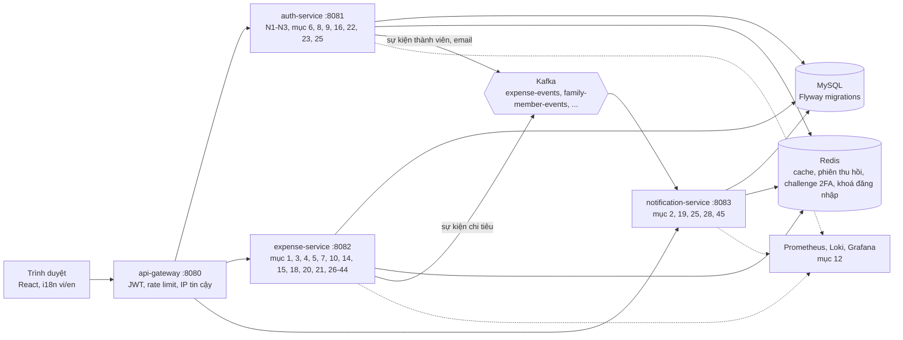
```mermaid
flowchart LR
    U["Trình duyệt<br/>React, i18n vi/en"]
    GW["api-gateway :8080<br/>JWT, rate limit, IP tin cậy"]
    AU["auth-service :8081<br/>N1-N3, mục 6, 8, 9, 16, 22, 23, 25"]
    EX["expense-service :8082<br/>mục 1, 3, 4, 5, 7, 10, 14, 15, 18, 20, 21, 26-44"]
    NO["notification-service :8083<br/>mục 2, 19, 25, 28, 45"]
    DB[("MySQL<br/>Flyway migrations")]
    RD[("Redis<br/>cache, phiên thu hồi, challenge 2FA, khoá đăng nhập")]
    KF{{"Kafka<br/>expense-events, family-member-events, ..."}}
    OB["Prometheus, Loki, Grafana<br/>mục 12"]

    U --> GW
    GW --> AU
    GW --> EX
    GW --> NO
    AU --> DB
    EX --> DB
    NO --> DB
    AU --> RD
    EX --> RD
    NO --> RD
    EX -- "sự kiện chi tiêu" --> KF
    AU -- "sự kiện thành viên, email" --> KF
    KF --> NO
    AU -.-> OB
    EX -.-> OB
    NO -.-> OB
```

| Mục | Tính năng | Service chính | Trang frontend |
|---|---|---|---|
| N1–N4 | Đăng ký/đăng nhập bằng email hoặc số điện thoại (kể cả email chưa xác thực), quên mật khẩu, Google, ghi chi tiêu | auth, expense | Login, Register, Verify, Transactions |
| 1 | Phân trang chung 5 dòng/trang | mọi service | mọi danh sách |
| 2 | Cảnh báo vượt ngân sách (app và email) | expense, notification | Notifications |
| 3 | Giao dịch định kỳ (tháng, tuần, năm) | expense | RecurringTransactions |
| 4 | Ảnh hoá đơn | expense | Transactions |
| 5 | Import và Export CSV/Excel | expense | Transactions |
| 6 | Một tài khoản, nhiều gia đình | auth | Layout, Profile |
| 7 | Một loại tiền tệ cho mỗi gia đình | expense | Wallets |
| 8 | Quản lý phiên đăng nhập | auth | Profile |
| 9 | Xác thực 2 lớp (TOTP) | auth | Login, Profile |
| 10 | Xoá mềm và thùng rác | expense | Trash |
| 11 | Integration test chạm DB thật | mọi service | không có |
| 12 | Observability | hạ tầng | không có |
| 13 | Đa ngôn ngữ vi/en | frontend | mọi trang |
| 14 | Chuyển tiền giữa các ví | expense | Wallets |
| 15 | Dữ liệu mẫu cho gia đình mới | expense | Wallets, Categories, Transactions |
| 16 | Quản lý gia đình | auth | Profile |
| 17 | Phân quyền OWNER và MEMBER | expense, auth | mọi trang |
| 18 | Ngân sách tổng, cảnh báo 80%, sao chép | expense | Budgets |
| 19 | Thông báo mở rộng và tuỳ chọn | notification | Notifications |
| 20 | Tìm kiếm, xoá hàng loạt, sao chép giao dịch | expense | Transactions |
| 21 | Báo cáo nâng cao | expense | Reports |
| 22 | Tài khoản: đổi email, xoá, xuất dữ liệu, khoá đăng nhập tạm | auth | Profile, Verify |
| 23 | Quản trị hệ thống, khoá người dùng | auth | AdminPanel |
| 24 | IP máy khách đáng tin cậy | gateway | không có |
| 25 | Email báo admin khi có tài khoản mới | auth, notification | không có |
| 26 | Ví riêng và ví chung | expense | Wallets |
| 27 | Giao dịch riêng tư | expense | Transactions, Trash |
| 28 | Yêu cầu chuyển tiền | expense, notification | Wallets |
| 29 | Giới hạn số tiền, chống ghi trùng và ghi đè | expense | Transactions, Wallets, Budgets |
| 30 | Điều chỉnh số dư (đối soát) | expense | Wallets |
| 31 | Chốt sổ theo tháng | expense | Wallets, Transactions |
| 32 | Loại ví (C3) | expense | Wallets |
| 33 | Chặn ví âm theo loại ví (A1) | expense | mọi trang ghi tiền |
| 34 | Thông báo khi sửa giao dịch (A2) | expense, notification | Notifications |
| 35 | Lịch sử thay đổi ví, ngân sách, chuyển tiền (A3) | expense | Wallets, Budgets |
| 36 | Giao dịch định kỳ chờ xác nhận và nhắc hoá đơn (A4, C2) | expense, notification | RecurringTransactions |
| 37 | Vai trò VIEWER, CHILD, hạn mức chi, duyệt khoản chi (A5) | auth, expense, notification | Profile, Transactions |
| 38 | Ngân sách theo ví/thành viên, theo năm, chuyển dư (A6) | expense | Budgets |
| 39 | Vay / cho vay / nợ (B3) | expense, notification | Loans |
| 40 | Mục tiêu tiết kiệm (C1) | expense, notification | Goals |
| 41 | Hoàn tiền / trả hàng (C4) | expense | Transactions |
| 42 | Tách giao dịch nhiều danh mục (C5) | expense | Transactions |
| 43 | Danh mục con và tag (C6) | expense | Categories, Transactions, Reports |
| 44 | Email tổng kết tháng (C7) | expense, notification | Profile |
| 45 | Thông báo dạng notice dùng chung | notification | Notifications |

---

### Nền tảng

#### N1 — Đăng ký, xác thực email, đăng nhập, làm mới token

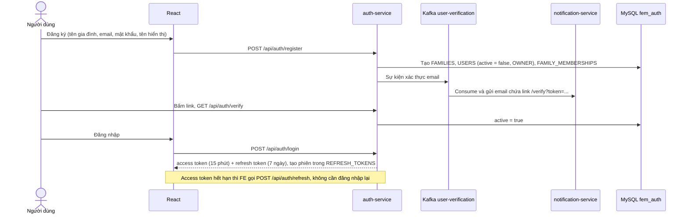
```mermaid
sequenceDiagram
    actor U as Người dùng
    participant FE as React
    participant AU as auth-service
    participant KF as Kafka user-verification
    participant NO as notification-service
    participant DB as MySQL fem_auth

    U->>FE: Đăng ký (tên gia đình, email, mật khẩu, tên hiển thị)
    FE->>AU: POST /api/auth/register
    AU->>DB: Tạo FAMILIES, USERS (active = false, OWNER), FAMILY_MEMBERSHIPS
    AU->>KF: Sự kiện xác thực email
    KF->>NO: Consume và gửi email chứa link /verify?token=...
    U->>AU: Bấm link, GET /api/auth/verify
    AU->>DB: active = true
    U->>FE: Đăng nhập
    FE->>AU: POST /api/auth/login
    AU-->>FE: access token (15 phút) + refresh token (7 ngày), tạo phiên trong REFRESH_TOKENS
    Note over FE,AU: Access token hết hạn thì FE gọi POST /api/auth/refresh, không cần đăng nhập lại
```

Access token là JWT mang `sub` (userId), `familyId`, `role`. Mọi service tự xác thực JWT độc lập, gateway chỉ kiểm tra sớm để trả 401 nhanh.

**Đăng nhập bằng số điện thoại:** ô đăng nhập nhận email hoặc số điện thoại (không có `@` thì hiểu là số điện thoại), vẫn kèm mật khẩu. Số điện thoại là tuỳ chọn, nhập lúc đăng ký hoặc trong Profile, được chuẩn hoá về dạng `+84…` (`PhoneNumbers`) nên `0912 345 678` và `+84912345678` là một số; mỗi số chỉ thuộc một tài khoản (`UNIQUE`). Số điện thoại **chưa được xác minh** bằng OTP (xem C8 trong TODO).

#### N1b — Email chưa xác thực: đăng ký lại, gửi lại link, tự dọn

Khi đăng ký xong mà chưa bấm link xác thực (hoặc link đã hết hạn), tài khoản ở trạng thái `active = false` và email vẫn nằm trong DB. Người dùng không bị kẹt:

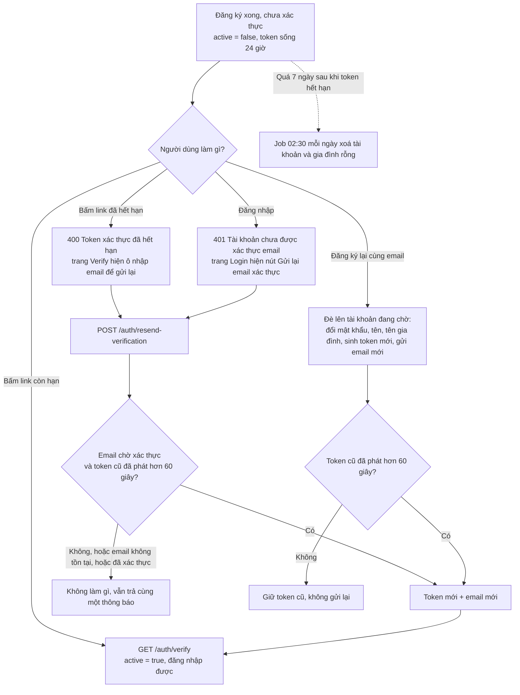
```mermaid
flowchart TD
    A["Đăng ký xong, chưa xác thực<br/>active = false, token sống 24 giờ"] --> B{"Người dùng làm gì?"}
    B -- "Bấm link còn hạn" --> V["GET /auth/verify<br/>active = true, đăng nhập được"]
    B -- "Bấm link đã hết hạn" --> E1["400 Token xác thực đã hết hạn<br/>trang Verify hiện ô nhập email để gửi lại"]
    B -- "Đăng nhập" --> E2["401 Tài khoản chưa được xác thực email<br/>trang Login hiện nút Gửi lại email xác thực"]
    B -- "Đăng ký lại cùng email" --> R["Đè lên tài khoản đang chờ:<br/>đổi mật khẩu, tên, tên gia đình, sinh token mới, gửi email mới"]
    E1 --> S["POST /auth/resend-verification"]
    E2 --> S
    S --> C{"Email chờ xác thực<br/>và token cũ đã phát hơn 60 giây?"}
    R --> C2{"Token cũ đã phát hơn 60 giây?"}
    C -- "Có" --> N["Token mới + email mới"]
    C -- "Không, hoặc email không tồn tại, hoặc đã xác thực" --> Q["Không làm gì, vẫn trả cùng một thông báo"]
    C2 -- "Có" --> N
    C2 -- "Không" --> K["Giữ token cũ, không gửi lại"]
    N --> V
    A -. "Quá 7 ngày sau khi token hết hạn" .-> D["Job 02:30 mỗi ngày xoá tài khoản và gia đình rỗng"]
```

- **Đăng ký lại đè lên tài khoản chưa xác thực** (chỉ khi tài khoản thường, chưa kích hoạt, chưa bị khoá và có mật khẩu). Người lạ đăng ký bằng email của bạn cũng không xác thực được vì không có hộp thư, nên đè lên không gây hại. Tài khoản đã xác thực, đăng ký qua Google hoặc bị khoá vẫn nhận 409.
- **`POST /api/auth/resend-verification`** (công khai, body `{email}`) luôn trả cùng một thông báo dù email có tồn tại hay không, để không lộ email nào đã đăng ký. Gateway giới hạn 3 lần/phút, và mỗi tài khoản chỉ được gửi lại sau 60 giây kể từ email trước.
- **Tự dọn:** mặc định 02:30 mỗi ngày, xoá tài khoản chưa xác thực đã quá **7 ngày sau khi token hết hạn**, kèm gia đình rỗng của nó (bỏ qua nếu tài khoản đang là chủ hộ của gia đình có thành viên khác). Đổi bằng biến môi trường `AUTH_UNVERIFIED_CLEANUP_CRON` và `AUTH_UNVERIFIED_CLEANUP_RETENTION_DAYS` trong `infra/.env` (production: `infra/.env.prod`).
- Không gửi lại email báo admin (mục 25) khi đăng ký lại đè lên tài khoản đang chờ, để admin không bị báo trùng.

#### N2 — Quên và đặt lại mật khẩu

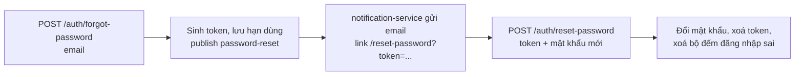
```mermaid
flowchart LR
    A["POST /auth/forgot-password<br/>email"] --> B["Sinh token, lưu hạn dùng<br/>publish password-reset"]
    B --> C["notification-service gửi email<br/>link /reset-password?token=..."]
    C --> D["POST /auth/reset-password<br/>token + mật khẩu mới"]
    D --> E["Đổi mật khẩu, xoá token,<br/>xoá bộ đếm đăng nhập sai"]
```

#### N3 — Đăng nhập Google (OAuth2)

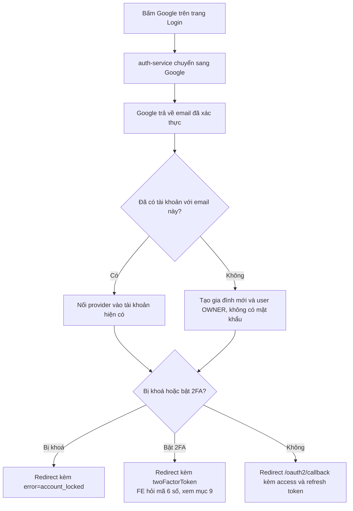
```mermaid
flowchart TD
    A["Bấm Google trên trang Login"] --> B["auth-service chuyển sang Google"]
    B --> C["Google trả về email đã xác thực"]
    C --> D{"Đã có tài khoản với email này?"}
    D -- "Có" --> E["Nối provider vào tài khoản hiện có"]
    D -- "Không" --> F["Tạo gia đình mới và user OWNER, không có mật khẩu"]
    E --> G{"Bị khoá hoặc bật 2FA?"}
    F --> G
    G -- "Bị khoá" --> X["Redirect kèm error=account_locked"]
    G -- "Bật 2FA" --> H["Redirect kèm twoFactorToken<br/>FE hỏi mã 6 số, xem mục 9"]
    G -- "Không" --> I["Redirect /oauth2/callback kèm access và refresh token"]
```

Trang Login có sẵn nút Facebook và GitHub nhưng đang ở trạng thái "sắp có" (bị vô hiệu). Backend đã có `AppOAuth2UserService` cho Facebook nhưng registration đang tắt trong `application.yml` (xem T8 trong TODO).

#### N4 — Ghi chi tiêu và cập nhật dữ liệu liên quan

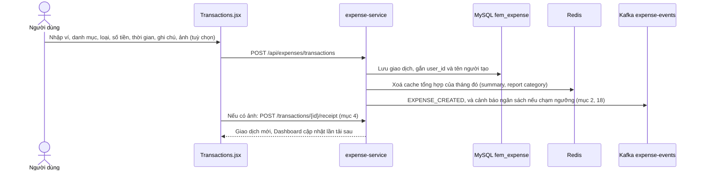
```mermaid
sequenceDiagram
    actor U as Người dùng
    participant FE as Transactions.jsx
    participant EX as expense-service
    participant DB as MySQL fem_expense
    participant RD as Redis
    participant KF as Kafka expense-events

    U->>FE: Nhập ví, danh mục, loại, số tiền, thời gian, ghi chú, ảnh (tuỳ chọn)
    FE->>EX: POST /api/expenses/transactions
    EX->>DB: Lưu giao dịch, gắn user_id và tên người tạo
    EX->>RD: Xoá cache tổng hợp của tháng đó (summary, report category)
    EX->>KF: EXPENSE_CREATED, và cảnh báo ngân sách nếu chạm ngưỡng (mục 2, 18)
    FE->>EX: Nếu có ảnh: POST /transactions/{id}/receipt (mục 4)
    EX-->>FE: Giao dịch mới, Dashboard cập nhật lần tải sau
```

Cache Redis chỉ áp dụng cho `GET /api/expenses/summary` và `GET /api/expenses/reports/category` (TTL 10 phút, khoá theo `familyId` và `yearMonth`).

---

### Mục 1 — Phân trang chạy ở backend (dùng chung, 5 dòng/trang)

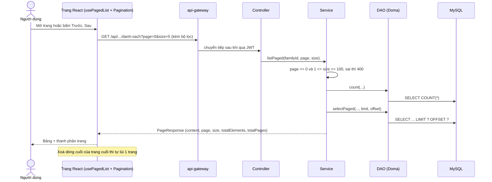
```mermaid
sequenceDiagram
    actor U as Người dùng
    participant FE as Trang React (usePagedList + Pagination)
    participant GW as api-gateway
    participant C as Controller
    participant S as Service
    participant D as DAO (Doma)
    participant DB as MySQL

    U->>FE: Mở trang hoặc bấm Trước, Sau
    FE->>GW: GET /api/.../danh-sach?page=0&size=5 (kèm bộ lọc)
    GW->>C: chuyển tiếp sau khi qua JWT
    C->>S: listPaged(familyId, page, size)
    S->>S: page >= 0 và 1 <= size <= 100, sai thì 400
    S->>D: count(...)
    D->>DB: SELECT COUNT(*)
    S->>D: selectPaged(..., limit, offset)
    D->>DB: SELECT ... LIMIT ? OFFSET ?
    S-->>FE: PageResponse (content, page, size, totalElements, totalPages)
    FE-->>U: Bảng + thanh phân trang
    Note over FE: Xoá dòng cuối của trang cuối thì tự lùi 1 trang
```

Áp dụng cho: Giao dịch, Ngân sách, Giao dịch định kỳ, Chuyển ví, 3 bảng Thùng rác, Thông báo, Admin (gia đình, người dùng), Thành viên gia đình, Lời mời đang chờ, Phiên đăng nhập. **Ví và Danh mục cố ý không phân trang** vì còn làm dữ liệu cho dropdown ở các trang khác. Component dùng chung: `frontend/src/components/Pagination.jsx` và `hooks/usePagedList.js`.

### Mục 2 — Cảnh báo ngân sách (trong app và email)

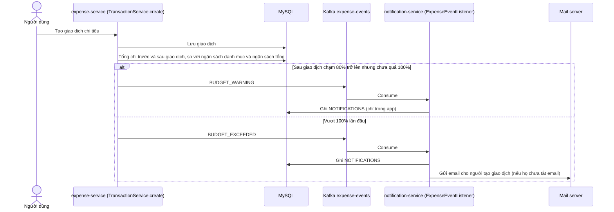
```mermaid
sequenceDiagram
    actor U as Người dùng
    participant EX as expense-service (TransactionService.create)
    participant DB as MySQL
    participant KF as Kafka expense-events
    participant NO as notification-service (ExpenseEventListener)
    participant SMTP as Mail server

    U->>EX: Tạo giao dịch chi tiêu
    EX->>DB: Lưu giao dịch
    EX->>DB: Tổng chi trước và sau giao dịch, so với ngân sách danh mục và ngân sách tổng
    alt Sau giao dịch chạm 80% trở lên nhưng chưa quá 100%
        EX->>KF: BUDGET_WARNING
        KF->>NO: Consume
        NO->>DB: Ghi NOTIFICATIONS (chỉ trong app)
    else Vượt 100% lần đầu
        EX->>KF: BUDGET_EXCEEDED
        KF->>NO: Consume
        NO->>DB: Ghi NOTIFICATIONS
        NO->>SMTP: Gửi email cho người tạo giao dịch (nếu họ chưa tắt email)
    end
```

Luật kích hoạt: cảnh báo 80% khi `trước < 80% và sau >= 80% và sau <= giới hạn`; vượt ngân sách khi `trước <= giới hạn và sau > giới hạn`. Nếu một giao dịch nhảy từ dưới 80% qua luôn 100% thì chỉ có "vượt ngân sách". Mỗi ngưỡng chỉ báo một lần cho mỗi lần chạm.

### Mục 3 — Giao dịch định kỳ (tháng, tuần, năm)

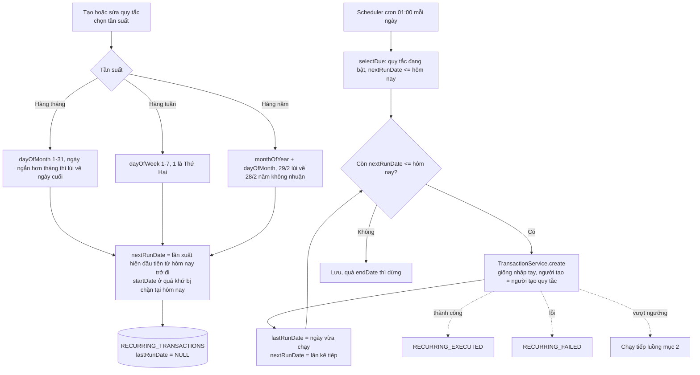
```mermaid
flowchart TD
    A["Tạo hoặc sửa quy tắc<br/>chọn tần suất"] --> B{"Tần suất"}
    B -- "Hàng tháng" --> B1["dayOfMonth 1-31, ngày ngắn hơn tháng thì lùi về ngày cuối"]
    B -- "Hàng tuần" --> B2["dayOfWeek 1-7, 1 là Thứ Hai"]
    B -- "Hàng năm" --> B3["monthOfYear + dayOfMonth, 29/2 lùi về 28/2 năm không nhuận"]
    B1 --> C["nextRunDate = lần xuất hiện đầu tiên từ hôm nay trở đi<br/>startDate ở quá khứ bị chặn tại hôm nay"]
    B2 --> C
    B3 --> C
    C --> D[("RECURRING_TRANSACTIONS<br/>lastRunDate = NULL")]

    S["Scheduler cron 01:00 mỗi ngày"] --> Q["selectDue: quy tắc đang bật, nextRunDate <= hôm nay"]
    Q --> L{"Còn nextRunDate <= hôm nay?"}
    L -- "Có" --> T["TransactionService.create<br/>giống nhập tay, người tạo = người tạo quy tắc"]
    T --> U["lastRunDate = ngày vừa chạy<br/>nextRunDate = lần kế tiếp"]
    U --> L
    L -- "Không" --> E["Lưu, quá endDate thì dừng"]
    T -. "thành công" .-> N1["RECURRING_EXECUTED"]
    T -. "lỗi" .-> N2["RECURRING_FAILED"]
    T -. "vượt ngưỡng" .-> N3["Chạy tiếp luồng mục 2"]
```

- Server tắt vài kỳ thì vòng lặp `Còn nextRunDate <= hôm nay` sinh bù đủ các kỳ bị lỡ. Quy tắc mới tạo không bị bù vì `nextRunDate` luôn tính từ hôm nay.
- Quyền: ai cũng tạo được quy tắc; chỉ người tạo quy tắc hoặc OWNER được sửa, bật/tắt, xoá (403 nếu vi phạm).
- Endpoint: `POST/GET /api/expenses/recurring-transactions`, `PUT /{id}`, `PUT /{id}/active`, `DELETE /{id}`.

### Mục 4 — Ảnh hoá đơn cho giao dịch

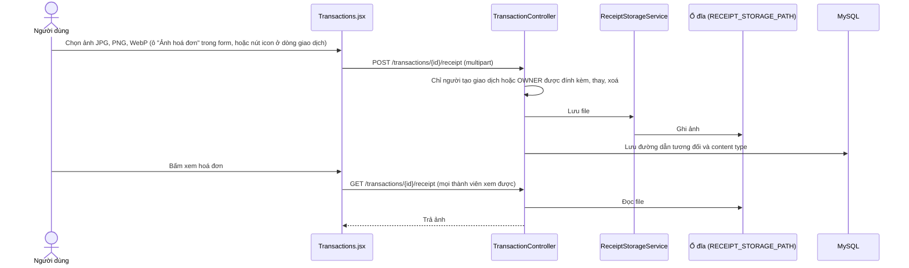
```mermaid
sequenceDiagram
    actor U as Người dùng
    participant FE as Transactions.jsx
    participant TC as TransactionController
    participant RS as ReceiptStorageService
    participant Disk as Ổ đĩa (RECEIPT_STORAGE_PATH)
    participant DB as MySQL

    U->>FE: Chọn ảnh JPG, PNG, WebP (ô "Ảnh hoá đơn" trong form, hoặc nút icon ở dòng giao dịch)
    FE->>TC: POST /transactions/{id}/receipt (multipart)
    TC->>TC: Chỉ người tạo giao dịch hoặc OWNER được đính kèm, thay, xoá
    TC->>RS: Lưu file
    RS->>Disk: Ghi ảnh
    TC->>DB: Lưu đường dẫn tương đối và content type
    U->>FE: Bấm xem hoá đơn
    FE->>TC: GET /transactions/{id}/receipt (mọi thành viên xem được)
    TC->>Disk: Đọc file
    TC-->>FE: Trả ảnh
```

Xoá ảnh: `DELETE /transactions/{id}/receipt`. Ảnh mới thay ảnh cũ thì file cũ bị xoá.

### Mục 5 — Import và Export CSV/Excel

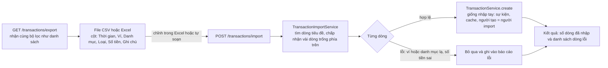
```mermaid
flowchart LR
    EXP["GET /transactions/export<br/>nhận cùng bộ lọc như danh sách"] --> FILE["File CSV hoặc Excel<br/>cột: Thời gian, Ví, Danh mục, Loại, Số tiền, Ghi chú"]
    FILE -->|"chỉnh trong Excel hoặc tự soạn"| IMP["POST /transactions/import"]
    IMP --> H["TransactionImportService<br/>tìm dòng tiêu đề, chấp nhận vài dòng trống phía trên"]
    H --> R{"Từng dòng"}
    R -->|"hợp lệ"| CR["TransactionService.create<br/>giống nhập tay: sự kiện, cache, người tạo = người import"]
    R -->|"lỗi: ví hoặc danh mục lạ, số tiền sai"| SK["Bỏ qua và ghi vào báo cáo lỗi"]
    CR --> RES["Kết quả: số dòng đã nhập và danh sách dòng lỗi"]
    SK --> RES
```

### Mục 6 — Một tài khoản thuộc nhiều gia đình

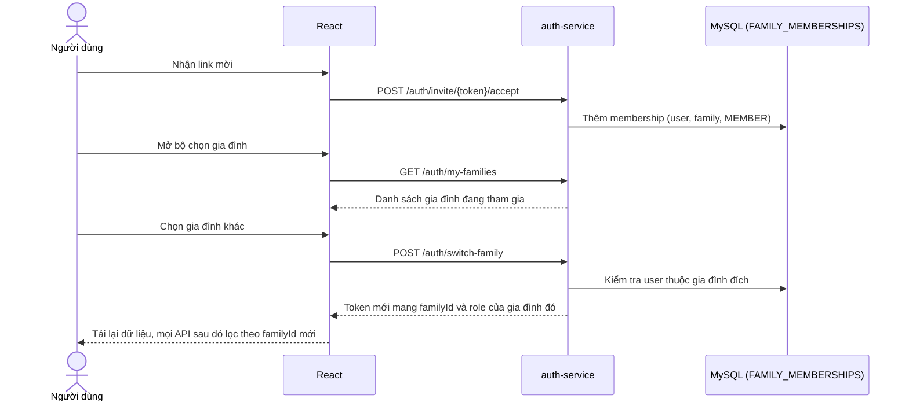
```mermaid
sequenceDiagram
    actor U as Người dùng
    participant FE as React
    participant AU as auth-service
    participant DB as MySQL (FAMILY_MEMBERSHIPS)

    U->>FE: Nhận link mời
    FE->>AU: POST /auth/invite/{token}/accept
    AU->>DB: Thêm membership (user, family, MEMBER)
    U->>FE: Mở bộ chọn gia đình
    FE->>AU: GET /auth/my-families
    AU-->>FE: Danh sách gia đình đang tham gia
    U->>FE: Chọn gia đình khác
    FE->>AU: POST /auth/switch-family
    AU->>DB: Kiểm tra user thuộc gia đình đích
    AU-->>FE: Token mới mang familyId và role của gia đình đó
    FE-->>U: Tải lại dữ liệu, mọi API sau đó lọc theo familyId mới
```

`USERS.family_id` và `USERS.role` chỉ lưu gia đình đang hoạt động; danh sách đầy đủ nằm ở `FAMILY_MEMBERSHIPS`. Quản lý gia đình xem mục 16.

### Mục 7 — Một loại tiền tệ cho mỗi gia đình

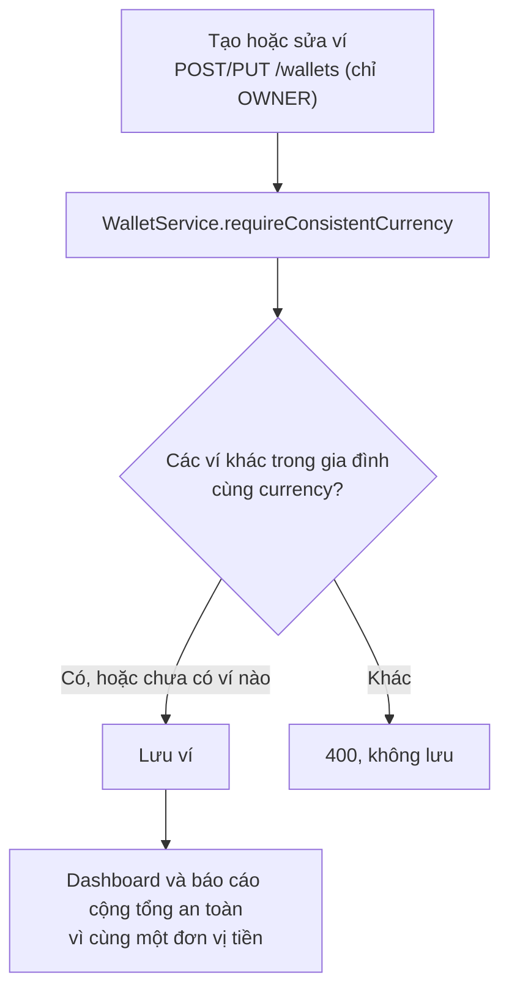
```mermaid
flowchart TD
    A["Tạo hoặc sửa ví<br/>POST/PUT /wallets (chỉ OWNER)"] --> B["WalletService.requireConsistentCurrency"]
    B --> C{"Các ví khác trong gia đình<br/>cùng currency?"}
    C -- "Có, hoặc chưa có ví nào" --> D["Lưu ví"]
    C -- "Khác" --> E["400, không lưu"]
    D --> F["Dashboard và báo cáo cộng tổng an toàn<br/>vì cùng một đơn vị tiền"]
```

Số dư hiện tại của ví = số dư đầu + thu − chi + chuyển vào − chuyển ra + điều chỉnh số dư (xem mục 14, 30). Ví có thể là ví chung hoặc ví riêng của một thành viên, xem mục 26.

### Mục 8 — Quản lý phiên đăng nhập, đăng xuất từ xa

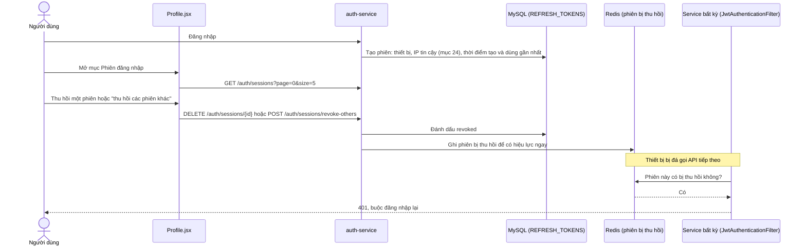
```mermaid
sequenceDiagram
    actor U as Người dùng
    participant FE as Profile.jsx
    participant AU as auth-service
    participant DB as MySQL (REFRESH_TOKENS)
    participant RD as Redis (phiên bị thu hồi)
    participant SV as Service bất kỳ (JwtAuthenticationFilter)

    U->>AU: Đăng nhập
    AU->>DB: Tạo phiên: thiết bị, IP tin cậy (mục 24), thời điểm tạo và dùng gần nhất
    U->>FE: Mở mục Phiên đăng nhập
    FE->>AU: GET /auth/sessions?page=0&size=5
    U->>FE: Thu hồi một phiên hoặc "thu hồi các phiên khác"
    FE->>AU: DELETE /auth/sessions/{id} hoặc POST /auth/sessions/revoke-others
    AU->>DB: Đánh dấu revoked
    AU->>RD: Ghi phiên bị thu hồi để có hiệu lực ngay
    Note over SV,RD: Thiết bị bị đá gọi API tiếp theo
    SV->>RD: Phiên này có bị thu hồi không?
    RD-->>SV: Có
    SV-->>U: 401, buộc đăng nhập lại
```

Thời gian hiển thị: backend trả `LocalDateTime` theo giờ UTC không kèm múi giờ, frontend đổi sang giờ máy người xem bằng `formatServerDateTime` (`frontend/src/utils/format.js`).

**Xoay và phát hiện dùng lại refresh token** (`AuthService#refresh`): mỗi lần refresh, token cũ bị thu hồi **nguyên tử** ngay trước khi phát token mới (`RefreshTokenDao#revokeById` chỉ update khi `revoked = false`, trả về số dòng bị ảnh hưởng) — hai request refresh song song cùng một token chỉ một request thắng, request còn lại nhận 401 thay vì cả hai cùng phát được token mới. Nếu một refresh token **đã bị xoay** (`rotated_at`, V12) lại được gửi lên lần nữa **quá 60 giây** sau khi xoay (dấu hiệu kinh điển của việc token bị đánh cắp và dùng song song với chủ tài khoản thật), toàn bộ phiên đăng nhập của user đó bị thu hồi ngay (`revokeAllByUserId`), buộc đăng nhập lại ở mọi thiết bị. Trong 60 giây đầu thì chỉ trả 401: thường là hai tab trình duyệt dùng chung một refresh token cùng refresh một lúc, không phải bị đánh cắp. Token bị thu hồi vì đăng xuất hoặc admin khoá không có `rotated_at`, nên không bị nhầm là dùng lại. `refresh` cũng kiểm tra tài khoản còn `active` (đã xác thực email), giống điều kiện ở `login`.

### Mục 9 — Xác thực 2 lớp (TOTP)

**Thành phần và nơi lưu dữ liệu**

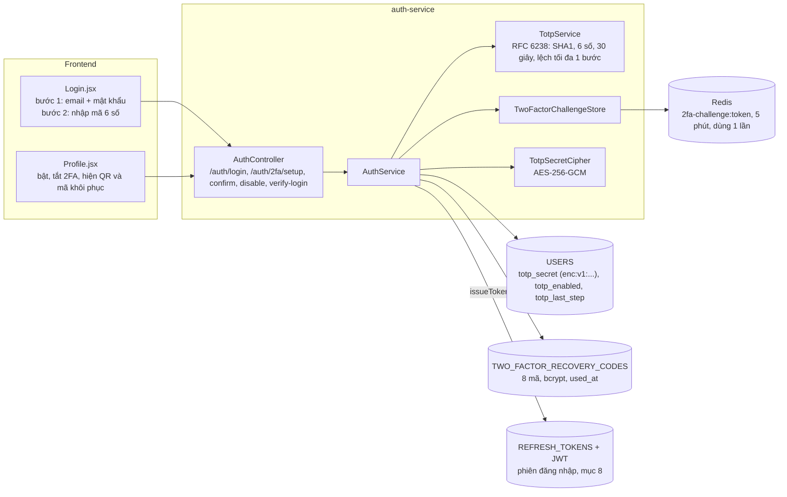
```mermaid
flowchart LR
    subgraph FE["Frontend"]
        LG["Login.jsx<br/>bước 1: email + mật khẩu<br/>bước 2: nhập mã 6 số"]
        PF["Profile.jsx<br/>bật, tắt 2FA, hiện QR và mã khôi phục"]
    end

    subgraph AUTH["auth-service"]
        AC["AuthController<br/>/auth/login, /auth/2fa/setup, confirm, disable, verify-login"]
        AS["AuthService"]
        TS["TotpService<br/>RFC 6238: SHA1, 6 số, 30 giây, lệch tối đa 1 bước"]
        CS["TwoFactorChallengeStore"]
        CI["TotpSecretCipher<br/>AES-256-GCM"]
    end

    U[("USERS<br/>totp_secret (enc:v1:...), totp_enabled, totp_last_step")]
    R[("TWO_FACTOR_RECOVERY_CODES<br/>8 mã, bcrypt, used_at")]
    RD[("Redis<br/>2fa-challenge:token, 5 phút, dùng 1 lần")]
    RT[("REFRESH_TOKENS + JWT<br/>phiên đăng nhập, mục 8")]

    LG --> AC
    PF --> AC
    AC --> AS
    AS --> TS
    AS --> CI
    AS --> CS --> RD
    AS --> U
    AS --> R
    AS -->|"issueTokens"| RT
```

**Trạng thái 2FA của một tài khoản**

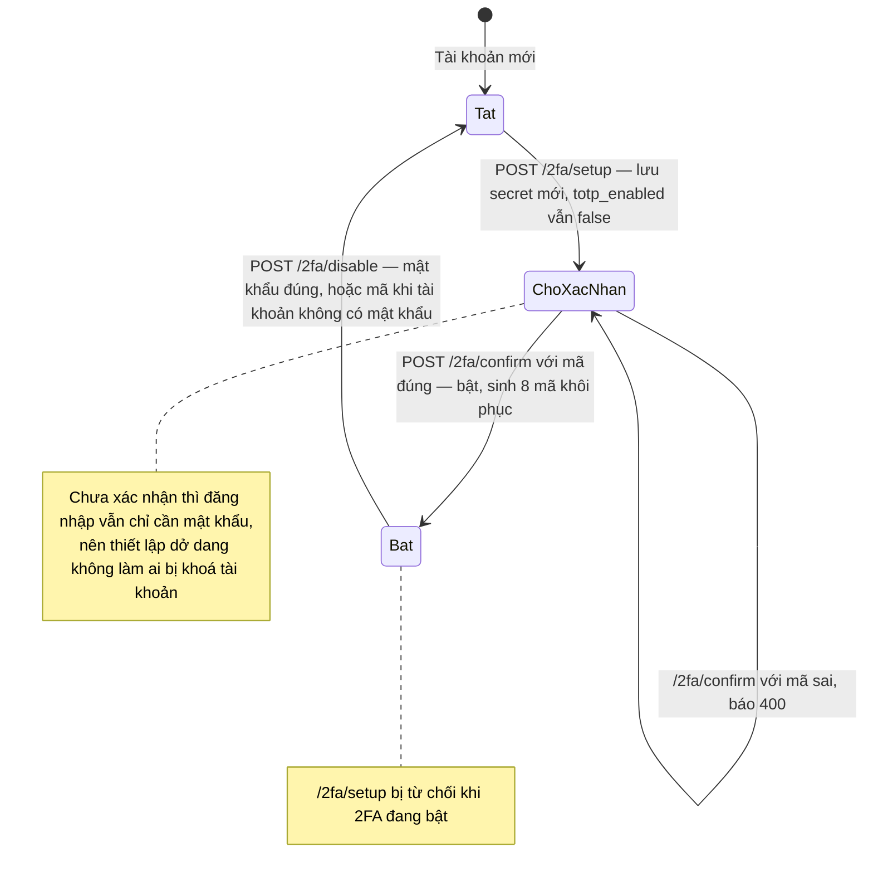
```mermaid
stateDiagram-v2
    [*] --> Tat: Tài khoản mới
    Tat --> ChoXacNhan: POST /2fa/setup — lưu secret mới, totp_enabled vẫn false
    ChoXacNhan --> ChoXacNhan: /2fa/setup lần nữa — đổi sang secret mới
    ChoXacNhan --> Bat: POST /2fa/confirm với mã đúng — bật, sinh 8 mã khôi phục
    ChoXacNhan --> ChoXacNhan: /2fa/confirm với mã sai, báo 400
    Bat --> Tat: POST /2fa/disable — mật khẩu đúng, hoặc mã khi tài khoản không có mật khẩu
    note right of ChoXacNhan
        Chưa xác nhận thì đăng nhập vẫn chỉ cần mật khẩu,
        nên thiết lập dở dang không làm ai bị khoá tài khoản
    end note
    note right of Bat
        /2fa/setup bị từ chối khi 2FA đang bật
    end note
```

**Luồng đăng nhập có 2FA**

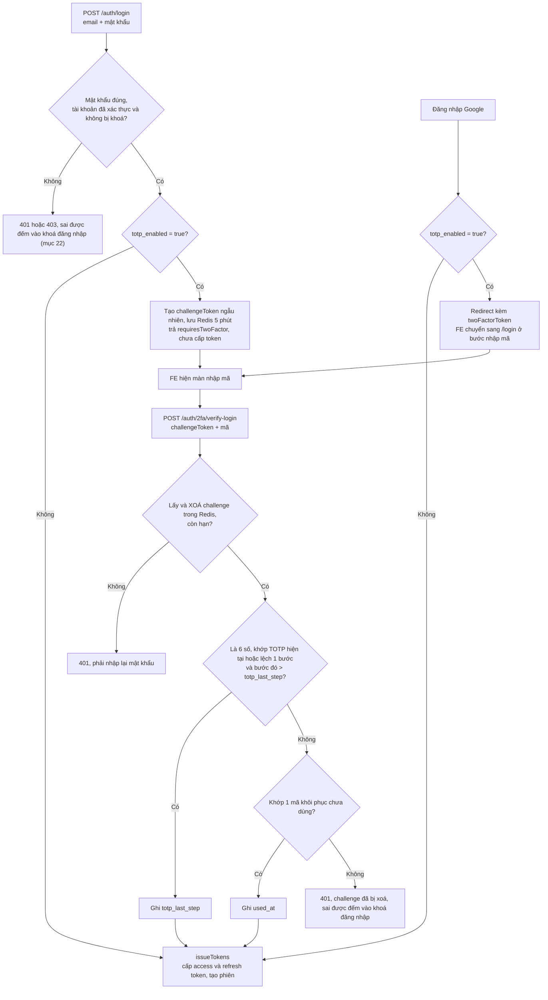
```mermaid
flowchart TD
    A["POST /auth/login<br/>email + mật khẩu"] --> B{"Mật khẩu đúng,<br/>tài khoản đã xác thực và không bị khoá?"}
    B -- "Không" --> X1["401 hoặc 403, sai được đếm vào khoá đăng nhập (mục 22)"]
    B -- "Có" --> C{"totp_enabled = true?"}
    C -- "Không" --> T["issueTokens<br/>cấp access và refresh token, tạo phiên"]
    C -- "Có" --> D["Tạo challengeToken ngẫu nhiên, lưu Redis 5 phút<br/>trả requiresTwoFactor, chưa cấp token"]
    D --> E["FE hiện màn nhập mã"]
    E --> F["POST /auth/2fa/verify-login<br/>challengeToken + mã"]
    F --> G{"Lấy và XOÁ challenge trong Redis,<br/>còn hạn?"}
    G -- "Không" --> X2["401, phải nhập lại mật khẩu"]
    G -- "Có" --> H{"Là 6 số, khớp TOTP hiện tại hoặc lệch 1 bước<br/>và bước đó > totp_last_step?"}
    H -- "Có" --> H2["Ghi totp_last_step"] --> T
    H -- "Không" --> I{"Khớp 1 mã khôi phục chưa dùng?"}
    I -- "Có" --> J["Ghi used_at"] --> T
    I -- "Không" --> X3["401, challenge đã bị xoá, sai được đếm vào khoá đăng nhập"]

    G2["Đăng nhập Google"] --> G3{"totp_enabled = true?"}
    G3 -- "Không" --> T
    G3 -- "Có" --> G4["Redirect kèm twoFactorToken<br/>FE chuyển sang /login ở bước nhập mã"] --> E
```

Điểm chính:
- Mã 6 số **không được lưu ở đâu**: server tính lại từ secret và giờ hiện tại mỗi lần kiểm tra, rồi so với mã người dùng nhập. Chỉ secret, mốc `totp_last_step` và bản băm mã khôi phục được lưu.
- Mã đã dùng không dùng lại được (`totp_last_step` chỉ tăng).
- QR do frontend vẽ bằng thư viện `qrcode` từ chuỗi `otpauth://`; không có dịch vụ ngoài nào. TOTP tự cài bằng JDK, không dùng thư viện TOTP.
- Khoá mã hoá secret lấy từ biến môi trường `TOTP_ENCRYPTION_KEY` (compose có giá trị mặc định chỉ dùng cho dev, khi triển khai thật phải đặt khoá riêng). Secret cũ dạng thô vẫn đọc được và được mã hoá lại lần ghi kế tiếp.

### Mục 10 — Xoá mềm và thùng rác

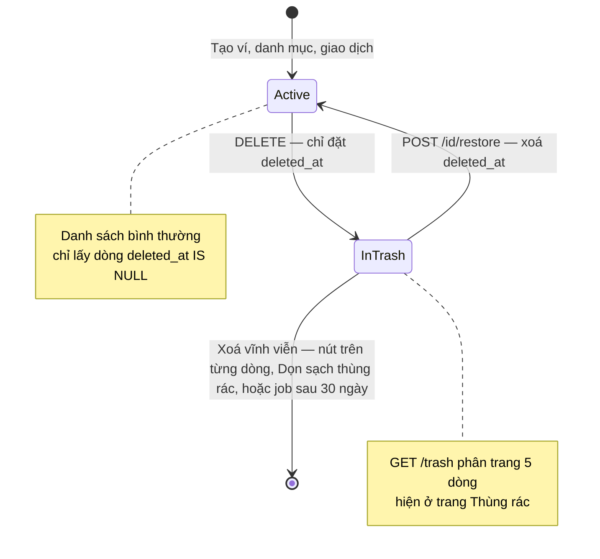
```mermaid
stateDiagram-v2
    [*] --> Active: Tạo ví, danh mục, giao dịch
    Active --> InTrash: DELETE — chỉ đặt deleted_at
    InTrash --> Active: POST /id/restore — xoá deleted_at
    InTrash --> [*]: Xoá vĩnh viễn — nút trên từng dòng, Dọn sạch thùng rác, hoặc job sau 30 ngày
    note right of Active
        Danh sách bình thường
        chỉ lấy dòng deleted_at IS NULL
    end note
    note right of InTrash
        GET /trash phân trang 5 dòng
        hiện ở trang Thùng rác
    end note
```

Quyền xoá và khôi phục: ví và danh mục chỉ OWNER; giao dịch thì người tạo hoặc OWNER. Khoản chuyển giữa các ví bị xoá cứng, không đi qua thùng rác. Ví đã có lịch sử chuyển thì không xoá được.

**Xoá vĩnh viễn** (`TrashController`, `TrashService`):

| Endpoint | Ai được dùng |
|---|---|
| `DELETE /api/expenses/trash/transactions/{id}` | Người tạo hoặc OWNER (như khôi phục). Giao dịch riêng tư của người khác trả 404, kể cả với OWNER |
| `DELETE /api/expenses/trash/wallets/{id}` | OWNER |
| `DELETE /api/expenses/trash/categories/{id}` | OWNER |
| `DELETE /api/expenses/trash` — "Dọn sạch thùng rác" | OWNER; phải gõ "XOÁ" để xác nhận. Gồm cả giao dịch riêng tư của thành viên khác: chỉ người tạo mới đưa được chúng vào thùng rác, nên xoá hẳn không làm lộ gì. Trả về số mục đã xoá theo loại và số mục được giữ lại |

`TrashRetentionScheduler` chạy lúc 03:30 mỗi đêm (`trash.purge-cron`) và xoá vĩnh viễn mọi mục nằm trong thùng rác quá `trash.retention-days` ngày (mặc định 30, env `TRASH_RETENTION_DAYS`), ở mọi gia đình.

Cả ba đường (nút từng dòng, Dọn sạch, job) đi qua **cùng một mã xử lý cho từng dòng** trong `TrashService`:
- **Thứ tự:** giao dịch trước, rồi mới đến ví và danh mục — giao dịch trong thùng rác vẫn giữ khoá ngoại tới ví/danh mục của nó.
- **Ví/danh mục còn bị tham chiếu thì không xoá:** còn giao dịch (đếm cả giao dịch trong thùng rác — `countAllByWalletId`/`countAllByCategoryId`), giao dịch định kỳ, lịch sử chuyển tiền (ví) hoặc ngân sách (danh mục). Xoá từng dòng thì trả 409 nói rõ lý do; Dọn sạch và job thì bỏ qua mục đó, để lại trong thùng rác và thử lại lần sau.
- **Mỗi dòng một transaction riêng** (`TrashPurger`, `REQUIRES_NEW`): một dòng lỗi không làm hoàn tác các dòng đã xoá, và job vẫn chạy tiếp.
- **Ảnh hoá đơn** bị xoá khỏi storage sau khi việc xoá dòng giao dịch đã commit (lỡ xoá file lỗi thì chỉ còn file thừa, không bao giờ có giao dịch trỏ tới file đã mất).
- **Lịch sử giao dịch được giữ lại:** `TRANSACTION_AUDIT_LOGS` cố ý không có khoá ngoại tới `TRANSACTIONS`, và mỗi lần xoá vĩnh viễn ghi thêm một dòng `PURGED` (người xoá; với job là "Hệ thống (tự dọn thùng rác)").

### Mục 11 — Integration test chạm DB thật

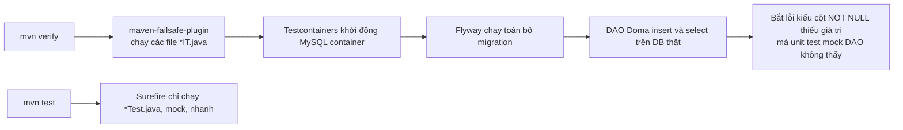
```mermaid
flowchart LR
    A["mvn verify"] --> B["maven-failsafe-plugin<br/>chạy các file *IT.java"]
    B --> C["Testcontainers khởi động MySQL container"]
    C --> D["Flyway chạy toàn bộ migration"]
    D --> E["DAO Doma insert và select trên DB thật"]
    E --> F["Bắt lỗi kiểu cột NOT NULL thiếu giá trị<br/>mà unit test mock DAO không thấy"]
    G["mvn test"] --> H["Surefire chỉ chạy *Test.java, mock, nhanh"]
```

Chỉ cần Docker đang chạy (Docker Desktop trên Windows cũng được). Testcontainers phải từ **1.21.4** trở lên: bản cũ hơn gọi Docker bằng API version mà Docker Engine 29+ từ chối (API tối thiểu 1.44), khiến mọi `*IT.java` báo "Could not find a valid Docker environment". CI (`.github/workflows/backend-ci.yml`) chạy `mvn verify` nên integration test chạy trên mọi push/PR. Ngoài ra nên `EXPLAIN` toàn bộ file `.sql` mới trên MySQL thật sau mỗi lần thêm truy vấn, vì unit test dùng DAO giả không bắt được lỗi SQL.

### Mục 12 — Observability

```mermaid
flowchart LR
    SV["5 service Spring Boot<br/>/actuator/prometheus"] -->|"scrape định kỳ"| P["Prometheus :9090"]
    CT["Log của các container Docker"] --> PT["Promtail"] --> L["Loki :3100"]
    P --> G["Grafana :3001<br/>dashboard có sẵn, tự nạp datasource"]
    L --> G
    G --> V["Xem metrics và tra log trên một màn hình"]
```

### Mục 13 — Đa ngôn ngữ (vi/en)

```mermaid
flowchart TD
    A["Mở trang"] --> B{"localStorage có fem-language?"}
    B -- "Có" --> C["Dùng ngôn ngữ đã lưu"]
    B -- "Chưa" --> D["Mặc định Tiếng Việt,<br/>không lấy theo ngôn ngữ trình duyệt"]
    C --> R["Render chữ từ src/locales/vi hoặc en / tên-trang.json"]
    D --> R
    S["Bấm nút VI | EN<br/>có ở cả trang công khai và sau đăng nhập"] --> W["i18n.changeLanguage và lưu localStorage"]
    W --> R
```

Thêm trang mới chỉ cần tạo `locales/vi/<tên>.json` và `locales/en/<tên>.json`, i18n tự nhận qua `import.meta.glob`. Thông báo lỗi do backend trả về (validation, nghiệp vụ) hiện là tiếng Việt cố định, chưa dịch theo ngôn ngữ giao diện.

---

### Mục 14 — Chuyển tiền giữa các ví

```mermaid
sequenceDiagram
    actor U as Người dùng (OWNER hoặc MEMBER)
    participant FE as Wallets.jsx
    participant EX as WalletTransferService
    participant DB as MySQL
    participant K as Kafka expense-events
    participant N as notification-service
    participant AU as auth-service (internal)

    U->>FE: Chọn ví nguồn (ví riêng của mình), ví đích, số tiền, thời gian, ghi chú
    FE->>EX: POST /api/expenses/transfers (có thể kèm header Idempotency-Key)
    EX->>DB: Kiểm tra 2 ví thuộc gia đình, chưa xoá, khác nhau, cùng loại tiền, số tiền 10.000đ–5.000.000đ (mục 29)
    EX->>DB: Ví nguồn phải là ví RIÊNG của người chuyển; ví đích là ví riêng của người khác hoặc ví chung (mục 26)
    EX->>DB: Khoá dòng ví nguồn (SELECT ... FOR UPDATE), số tiền phải <= số dư hiện tại của ví nguồn
    EX->>DB: Ghi WALLET_TRANSFERS (không tạo giao dịch thu hoặc chi)
    EX->>K: Publish WALLET_TRANSFERRED (sau khi commit)
    EX-->>FE: OK, FE tải lại lịch sử chuyển và số dư ví
    K->>N: WALLET_TRANSFERRED
    N->>DB: 1 dòng thông báo trong app, dùng chung cho cả gia đình
    N-->>U: Email "đã trừ" cho người tạo giao dịch (nếu chưa tắt)
    N->>AU: GET /internal/families/{id}/members (JWT role SERVICE)
    N-->>U: Email "đã cộng, ai chuyển" cho từng thành viên khác (nếu chưa tắt)
    U->>FE: Sửa hoặc xoá một khoản chuyển
    FE->>EX: PUT hoặc DELETE /transfers/id (người tạo hoặc OWNER)
    Note over EX,DB: Khi sửa, số tiền cũ của chính khoản đang sửa được cộng/trừ lại trước khi so với số dư mới — tránh báo "vượt số dư" oan khi chỉ sửa ghi chú
```

Khoản chuyển **không** tính vào báo cáo thu chi, biểu đồ xu hướng hay ngân sách, nên tổng thu chi không bị sai. Endpoint: `POST/GET /api/expenses/transfers` (phân trang), `PUT /{id}`, `DELETE /{id}`.

Quy tắc ví nguồn/ví đích áp dụng cho cả OWNER: không ai chuyển được tiền ra khỏi ví riêng của người khác hay ví chung. Muốn lấy tiền từ ví của thành viên khác thì gửi **yêu cầu chuyển tiền** (mục 28). Khoá dòng ví nguồn giúp hai lần chuyển đồng thời không cùng đọc một số dư rồi cùng vượt quá. Khi sửa khoản chuyển cũ (tạo trước khi có quy tắc ví riêng), mỗi phía chỉ bị kiểm tra lại nếu ví ở phía đó thay đổi.

### Mục 15 — Dữ liệu mẫu cho gia đình mới

```mermaid
flowchart TD
    A["Trang Ví, Danh mục hoặc Giao dịch<br/>gia đình chưa có ví hoặc danh mục"] --> B{"Người dùng là OWNER?"}
    B -- "Không" --> C["Hiện dòng 'Hãy nhờ chủ hộ tạo ví và danh mục'"]
    B -- "Có" --> D["Nút 'Tạo ví & danh mục mẫu'"]
    D --> E["POST /api/expenses/onboarding/seed-defaults"]
    E --> F{"Gia đình chưa có danh mục?"}
    F -- "Có" --> G["Tạo 8 danh mục chi: Ăn uống, Đi lại, Nhà cửa & hoá đơn, Mua sắm, Sức khoẻ, Giáo dục, Giải trí, Khác<br/>và 3 danh mục thu: Lương, Thưởng, Thu nhập khác"]
    F -- "Không" --> H["Bỏ qua phần danh mục"]
    G --> I{"Gia đình chưa có ví?"}
    H --> I
    I -- "Có" --> J["Tạo ví 'Tiền mặt', VND, số dư 0"]
    I -- "Không" --> K["Bỏ qua phần ví"]
```

Mỗi phần làm độc lập và làm lại nhiều lần không tạo trùng.

### Mục 16 — Quản lý gia đình

```mermaid
flowchart TD
    subgraph OWNER["Chỉ OWNER"]
        R["PUT /auth/family<br/>đổi tên gia đình"]
        T["POST /auth/family/transfer-ownership<br/>chuyển quyền chủ hộ cho 1 thành viên"]
        I1["GET /auth/invites<br/>lời mời đang chờ, phân trang"]
        I2["DELETE /auth/invites/id<br/>huỷ lời mời"]
        I3["POST /auth/invites/id/resend<br/>token mới, gia hạn, gửi lại email"]
        RM["DELETE /auth/family/members/userId<br/>xoá thành viên"]
    end
    subgraph MEMBER["Thành viên (không phải chủ hộ)"]
        L["POST /auth/family/leave<br/>rời gia đình"]
    end
    T --> TK["Trả token mới cho người gọi vì role đã đổi"]
    L --> L2{"Còn gia đình khác?"}
    L2 -- "Có" --> L3["Chuyển sang gia đình đầu tiên còn lại"]
    L2 -- "Không" --> L4["Tạo gia đình cá nhân mới, người này là OWNER"]
    L3 --> TK2["Trả token mới"]
    L4 --> TK2
    OWNER_LEAVE["OWNER gọi /family/leave"] --> ERR["400: phải chuyển quyền chủ hộ trước"]
```

Rời gia đình, chuyển quyền, xoá thành viên đều phát sự kiện thành viên (mục 19). Gia đình luôn còn ít nhất một OWNER. **Chưa có** chức năng xoá gia đình (TODO T7).

### Mục 17 — Phân quyền OWNER và MEMBER

```mermaid
flowchart LR
    A["Yêu cầu từ người dùng"] --> B{"Đối tượng"}
    B -- "Ví, danh mục, ngân sách,<br/>dữ liệu mẫu" --> C["Chỉ OWNER được tạo, sửa, xoá, khôi phục<br/>MEMBER chỉ xem"]
    B -- "Giao dịch" --> D["MEMBER: chỉ sửa, xoá, khôi phục,<br/>đính kèm ảnh của chính mình<br/>OWNER: tất cả, trừ giao dịch riêng tư của người khác (mục 27)<br/>Ghi vào ví riêng của người khác: 403 (mục 26)"]
    B -- "Giao dịch định kỳ" --> E["Ai cũng tạo được<br/>sửa, bật/tắt, xoá: người tạo quy tắc hoặc OWNER"]
    B -- "Chuyển ví" --> F["Ai cũng tạo được, chỉ từ ví riêng của mình (mục 14)<br/>sửa, xoá: người tạo hoặc OWNER"]
    B -- "Yêu cầu chuyển tiền" --> F2["Ai cũng gửi được<br/>duyệt, từ chối: chỉ chủ ví nguồn (mục 28)"]
    B -- "Gia đình, lời mời, xoá thành viên" --> G["Chỉ OWNER"]
    C --> H["Vi phạm: 403 Bạn không có quyền thực hiện thao tác này"]
    D --> H
    E --> H
    F --> H
    F2 --> H
    G --> H
```

Frontend **ẩn** (không chỉ vô hiệu hoá) form và nút mà người dùng không có quyền; backend vẫn kiểm tra lại. Bảng giao dịch có cột "Người tạo" (tên được lưu kèm giao dịch lúc tạo nên người đã rời gia đình vẫn hiện tên, giao dịch cũ chưa có tên hiện "Thành viên cũ").

### Mục 18 — Ngân sách tổng, cảnh báo và sao chép

```mermaid
flowchart TD
    A["Tạo ngân sách<br/>chọn danh mục hoặc 'Tất cả danh mục'"] --> B{"Chọn gì?"}
    B -- "Một danh mục" --> C["Chi của danh mục đó trong tháng<br/>mỗi danh mục và tháng chỉ có 1 ngân sách"]
    B -- "Tất cả danh mục" --> D["categoryId = null: tổng mọi khoản CHI trong tháng<br/>mỗi tháng chỉ có 1 ngân sách tổng"]
    C --> E["Mỗi giao dịch chi: so tổng trước và sau"]
    D --> E
    E --> F["Chạm 80%: BUDGET_WARNING, chỉ trong app"]
    E --> G["Vượt 100%: BUDGET_EXCEEDED, trong app và email"]

    S["POST /budgets/copy<br/>fromMonth, toMonth"] --> S1["Sao chép mọi ngân sách của tháng nguồn sang tháng đích<br/>bỏ qua cái đã có ở tháng đích"]
    S1 --> S2["Trả copied và skipped"]
```

Chỉ OWNER tạo, sửa, xoá, sao chép ngân sách. Ngân sách trùng (cùng danh mục hoặc cùng tổng trong một tháng) trả 400 với thông báo tiếng Việt.

### Mục 19 — Thông báo mở rộng và tuỳ chọn

```mermaid
flowchart LR
    subgraph EXP["expense-service, topic expense-events"]
        E1["BUDGET_WARNING"]
        E2["BUDGET_EXCEEDED"]
        E3["RECURRING_EXECUTED"]
        E4["RECURRING_FAILED"]
        E5["WALLET_TRANSFERRED"]
        E6["EXPENSE_DELETED"]
        E7["TRANSFER_REQUESTED<br/>TRANSFER_REQUEST_APPROVED<br/>TRANSFER_REQUEST_REJECTED"]
    end
    subgraph AUTHS["auth-service, topic family-member-events"]
        A1["MEMBER_JOINED"]
        A2["MEMBER_LEFT"]
        A3["MEMBER_REMOVED"]
    end
    E1 --> N["notification-service<br/>ghi NOTIFICATIONS theo gia đình"]
    E2 --> N
    E3 --> N
    E4 --> N
    E5 --> N
    E6 --> N
    E7 --> N
    A1 --> N
    A2 --> N
    A3 --> N
    E2 -->|"nếu người tạo chưa tắt email"| M["Email cảnh báo vượt ngân sách"]
    E5 -->|"nếu chưa tắt email"| W1["Email 'đã trừ' cho người tạo"]
    E5 -->|"tra email qua auth-service /internal, nếu chưa tắt"| W2["Email 'đã cộng' cho từng thành viên khác"]
    E7 -->|"nếu chưa tắt email"| W3["Email cho chủ ví (yêu cầu mới)<br/>hoặc người gửi (bị từ chối)"]
    N --> UI["Trang Notifications + chuông báo chưa đọc"]
    P["Tuỳ chọn của từng người dùng<br/>hiện trong app theo loại, email cho BUDGET_EXCEEDED, WALLET_TRANSFERRED,<br/>TRANSFER_REQUESTED, TRANSFER_REQUEST_REJECTED"] -.->|"lọc lúc đọc danh sách và đếm chưa đọc"| UI
```

Endpoint: `GET /api/notifications` (phân trang), `GET /unread-count`, `PUT /{id}/read`, `PUT /read-all`, `DELETE /{id}`, `DELETE /read` (xoá mọi thông báo đã đọc), `GET/PUT /preferences`. Vì thông báo được lưu theo gia đình, việc tắt hiển thị một loại chỉ ảnh hưởng người tắt (lọc lúc đọc), không mất thông báo của người khác. Quy tắc định kỳ đang lỗi sẽ báo lỗi mỗi ngày cho đến khi được sửa.

`GET /api/notifications` **không** trả `payloadJson` — dữ liệu đó là nguyên văn event Kafka gốc (gồm cả email người thực hiện) và mọi thành viên gia đình đều đọc được danh sách này, nên trường này bị bỏ khỏi `NotificationResponse` để không lộ email giữa các thành viên với nhau. Cột `payload_json` vẫn còn trong DB, chỉ không trả ra qua API.

### Mục 20 — Tìm kiếm, xoá hàng loạt, sao chép giao dịch

```mermaid
flowchart TD
    A["Trang Giao dịch"] --> B["Bộ lọc: ví, danh mục, loại, từ ngày, đến ngày<br/>ghi chú (q), số tiền tối thiểu, tối đa"]
    B --> C["GET /transactions?...&page=0&size=5<br/>q không phân biệt hoa thường, ký tự % và _ được thoát đúng<br/>min lớn hơn max trả 400"]
    C --> D["Bảng kết quả có cột chọn"]
    D --> E["Chọn nhiều dòng<br/>dòng không có quyền thì ô chọn bị vô hiệu"]
    E --> F["POST /transactions/bulk-delete<br/>ids tối đa 100"]
    F --> G["Mỗi id xử lý như xoá 1 giao dịch (xoá mềm, sự kiện, cache)"]
    G --> H["Trả deleted, skipped (không tồn tại), forbidden (không có quyền)"]
    D --> I["Nút Sao chép: điền sẵn form bằng ví, danh mục, loại, số tiền, ghi chú<br/>của dòng đó, thời gian = bây giờ, chưa lưu cho đến khi bấm Thêm"]
```

Bộ lọc `q`, `minAmount`, `maxAmount` áp dụng cho cả `GET /transactions/export` (mục 5).

### Mục 21 — Báo cáo nâng cao

```mermaid
flowchart LR
    P["Trang Báo cáo /reports"] --> T1["Khoảng ngày tuỳ chọn<br/>GET /reports/range?from&to"]
    P --> T2["Theo năm<br/>GET /reports/year?year"]
    P --> T3["Theo thành viên<br/>GET /reports/by-member?from&to"]
    P --> T4["So sánh tháng<br/>GET /reports/compare?month&withMonth"]
    T1 --> R1["Tổng thu, chi, chênh lệch, theo danh mục<br/>gom theo ngày nếu khoảng tối đa 62 ngày, ngược lại theo tháng<br/>khoảng tối đa 366 ngày"]
    T2 --> R2["12 tháng, tháng không có dữ liệu = 0"]
    T3 --> R3["Thu và chi của từng người, sắp theo chi giảm dần"]
    T4 --> R4["Tổng thu chi hai tháng, chi theo danh mục và chênh lệch"]
    P --> PR["Nút In / Lưu PDF<br/>window.print(), CSS @media print ẩn menu và nút"]
```

Các báo cáo bỏ qua giao dịch đã xoá mềm và không tính khoản chuyển ví. Dashboard vẫn dùng bộ endpoint cũ `summary`, `reports/category`, `reports/trend`, `reports/wallet-category` (có cache Redis). Không có PDF phía server, PDF là in từ trình duyệt.

### Mục 22 — Quản lý tài khoản

**Khoá đăng nhập tạm**

```mermaid
flowchart TD
    A["POST /auth/login (hoặc nhập mã 2FA sai)"] --> B{"Đã sai 5 lần liên tiếp trong 15 phút<br/>với email này? (Redis login-fail:email)"}
    B -- "Có" --> X["429 Tài khoản tạm khoá, thử lại sau N phút"]
    B -- "Không" --> C{"Đúng?"}
    C -- "Không" --> D["Tăng bộ đếm, 401 (email không tồn tại cũng đếm như sai mật khẩu, cùng thông báo)"]
    C -- "Có" --> E["Xoá bộ đếm, tiếp tục đăng nhập"]
```

**Đổi email**

```mermaid
sequenceDiagram
    actor U as Người dùng
    participant FE as Profile.jsx
    participant AU as auth-service
    participant NO as notification-service
    participant MB as Hộp thư email mới

    U->>FE: Nhập email mới + mật khẩu (tài khoản chỉ dùng Google thì dùng mã 2FA)
    FE->>AU: POST /auth/me/email
    AU->>AU: Kiểm tra mật khẩu, email chưa bị dùng
    AU->>AU: Lưu pending_email, token có tiền tố ec., hạn dùng
    AU->>NO: Sự kiện xác thực email gửi tới email MỚI
    NO->>MB: Email chứa link /verify?token=ec....
    U->>AU: Bấm link, GET /auth/verify (nhận ra tiền tố ec.)
    AU->>AU: Đổi email, xoá pending, thu hồi các phiên khác
```

Email xác nhận đổi email hiện dùng lại mẫu email "Xác thực tài khoản" (TODO T6: thêm mẫu riêng ở notification-service).

**Xuất dữ liệu và xoá tài khoản**

```mermaid
flowchart TD
    X1["GET /auth/me/export"] --> X2["JSON: hồ sơ, gia đình tham gia, phiên<br/>không có mật khẩu hay secret<br/>FE tải về thành file .json"]

    D1["DELETE /auth/me<br/>mật khẩu hoặc mã 2FA"] --> D2{"Là OWNER của gia đình<br/>còn thành viên khác?"}
    D2 -- "Có" --> D3["400: phải chuyển quyền chủ hộ trước"]
    D2 -- "Không" --> D4["Xoá phiên, mã khôi phục 2FA, membership, lời mời đã gửi, rồi xoá user"]
    D4 --> D5{"Gia đình nào còn 0 thành viên?"}
    D5 -- "Có" --> D6["Xoá dòng gia đình bên auth-service<br/>dữ liệu chi tiêu và thông báo của gia đình đó vẫn còn (mồ côi, TODO T7)"]
    D5 -- "Không" --> D7["Xong, FE xoá token và về trang đăng nhập"]
    D6 --> D7
```

### Mục 23 — Quản trị hệ thống

```mermaid
flowchart TD
    A["Người dùng có is_system_admin<br/>trang /admin"] --> B["GET /admin/families, /admin/users (phân trang)"]
    A --> C["PUT /admin/users/id/system-admin<br/>cấp hoặc thu quyền quản trị"]
    A --> D["PUT /admin/users/id/locked<br/>khoá hoặc mở khoá"]
    D --> E{"Điều kiện"}
    E -- "Khoá chính mình<br/>hoặc khoá admin khác" --> X["Từ chối"]
    E -- "Hợp lệ" --> F["Đặt locked = true và thu hồi ngay mọi phiên của người đó"]
    F --> G["Từ đó login, refresh, 2FA, chuyển gia đình, Google đều bị từ chối<br/>403 Tài khoản đã bị khoá bởi quản trị viên<br/>Google: redirect kèm error=account_locked"]
```

### Mục 24 — IP máy khách đáng tin cậy

```mermaid
flowchart TD
    A["Request vào api-gateway"] --> B{"remoteAddr là địa chỉ riêng<br/>(private, loopback, link-local)?"}
    B -- "Không, kết nối trực tiếp từ ngoài" --> C["IP = remoteAddr<br/>bỏ qua mọi header chuyển tiếp"]
    B -- "Có, đi qua proxy tin cậy<br/>(nginx, mạng Docker)" --> D["IP = phần tử NGOÀI CÙNG BÊN PHẢI của X-Forwarded-For<br/>do proxy gần nhất thêm vào"]
    C --> E["ClientIpFilter xoá X-Client-Ip do client gửi<br/>rồi đặt X-Client-Ip = IP đã tính"]
    D --> E
    E --> F["RateLimitFilter dùng IP này để đếm"]
    E --> G["auth-service đọc X-Client-Ip để ghi IP vào phiên"]
```

Hệ thống không tin phần tử **đầu** của `X-Forwarded-For` vì client tự điền được; IP thật là phần tử cuối do proxy gần nhất thêm vào. Trên production, nginx là proxy duy nhất và cổng 8080 không mở ra ngoài, nên header không giả được. Mạng Docker `fem-network` bật IPv6 để nginx thấy đúng địa chỉ IPv6 thật của người dùng (VPS chỉ có IPv6 public). nginx **không** đọc `CF-Connecting-IP` vì production không đi qua Cloudflare; tin header đó khi không có Cloudflare sẽ cho phép giả IP. Giới hạn còn lại chỉ ở dev: gọi thẳng cổng 8080 từ máy host trong Docker Desktop thì địa chỉ nguồn là dải riêng, nên vẫn giả được bằng header.

### Mục 25 — Email báo cho admin khi có tài khoản mới

```mermaid
sequenceDiagram
    actor U as Người dùng mới
    participant AU as auth-service (AuthService)
    participant DB as MySQL fem_auth
    participant KF as Kafka user-registered
    participant NO as notification-service (NewUserRegisteredEventListener)
    participant SMTP as Mail server
    actor AD as Admin hệ thống

    alt Đăng ký bằng form
        U->>AU: POST /auth/register
        AU->>DB: Tạo gia đình và user (chưa xác thực email)
    else Đăng nhập Google lần đầu
        U->>AU: OAuth2 thành công, chưa có tài khoản
        AU->>DB: Tạo gia đình và user (đã xác thực)
    else Nhận lời mời bằng tài khoản mới
        U->>AU: POST /auth/invite/token/accept
        AU->>DB: Tạo user thành viên (đã xác thực)
    end
    AU->>DB: SELECT email của admin hệ thống đang hoạt động và chưa bị khoá
    alt Có ít nhất 1 admin
        AU->>KF: NewUserRegisteredEvent (sau khi commit), kèm adminEmails
        KF->>NO: Consume
        loop Mỗi admin
            NO->>SMTP: Gửi email riêng: tên, email, gia đình, đăng ký qua đâu, trạng thái, thời điểm
            SMTP-->>AD: Email "Có người dùng mới đăng ký"
        end
    else Chưa có admin nào
        AU->>AU: Ghi log cảnh báo, không phát sự kiện
    end
```

- Người nhận là mọi người dùng có `is_system_admin`, `active` và chưa bị khoá, lấy tại thời điểm tạo tài khoản. Cấp hoặc thu quyền admin ở trang quản trị (mục 23) thì danh sách người nhận đổi theo.
- Mỗi admin nhận một email riêng (không lộ địa chỉ của nhau). Giá trị người dùng nhập (tên, tên gia đình) được escape HTML trước khi chèn vào email.
- Sự kiện chỉ được gửi sau khi giao dịch tạo tài khoản commit. Gửi mail lỗi (SMTP chưa cấu hình hoặc một địa chỉ hỏng) chỉ ghi log, không làm Kafka gửi lại sự kiện.
- Mẫu email: `notification-service/src/main/resources/mail-templates/new-user-registered-email.html`. Link "Mở trang quản trị" trỏ tới `FRONTEND_BASE_URL/admin`.

### Mục 26 — Ví riêng và ví chung

```mermaid
flowchart TD
    A["OWNER tạo hoặc sửa ví<br/>chọn chủ ví: một thành viên hoặc 'Ví chung'"] --> B[("WALLETS.owner_user_id<br/>NULL = ví chung")]
    C["Ghi giao dịch, giao dịch định kỳ<br/>vào một ví"] --> D{"WalletService.canUse"}
    D -- "Người gọi là OWNER" --> OK["Cho phép"]
    D -- "Ví chung" --> OK
    D -- "Ví riêng của chính người gọi" --> OK
    D -- "Ví riêng của thành viên khác" --> X["403 Ví riêng của thành viên khác"]
```

- **Xem không bị giới hạn:** mọi thành viên vẫn thấy mọi ví và số dư. Giới hạn chỉ áp dụng khi ghi tiền vào hoặc ra khỏi ví.
- Ví có từ trước migration V14 giữ nguyên là ví chung để không ai mất quyền khi nâng cấp; OWNER gán chủ ví sau trên trang Wallets.
- Chuyển tiền có quy tắc chặt hơn (chỉ từ ví riêng của chính mình), xem mục 14.

### Mục 27 — Giao dịch riêng tư

```mermaid
flowchart TD
    A["Người tạo tích 'Riêng tư'<br/>TRANSACTIONS.is_private = true"] --> B{"Ai xem?"}
    B -- "Người tạo" --> C["Thấy đầy đủ như giao dịch thường"]
    B -- "Người khác, kể cả OWNER" --> D{"Danh sách chỉ lọc theo ngày?"}
    D -- "Có" --> E["Hiện dòng che: chỉ người tạo và thời gian,<br/>số tiền, ví, danh mục, ghi chú hiện ***"]
    D -- "Không, có lọc ví, danh mục, loại, ghi chú, số tiền" --> F["Ẩn hẳn dòng đó<br/>vì bộ lọc khớp sẽ làm lộ thông tin"]
    A --> G["Số tiền VẪN được tính vào số dư ví, tổng hợp,<br/>báo cáo, ngân sách: tổng của gia đình luôn đúng tiền thật"]
```

- Chi tiết, ảnh hoá đơn, lịch sử, thùng rác và file export của giao dịch riêng tư chỉ người tạo xem được; người khác (kể cả OWNER) nhận 404.
- Chỉ người tạo được đổi trạng thái riêng tư. OWNER sửa giao dịch thường của người khác không bật được riêng tư, vì như vậy chính OWNER cũng mất quyền xem.
- Thông báo `EXPENSE_DELETED` của giao dịch riêng tư che số tiền và ghi chú bằng `***`.

### Mục 28 — Yêu cầu chuyển tiền

```mermaid
sequenceDiagram
    actor B as Thành viên B
    participant EX as TransferRequestService
    participant N as notification-service
    actor A as Chủ ví A

    B->>EX: POST /api/expenses/transfer-requests<br/>từ ví riêng của A sang ví riêng của B, số tiền, ghi chú
    EX->>EX: Kiểm tra: ví nguồn là ví riêng của người khác (không phải ví chung, không phải của B)<br/>ví nhận là ví riêng của B, cùng tiền tệ, 10.000đ–5.000.000đ<br/>B có dưới 5 yêu cầu đang chờ
    EX->>N: TRANSFER_REQUESTED, trạng thái PENDING
    N-->>A: Thông báo trong app + email
    alt A đồng ý: POST /{id}/approve
        EX->>EX: Tạo khoản chuyển thật qua WalletTransferService (đủ mọi kiểm tra, kể cả số dư)<br/>và đánh dấu COMPLETED trong cùng một transaction
        EX->>N: TRANSFER_REQUEST_APPROVED (trong app) + WALLET_TRANSFERRED (email như mục 14)
    else A từ chối: POST /{id}/reject
        EX->>N: TRANSFER_REQUEST_REJECTED, trạng thái REJECTED
        N-->>B: Thông báo trong app + email
    end
```

- Chỉ chủ ví nguồn được duyệt hoặc từ chối; người khác gọi thì nhận 404 (không lộ yêu cầu tồn tại). Không ai ngoài chủ ví chuyển được tiền ra khỏi ví riêng của họ.
- Duyệt mà chuyển thất bại (ví dụ không còn đủ số dư) thì yêu cầu vẫn ở PENDING. Hai người bấm cùng lúc (double click) thì người sau nhận 409.
- `GET /transfer-requests` (phân trang) trả cả yêu cầu mình đã gửi và yêu cầu đang chờ mình duyệt; `GET /pending-count` là số trên huy hiệu ở trang Wallets (component `TransferRequests.jsx`).
- `TRANSFER_REQUESTS` cố ý không có khoá ngoại tới `WALLETS`: yêu cầu là lịch sử, không được chặn việc xoá ví.

### Mục 29 — Giới hạn số tiền, chống ghi trùng và ghi đè

- **Giới hạn số tiền** (`TransactionAmounts`): mọi khoản tiền di chuyển (giao dịch thu/chi, giao dịch định kỳ, import CSV/Excel, chuyển ví, yêu cầu chuyển tiền) phải từ **10.000đ đến 5.000.000đ**. Ngân sách có giới hạn riêng trong `BudgetService`; số dư đầu của ví không bị giới hạn. Frontend kiểm tra cùng giới hạn trong `utils/inputLimits.js`, hai nơi phải sửa đồng bộ.
- **Chống ghi trùng** (`IdempotencyGuard`, bảng `IDEMPOTENCY_KEYS`): `POST /transactions` và `POST /transfers` nhận header `Idempotency-Key`; gửi lại cùng key thì nhận lại đúng response cũ thay vì tạo dòng thứ hai.
- **Chống ghi đè** (optimistic locking, cột `version` trên `TRANSACTIONS` và `BUDGETS`): hai người cùng sửa một dòng thì người lưu sau nhận 409 và phải tải lại.

### Mục 30 — Điều chỉnh số dư (đối soát)

Khi số dư trong ứng dụng lệch với thực tế (quên ghi một khoản, phí ngân hàng...), người dùng nhập **số dư thực tế** của ví; phần chênh lệch được ghi vào bảng riêng `WALLET_ADJUSTMENTS`. Giống chuyển tiền, điều chỉnh **chỉ thay đổi số dư ví**: không phải thu hay chi, không ảnh hưởng ngân sách, báo cáo thu chi hay báo cáo danh mục.

```mermaid
sequenceDiagram
    actor U as Người dùng
    participant FE as Wallets.jsx (WalletAdjustments)
    participant S as WalletAdjustmentService
    participant DB as MySQL

    U->>FE: Chọn ví, nhập số dư thực tế (có thể âm), lý do
    FE->>FE: Hiện số dư trong app và chênh lệch sẽ ghi
    FE->>S: POST /api/expenses/wallet-adjustments {walletId, actualBalance, note}
    S->>S: Quyền: OWNER mọi ví; thành viên chỉ ví riêng của mình (ví chung chỉ OWNER)
    S->>DB: Khoá dòng ví (SELECT ... FOR UPDATE), tính số dư hiện tại
    S->>S: Chênh lệch = thực tế − hiện tại; bằng 0 thì 400
    S->>DB: Ghi WALLET_ADJUSTMENTS (amount có dấu, số dư trước/sau, người, thời điểm)
    S-->>FE: OK, FE tải lại số dư và lịch sử điều chỉnh
```

- Số dư hiện tại của ví = số dư đầu + thu − chi + chuyển vào − chuyển ra **+ tổng điều chỉnh** (`WalletService.currentBalanceOf`). Bảng số dư theo tháng (`GET /reports/wallet-month`) có thêm cột **Điều chỉnh**, tính vào số dư đầu tháng và dư/âm.
- Endpoint: `POST /api/expenses/wallet-adjustments`, `GET /api/expenses/wallet-adjustments?walletId=&page=&size=` (mọi thành viên xem được), `DELETE /{id}` (người tạo hoặc OWNER; xoá cứng, số dư trở lại như trước).
- Ví đã có điều chỉnh thì không đưa vào thùng rác được. Nếu ví bị xoá vĩnh viễn, điều chỉnh của nó bị xoá theo (`ON DELETE CASCADE`).
- Ô nhập số dư dùng `AmountInput` với tuỳ chọn `allowNegative`.

### Mục 31 — Chốt sổ theo tháng

OWNER chốt một tháng **đã qua** (không chốt được tháng hiện tại hay tương lai). Sau khi chốt, không ai (kể cả OWNER) thêm, sửa, xoá hay khôi phục được dữ liệu có ngày thuộc tháng đó cho đến khi OWNER mở lại sổ. Nhờ vậy số dư, dư/âm và ngân sách của tháng đã quyết toán không bị đổi ngầm.

```mermaid
flowchart TD
    A["OWNER chọn tháng đã qua → POST /period-locks"] --> B[("PERIOD_LOCKS<br/>+ 1 dòng LOCKED ở PERIOD_LOCK_LOGS")]
    W["Thao tác ghi bất kỳ"] --> C{"PeriodLockService.requireUnlocked<br/>(mọi ngày mà thao tác chạm tới)"}
    C -- "Tháng còn mở" --> OK["Cho phép"]
    C -- "Có tháng đã chốt" --> X["409 Tháng yyyy-MM đã chốt sổ"]
    U["OWNER mở lại sổ → DELETE /period-locks/yyyy-MM"] --> L[("Xoá khỏi PERIOD_LOCKS<br/>+ 1 dòng UNLOCKED")]
```

| Thao tác | Ngày được kiểm tra |
|---|---|
| Tạo giao dịch (nhập tay, import CSV/Excel, giao dịch định kỳ) | Ngày giao dịch |
| Sửa giao dịch, sửa chuyển tiền | **Cả ngày cũ lẫn ngày mới**: không chuyển được dữ liệu vào hay ra khỏi tháng đã chốt |
| Xoá, khôi phục giao dịch; xoá chuyển tiền; xoá điều chỉnh số dư | Ngày của dòng đó |
| Tạo chuyển tiền, duyệt yêu cầu chuyển tiền, tạo điều chỉnh số dư | Ngày của khoản đó |
| Xoá hàng loạt | Từng dòng; dòng thuộc tháng đã chốt được đếm vào `locked` trong kết quả, các dòng khác vẫn xoá |
| Đổi **số dư ban đầu** của ví | Bị chặn khi gia đình đã có bất kỳ tháng nào chốt sổ (số dư ban đầu ảnh hưởng mọi tháng); muốn sửa số dư thì dùng điều chỉnh số dư (mục 30) |

- **Không chặn:** đính kèm/xoá ảnh hoá đơn (không đổi số liệu); xoá vĩnh viễn trong thùng rác (dòng đã nằm trong thùng rác thì không còn được tính); ngân sách của tháng đã chốt.
- **Giao dịch định kỳ:** nếu một kỳ rơi vào tháng đã chốt (server tắt nhiều ngày rồi chạy bù), lệnh tạo bị từ chối, quy tắc báo `RECURRING_FAILED` mỗi ngày như mọi lỗi định kỳ khác. Xử lý bằng cách mở lại sổ hoặc sửa quy tắc (sửa quy tắc sẽ tính lại ngày chạy từ hôm nay).
- **Endpoint:** `GET /api/expenses/period-locks` (mọi thành viên), `POST /period-locks {periodMonth}` và `DELETE /period-locks/{yyyy-MM}` (chỉ OWNER), `GET /period-locks/history` (phân trang).
- **Frontend:** trang Ví có mục "Chốt sổ theo tháng" (danh sách tháng đã chốt, nút chốt/mở sổ cho OWNER, lịch sử chốt/mở) và nhãn "Đã chốt sổ" cạnh bảng số dư theo tháng. Trang Giao dịch và lịch sử chuyển tiền/điều chỉnh hiện biểu tượng khoá và ẩn nút sửa/xoá cho dòng thuộc tháng đã chốt (hook `usePeriodLocks`).

### Mục 32 — Loại ví (C3)

`WALLETS.wallet_type`: **CASH** (mặc định, ví cũ đều là CASH), **BANK**, **CREDIT_CARD**, **SAVINGS**. Mỗi loại chỉ giữ trường của nó (`WalletService.applyType`):

| Loại | Trường riêng |
|---|---|
| CREDIT_CARD | `credit_limit` (bắt buộc), `statement_day`, `payment_due_day` (ngày trong tháng) |
| SAVINGS | `interest_rate` (%/năm), `maturity_date` (chỉ để hiển thị) |

Loại ví quyết định mức âm cho phép (mục 33) và việc nhắc hạn thẻ (mục 36). Bảng số dư theo tháng có thêm cột **Vay / nợ** (mục 39).

### Mục 33 — Chặn ví âm (A1)

`WalletService.requireAllowedOutflow(ví, số tiền ra)`: khoá dòng ví (`SELECT ... FOR UPDATE`) rồi kiểm tra số dư sau khi trừ không thấp hơn **sàn**: 0 với CASH/BANK/SAVINGS, `-credit_limit` với thẻ tín dụng. Vượt sàn thì 400 kèm số tiền còn dùng được.

Áp dụng khi tiền **ra** khỏi ví: tạo khoản chi (nhập tay, import, định kỳ, duyệt), sửa giao dịch làm tiền ra nhiều hơn (kể cả chuyển sang ví khác), khôi phục khoản chi từ thùng rác, chuyển tiền (thay cho kiểm tra cũ "≤ số dư"), cho vay, trả nợ, xoá khoản đi vay, xoá lần thu nợ. **Không áp dụng** khi xoá một khoản thu (sửa sai phải luôn làm được) và với điều chỉnh số dư (đó là số dư thật). Ví đang âm từ trước vẫn nhận tiền vào bình thường; muốn sửa thì dùng điều chỉnh số dư (mục 30).

### Mục 34 — Thông báo khi sửa giao dịch (A2)

`TransactionService.update` phát notice `EXPENSE_UPDATED` (chỉ trong app) liệt kê từng thay đổi: số tiền cũ → mới, loại, ví, danh mục, ngày, ghi chú. Không có gì thay đổi thì không phát. Giao dịch riêng tư chỉ báo "đã sửa 1 giao dịch riêng tư (***)".

### Mục 35 — Lịch sử thay đổi ví, ngân sách, chuyển tiền (A3)

Bảng `ENTITY_AUDIT_LOGS(entity_type WALLET|BUDGET|TRANSFER, entity_id, action, actor, before_json, after_json)`, ghi bởi `EntityAuditService` khi tạo/sửa/xoá/khôi phục. Người thực hiện lấy từ JWT của request (scheduler thì ghi "Hệ thống"). Không có khoá ngoại tới đối tượng, nên lịch sử còn lại cả khi đối tượng đã bị xoá cứng. Endpoint `GET /api/expenses/audit-logs/{WALLET|BUDGET|TRANSFER}/{id}`; trang Ví và Ngân sách có nút xem lịch sử (`EntityHistoryModal`, hiện các trường đã đổi).

### Mục 36 — Định kỳ chờ xác nhận, nhắc hoá đơn và hạn thẻ (A4, C2)

```mermaid
flowchart TD
    S["Scheduler 01:00"] --> M{"Quy tắc mode?"}
    M -- "AUTO" --> A["Ghi giao dịch như trước (mục 3)"]
    M -- "CONFIRM" --> D["Tạo RECURRING_DRAFTS (PENDING) + notice RECURRING_DRAFT_CREATED<br/>quy tắc chuyển sang kỳ sau"]
    D --> U{"Người tạo quy tắc hoặc OWNER"}
    U -- "Xác nhận + số tiền thật" --> T["Ghi giao dịch vào ngày đến hạn<br/>(đủ mọi kiểm tra) → CONFIRMED"]
    U -- "Bỏ qua" --> K["SKIPPED"]
    R["ReminderScheduler 08:00 (ReminderService)"] --> B["Quy tắc chi có remind_days_before:<br/>còn ≤ N ngày tới next_run_date → BILL_DUE_SOON"]
    R --> C["Thẻ tín dụng có payment_due_day và đang dư nợ:<br/>còn ≤ 3 ngày → BILL_DUE_SOON cho chủ thẻ"]
```

- Mỗi kỳ chỉ nhắc một lần (`RECURRING_TRANSACTIONS.last_reminded_for`, `WALLETS.last_payment_reminder_on`). Sửa quy tắc thì cho phép nhắc lại.
- Endpoint: `GET /api/expenses/recurring-drafts`, `GET /count`, `POST /{id}/confirm {amount, note}`, `POST /{id}/skip`.

### Mục 37 — Vai trò VIEWER, CHILD, hạn mức chi và duyệt khoản chi (A5)

| Vai trò | Quyền |
|---|---|
| OWNER | Như trước, cộng đổi vai trò thành viên, đặt hạn mức và ngưỡng duyệt |
| MEMBER | Như trước |
| CHILD | Như MEMBER, nhưng thường có hạn mức chi ngày/tháng |
| VIEWER | Chỉ xem: mọi request ghi tới expense-service đều bị chặn 403 (`ViewerReadOnlyInterceptor`); frontend hiện banner "chỉ xem" |

- **Đổi vai trò:** `PUT /api/auth/family/members/{userId}/role {MEMBER|CHILD|VIEWER}` (chỉ OWNER; vai trò OWNER vẫn chỉ đổi qua "chuyển quyền chủ hộ"). Token đang sống của người đó bị chặn để vai trò mới có hiệu lực ngay.
- **Hạn mức chi** (`MEMBER_SPENDING_LIMITS`, `PUT /api/expenses/spending-limits/{userId}`): tổng chi của chính người đó trong ngày/tháng cộng khoản mới không được vượt; kiểm tra khi họ tự ghi hoặc sửa khoản chi. Không áp dụng cho OWNER, cho khoản OWNER duyệt hay cho scheduler.
- **Duyệt khoản chi** (`FAMILY_SETTINGS.approval_threshold`): khoản chi của người không phải OWNER vượt ngưỡng thì `POST /transactions` trả **202** và tạo `TRANSACTION_APPROVALS` (PENDING), **chưa** phải giao dịch nên không ảnh hưởng số dư, ngân sách hay báo cáo. OWNER nhận notice `APPROVAL_REQUESTED` (email theo vai trò OWNER), rồi `POST /api/expenses/approvals/{id}/approve` (ghi thành giao dịch của người gửi, đủ mọi kiểm tra) hoặc `/reject`; người gửi nhận `APPROVAL_DECIDED`. Import CSV/Excel và giao dịch định kỳ không đi qua bước duyệt.
- Danh bạ nội bộ `/internal/families/{id}/members` trả thêm `role` để notification-service gửi email theo vai trò.

### Mục 38 — Ngân sách nâng cao (A6)

`BUDGETS` thêm `wallet_id`, `user_id` (NULL = mọi ví / cả gia đình), `period_type` (MONTH với kỳ `yyyy-MM`, YEAR với kỳ `yyyy`) và `rollover`. Trùng lặp tính theo đủ phạm vi (danh mục, ví, thành viên, loại kỳ, kỳ). Ngân sách năm có hạn mức tối đa gấp 12 lần ngân sách tháng.

`BudgetMonitor` gom toàn bộ logic: chi tiêu của một ngân sách đọc từ view `TRANSACTION_CATEGORY_LINES` (giao dịch tách tính theo từng phần), danh mục cha gồm cả danh mục con; **chuyển dư** = phần chưa chi của ngân sách cùng phạm vi ở kỳ trước (không âm, chỉ lùi một kỳ). Cảnh báo 80%/100% (mục 2) giờ chạy cho mọi ngân sách khớp với khoản chi. `GET /api/expenses/budgets/status?yearMonth=` trả số đã chi, phần chuyển sang, hạn mức thực và % của mọi ngân sách phủ tháng đó; trang Ngân sách dùng endpoint này.

### Mục 39 — Vay / cho vay / nợ (B3)

`LOANS` (BORROWED: tiền vào ví; LENT: tiền ra khỏi ví) và `LOAN_PAYMENTS` (mỗi lần trả qua một ví). Đối tác có thể là **người ngoài** (`counterparty_name`) hoặc **một ví khác trong gia đình** (`counterparty_wallet_id`, V28): khi đó tiền chuyển thật giữa hai ví (ví cho vay giảm, ví đi vay tăng, mỗi lần trả ngược lại), tổng tiền gia đình không đổi; ví đối ứng không được là ví của chính khoản vay hay ví riêng của người đứng tên, và người ghi phải được dùng ví bị trừ tiền. Mỗi khoản có **thành viên đứng tên** (`member_user_id`, V27): người trong gia đình đi vay hoặc cho vay, khác với `counterparty_name` (đối tác bên ngoài) và người nhập. Mặc định là người nhập; chỉ OWNER được ghi đứng tên người khác; danh sách lọc được theo `memberUserId`; email nhắc hạn gửi cho thành viên đứng tên. Không tính là thu/chi: chỉ làm đổi số dư ví (`LoanDao.sumNetFlowForWallet` được cộng vào `currentBalanceOf`) và có cột riêng trong bảng số dư theo tháng. Còn nợ = gốc − tổng đã trả; trả hết thì CLOSED, xoá lần trả thì mở lại. Chỉ sửa được người vay, liên hệ, hạn trả, ghi chú; chỉ xoá được khoản chưa có lần trả. Áp dụng chặn ví âm (mục 33) và chốt sổ (mục 31). Nhắc trước hạn 3 ngày (`LOAN_DUE_SOON`). Endpoint `/api/expenses/loans` (CRUD, `GET /{id}` kèm các lần trả, `POST/DELETE /{id}/payments`); trang **Vay / nợ**.

### Mục 40 — Mục tiêu tiết kiệm (C1)

`SAVINGS_GOALS(name, target_amount, deadline, wallet_id, milestone_reached, archived)`. Tiến độ = số dư hiện tại của ví gắn kèm / mục tiêu. `ReminderService` mỗi sáng phát `SAVINGS_MILESTONE` khi đạt mốc 50/80/100% mới (mỗi mốc một lần; mốc đã đạt sẵn lúc tạo không báo). Ví đang gắn mục tiêu không xoá được. Endpoint `/api/expenses/savings-goals`; trang **Mục tiêu tiết kiệm**.

### Mục 41 — Hoàn tiền / trả hàng (C4)

`POST /api/expenses/transactions/{id}/refunds {amount, occurredAt, note}` ghi một dòng **EXPENSE số tiền âm** cùng ví, cùng danh mục, có `refund_of_id` trỏ về khoản gốc (ràng buộc CHECK chỉ cho số âm khi có `refund_of_id`). Nhờ vậy mọi `SUM(amount)` của chi tự trừ đi: chi theo danh mục, ngân sách, hạn mức, số dư ví; thu nhập không bị phồng. Giới hạn: tổng hoàn ≤ khoản gốc, ngày hoàn ≥ ngày chi. Khoản hoàn không sửa được (xoá rồi tạo lại); khoản gốc còn khoản hoàn thì không xoá được; khôi phục khoản hoàn cần khoản gốc đang hoạt động.

### Mục 42 — Tách giao dịch (C5)

`TransactionRequest.splits = [{categoryId, amount}]` (2–10 phần, khác danh mục, cùng loại, tổng đúng bằng số tiền). Lưu ở `TRANSACTION_SPLITS`; `TRANSACTIONS.category_id` là danh mục của phần đầu. View `TRANSACTION_CATEGORY_LINES` trả một dòng cho mỗi phần (hoặc một dòng cho giao dịch không tách); mọi tổng theo danh mục (summary, báo cáo danh mục, ví × danh mục, ngân sách) đọc từ view này. Lọc theo danh mục gồm cả giao dịch có phần thuộc danh mục đó.

### Mục 43 — Danh mục con và tag (C6)

- **Danh mục con:** `CATEGORIES.parent_id`, một cấp; cha phải là danh mục gốc cùng loại; danh mục đang có con không xoá được và không thể trở thành con. Ngân sách và bộ lọc theo danh mục cha gồm cả con.
- **Tag:** `TransactionRequest.tags` (tối đa 10, tự tạo tag mới, không phân biệt hoa thường). `GET /api/expenses/tags`, lọc danh sách/export bằng `tagId`, báo cáo `GET /api/expenses/reports/by-tag?from&to` (tab "Theo tag").

### Mục 44 — Email tổng kết tháng (C7)

`ReminderScheduler` chạy 07:00 ngày 1 (`monthly-summary.cron`): với mỗi gia đình có ví, gửi notice `MONTHLY_SUMMARY` (trong app và email cho mọi thành viên chưa tắt): thu, chi, chênh lệch so với tháng trước, 3 danh mục chi nhiều nhất, số ngân sách tháng trong và vượt hạn mức. `MONTHLY_SUMMARY_RUNS` giữ mỗi tháng một lần. OWNER gửi ngay một tháng đã qua bằng `POST /api/expenses/monthly-summary/send?yearMonth=` (trang Hồ sơ → Kiểm soát chi tiêu).

### Mục 45 — Notice dùng chung

`ExpenseEvent.notice(type, familyId, actor, targetUserId, targetRole, title, message, linkPath)`: expense-service soạn sẵn nội dung tiếng Việt, `ExpenseEventListener.handleNotice` lưu một dòng thông báo cho cả gia đình (người thực hiện là `0` = "Hệ thống" nếu không có), và nếu loại đó có email thì gửi theo mẫu `generic-notice-email.html` tới `targetUserId`, hoặc mọi thành viên có `targetRole`, hoặc cả gia đình, theo tuỳ chọn tắt email của từng người. Các loại mới đều tắt/bật được trong trang Thông báo.

---

## Việc cần làm (TODO)

Mọi việc chưa làm của project, gom về một chỗ (cập nhật 05/10/2026). Thứ tự đề xuất:

1. **Vận hành (V1, V2):** site đã chạy thật, nên các việc ảnh hưởng người dùng và dữ liệu được làm trước.
2. **Nghiệp vụ:** A, B, C đã xong (mục 30–44); còn A7 và C8 đang pending.
3. **Phần còn lại** của T, tuỳ nhu cầu.

### V. Vận hành và hạ tầng

- [ ] **V1 — Truy cập bằng IPv4.** VPS chỉ có IPv6 public (IPv4 `10.10.1.19` chỉ là NAT để đi ra), nên người dùng ở mạng chỉ có IPv4 không vào được site. Hỏi Topcloud cấp IPv4 public hoặc NAT cổng 80/443 về VPS. Cách thay thế là Cloudflare proxy, nhưng phương án này đã bị loại; nếu dùng lại thì phải thêm `set_real_ip_from` + `real_ip_header CF-Connecting-IP` vào nginx (xem `infra/DEPLOY.md`).
- [ ] **V2 — Đẩy backup ra ngoài VPS.** `backup-mysql.sh` chỉ ghi vào `/var/backups/fem` (cron hằng đêm) và `~/fem-backups` (trước mỗi lần deploy) trên chính VPS, nên hỏng ổ đĩa là mất cả dữ liệu lẫn backup. Dùng rclone/rsync đẩy lên Google Drive/S3 hoặc máy khác. Sao lưu thêm volume ảnh hoá đơn `receipt-uploads`.
- [ ] **V3 — Giám sát và cảnh báo.** Bật monitoring trên VPS (`--profile monitoring`, xem mục 12), thêm uptime check từ bên ngoài (dịch vụ hỗ trợ IPv6) để nhận email khi site chết. Bật email khi workflow lỗi: GitHub → Settings tài khoản → Notifications → Actions → "Only notify for failed workflows".
- [ ] **V4 — Bảo mật VPS.** Cài `unattended-upgrades` (tự vá bảo mật) và `fail2ban` cho SSH.
- [ ] **V5 — RAM của VPS.** Tổng `mem_limit` trong `docker-compose.prod.yml` khoảng 4,5 GB; kiểm tra bằng `free -h` và `docker stats`. Nếu thiếu thì giảm limit hoặc nâng VPS, chưa cần load balancer (xem [Triển khai và CI/CD](#triển-khai-và-cicd)).
- [ ] **V6 — Tự deploy khi chỉ sửa `infra/`.** Commit chỉ sửa `infra/**` hoặc `deploy.yml` không chạy CI nên không tự deploy; thêm trigger `push` theo `paths: infra/**` vào `deploy.yml`.
- [ ] **V7 — Build image trên GitHub.** Hiện VPS tự build 5 image Java mỗi lần deploy (tốn CPU/RAM, lâu). Có thể build trên GitHub Actions, đẩy lên GHCR rồi VPS chỉ `pull`; khi đó compose đổi sang `image: ghcr.io/...`.

- [ ] **V8 — Đo tải thật.** Chạy [kiểm thử tải](#kiểm-thử-tải-jmeter) trên máy local với tài nguyên bằng VPS, ghi lại ngưỡng req/s và nút thắt vào README, rồi chỉnh `DB_POOL_SIZE`/`TOMCAT_MAX_THREADS`/`mem_limit` nếu cần.

### T. Kỹ thuật

- [ ] **T1 — Outbox cho Kafka.** Thiết kế đã chốt ở [Chịu lỗi khi Kafka gặp sự cố](#chịu-lỗi-khi-kafka-gặp-sự-cố): bảng `OUTBOX_EVENTS`, đổi 6 publisher sang chờ ack có timeout, job gửi lại. Cần chốt trước: chỉ 2 email quan trọng (xác thực, đặt lại mật khẩu) hay cả 6 loại event.
- [ ] **T2 — Test cho frontend.** Backend có unit test và integration test chạy trong CI; frontend chưa có test nào (CI chỉ lint và build). Bắt đầu bằng Vitest + React Testing Library cho các hook dùng chung (`usePagedList`) và form chính.
- [ ] **T3 — Job dọn `IDEMPOTENCY_KEYS`** (expense-service). Mỗi request có `Idempotency-Key` ghi một dòng và không có gì xoá; dòng chỉ cần sống lâu hơn `IN_FLIGHT_TIMEOUT` (1 phút) trong `IdempotencyGuard`, nên purge dòng cũ hơn vài ngày.
- [ ] **T4 — Job dọn `REFRESH_TOKENS` và `FAMILY_INVITES` hết hạn** (auth-service). Hiện chỉ bị xoá khi có hành động cụ thể (logout, đổi mật khẩu, xoá lời mời...).
- [ ] **T5 — Dịch thông báo lỗi của backend.** Lỗi validation và nghiệp vụ luôn là tiếng Việt, kể cả khi giao diện đang ở tiếng Anh (mục 13).
- [ ] **T6 — Mẫu email riêng cho đổi email.** Hiện dùng lại mẫu "Xác thực tài khoản" (mục 22).
- [ ] **T7 — Xoá gia đình và dọn dữ liệu mồ côi.** Chưa có chức năng xoá gia đình (mục 16). Khi gia đình bị xoá vì không còn thành viên (mục 22), ví, giao dịch và thông báo của nó vẫn nằm lại ở `fem_expense`/`fem_notify`; cần một sự kiện Kafka (ví dụ `FAMILY_DELETED`) để expense-service và notification-service dọn theo.
- [ ] **T8 — Đăng nhập Facebook và GitHub.** Nút đã có trên trang Login nhưng đang vô hiệu ("sắp có"); Facebook đã có `AppOAuth2UserService` nhưng registration đang tắt trong `application.yml`, GitHub chưa có gì ở backend.
- [ ] **T9 — Dọn phần demo cũ.** Service `cloudflared` trong hai file compose dev và script `infra/get-tunnel-url.sh`/`.bat` là di sản của giai đoạn demo (backend chạy local, lộ ra qua Cloudflare Quick Tunnel, frontend trên GitHub Pages). Production không dùng nữa; xoá nếu không còn cần chia sẻ bản dev ra ngoài.

### Pending (chưa làm theo quyết định)

- [ ] **A7 — Đa tiền tệ** (pending: chỉ làm khi thật sự cần). Hiện mỗi gia đình chỉ dùng **một** tiền tệ (mục 7, `WalletService.requireConsistentCurrency`), nên mọi phép cộng tổng đều đúng. Nếu cần ví USD cạnh ví VND thì phải có bảng tỷ giá theo ngày, chuyển tiền giữa hai ví khác tiền tệ (ghi cả hai số tiền), và quy đổi về tiền tệ gốc trong mọi SQL tổng hợp (summary, report, budget, view `TRANSACTION_CATEGORY_LINES`).
- [ ] **C8 — Xác minh số điện thoại bằng OTP** (pending: cần kinh phí). Số điện thoại dùng để đăng nhập (USERS.phone, V14/V15) chưa được xác minh. Khi có ngân sách gửi tin thì thêm OTP qua Zalo ZNS (khoảng 300đ/tin, cần OA đã xác thực) hoặc SMS Brandname, và cột `phone_verified_at`.

---

## Triển khai và CI/CD

Production chạy tại **https://quanlychitieu.online** trên một VPS Topcloud (Ubuntu, Docker), dùng `infra/docker-compose.prod.yml`.

```
Người dùng ──IPv6:443──▶ nginx (HTTPS, Let's Encrypt)
                           ├── /api/* ──▶ api-gateway ──▶ auth / expense / notification-service
                           └── /*     ──▶ frontend (nginx tĩnh)
MySQL, Kafka, Redis, Eureka: chỉ trong mạng Docker fem-network.
MySQL nghe thêm trên 127.0.0.1:3306 của VPS để vào bằng SSH tunnel.
```

- **VPS chỉ có IPv6 public**, domain chỉ có bản ghi AAAA, không dùng Cloudflare. Người dùng chỉ có IPv4 chưa vào được (TODO V1).
- Code nằm ở `/opt/family-expense-manager` (nhánh `main`), user SSH `deploy` (chỉ đăng nhập bằng key, đã tắt root). Biến môi trường ở `infra/.env.prod` (không commit, mẫu là `.env.prod.example`; mọi URL đều suy ra từ `DOMAIN`).
- Hướng dẫn cài VPS từ đầu: **[infra/DEPLOY.md](infra/DEPLOY.md)**.

### Luồng CI/CD

```mermaid
flowchart LR
    A["push feature/dev"] --> CI1["Backend CI / Frontend CI<br/>(chỉ test, không deploy)"]
    A --> PR["PR vào main"] --> M["merge vào main"]
    M --> CI2["Backend CI / Frontend CI<br/>trên main"]
    CI2 -- "xanh" --> D["Deploy to VPS<br/>runner tự cài trên VPS (nhãn fem-vps)"]
    CI2 -- "đỏ" --> X["Không deploy, site giữ bản cũ"]
    D --> S["git pull main → backup MySQL<br/>→ docker compose up -d --build<br/>→ chờ https://DOMAIN/ trả lời (tối đa 5 phút)"]
    MAN["Actions → Deploy to VPS → Run workflow"] --> D
```

| Workflow | Chạy khi | Làm gì |
|---|---|---|
| `backend-ci.yml` | push/PR có thay đổi `backend/**` | `mvn verify`: build, unit test, integration test với MySQL thật (Testcontainers) |
| `frontend-ci.yml` | push/PR có thay đổi `frontend/**` | `npm ci`, lint, build |
| `deploy.yml` | một trong hai CI trên **xanh trên `main`**, hoặc bấm tay | Chạy `infra/deploy.sh` trên VPS |

- **Vì sao dùng self-hosted runner:** runner của GitHub không có IPv6 nên không SSH vào được VPS chỉ có IPv6. Runner cài trên VPS (`~/actions-runner`, service systemd, user `deploy`, nhãn `fem-vps`) tự kết nối ra GitHub để nhận job, nên không cần mở thêm cổng.
- **Commit chỉ sửa `infra/`, README hoặc `deploy.yml`** không chạy CI nên không tự deploy; deploy tay bằng nút **Run workflow** (TODO V6).
- Hai lần deploy không bao giờ chạy song song (`concurrency: deploy-prod`).
- `deploy.sh` backup MySQL vào `~/fem-backups` (giữ 7 ngày) trước khi khởi động lại service, vì migration Flyway chạy lúc service khởi động. Backup hằng đêm vẫn chạy bằng cron vào `/var/backups/fem` (giữ 14 ngày).

### Thao tác thường dùng trên VPS

```bash
ssh fem                                   # alias SSH trên máy Windows
fem ps                                    # alias = docker compose -f .../docker-compose.prod.yml --env-file .../.env.prod
fem logs -f expense-service
/opt/family-expense-manager/infra/deploy.sh   # deploy tay, giống hệt CD
```

- **Rollback:** `cd /opt/family-expense-manager && git checkout <commit-cũ> && fem up -d --build`; nếu migration đã chạy thì khôi phục DB từ backup. Xong nhớ `git checkout main` (lần deploy sau `deploy.sh` cũng tự làm việc này).
- **Vào MySQL từ máy Windows:** `ssh -N -L 3307:127.0.0.1:3306 fem`, rồi kết nối DB tool tới `127.0.0.1:3307`.
- **Không bao giờ chạy `fem down -v`**: lệnh này xoá volume MySQL và chứng chỉ HTTPS.
- Chứng chỉ Let's Encrypt tự gia hạn (container `certbot`, kiểm tra 2 lần/ngày), nginx tự reload mỗi 6 giờ.

### Có cần load balancer không

Chưa. Toàn bộ hệ thống chạy trên một VPS với lượng người dùng của một vài gia đình; chạy thêm bản sao service trên cùng máy chỉ tốn RAM mà không tăng độ sẵn sàng. Gateway đã gọi service qua Eureka (`LoadBalancerFilterFunctions.lb(...)`), nên khi thật sự cần scale chỉ phải tăng số instance. Thứ tự khi quá tải: đo bằng [kiểm thử tải](#kiểm-thử-tải-jmeter) → chỉnh pool DB/thread theo kết quả → nâng cấu hình VPS → nhiều VPS + load balancer.

## Kiểm thử tải (JMeter)

Kịch bản: [`loadtest/fem-load.jmx`](loadtest/fem-load.jmx) (JMeter 5.6+).

```mermaid
flowchart LR
    S["setUp: đăng nhập 1 lần<br/>lấy token, ví, danh mục chi"] --> R["Nhóm Đọc (mặc định 20 thread)<br/>summary, reports/category (cache Redis)<br/>transactions trang 1, reports/trend (MySQL)<br/>notifications/unread-count"]
    S --> W["Nhóm Ghi (mặc định TẮT)<br/>POST /transactions, số tiền ngẫu nhiên 10.000–5.000.000<br/>Idempotency-Key ngẫu nhiên"]
```

**Không chạy trên production:**
- Nhóm Ghi tạo dữ liệu thật và có thể làm notification-service gửi email thật (vượt ngân sách).
- Tải nặng làm site sập với người dùng thật.
- nginx sẽ chặn một IP vượt 20 req/s, nên số đo được chỉ là ngưỡng của rate limit, không phải sức chịu của hệ thống.

**Chuẩn bị (máy local):**
1. Chạy stack dev: `docker compose -f infra/docker-compose-dev.yml up -d --build`. Muốn sát VPS hơn thì giới hạn Docker Desktop (Settings → Resources) về CPU/RAM bằng VPS. Để trống `SMTP_*` trong `infra/.env` để không gửi email thật.
2. Đăng ký một tài khoản riêng cho test (**không bật 2FA**), xác thực email, rồi bấm "Tạo ví & danh mục mẫu" (mục 15).

**Chạy** (chế độ dòng lệnh; GUI chỉ dùng để xem/sửa kịch bản):
```bash
jmeter -n -t loadtest/fem-load.jmx \
  -Jemail=loadtest@example.com -Jpassword='...' \
  -JreadThreads=50 -JwriteThreads=5 -Jrampup=60 -Jduration=300 \
  -l loadtest/out/result.jtl -e -o loadtest/out/report
```

| Tham số `-J` | Mặc định | Ý nghĩa |
|---|---|---|
| `protocol`, `host`, `port` | `http`, `localhost`, `8080` | Đích gửi, mặc định là api-gateway của stack dev (không qua nginx) |
| `email`, `password` | `loadtest@example.com`, rỗng | Tài khoản test |
| `readThreads`, `writeThreads` | `20`, `0` | Số người dùng ảo đọc / ghi |
| `rampup`, `duration` | `60`, `300` | Giây để tăng đủ thread / giây chạy |
| `yearMonth` | tháng hiện tại | Tháng cho summary và báo cáo |

Access token sống 15 phút, nên mỗi lần chạy giữ `duration` dưới 900 giây. Kết quả nằm ở `loadtest/out/report/index.html` (đã có trong `.gitignore`).

**Đọc kết quả:**
- Chạy nhiều lần, tăng dần `readThreads` (10 → 50 → 100 → 200).
- **Ngưỡng chịu tải** là throughput (req/s) cao nhất khi **p95 dưới khoảng 500 ms và lỗi dưới 1%**.
- Trong lúc chạy, xem `docker stats` hoặc Grafana (mục 12) để biết thành phần nào bão hoà trước, rồi chỉnh theo bảng sau:

| Dấu hiệu | Nút thắt | Chỉnh |
|---|---|---|
| CPU một service ~100%, latency tăng đều | CPU | Nâng vCPU của VPS; tăng thread không giúp gì |
| CPU thấp, latency cao, log có `Connection is not available, request timed out` | Pool DB (mặc định 10 kết nối mỗi service) | Tăng `DB_POOL_SIZE` trong `infra/.env.prod`, giữ 3 × giá trị này dưới `max_connections` của MySQL (151) |
| CPU thấp, request xếp hàng, MySQL nhàn | Thread Tomcat (mặc định 200) | Tăng `TOMCAT_MAX_THREADS` (mỗi thread tốn RAM) |
| MySQL CPU cao | Truy vấn | `EXPLAIN` truy vấn chậm, thêm index, cache thêm endpoint đọc nhiều |
| Container bị khởi động lại, log có `OutOfMemoryError` | RAM | Tăng `mem_limit` của service đó hoặc nâng RAM VPS (TODO V5) |

`DB_POOL_SIZE` và `TOMCAT_MAX_THREADS` áp dụng cho auth-, expense- và notification-service; để trống thì dùng mặc định của Spring Boot. Sửa xong chạy `fem up -d` (hoặc deploy lại) và đo lại.

**Kiểm tra rate limit của nginx trên production** (an toàn, chỉ gửi GET không cần đăng nhập):
```bash
seq 1 100 | xargs -P 50 -I{} curl -s -o /dev/null -w "%{http_code}\n" https://quanlychitieu.online/api/auth/me | sort | uniq -c
```
100 request gửi song song (50 cùng lúc, vì gửi tuần tự thì không bao giờ vượt 20 req/s). Kết quả đúng: khoảng 40–60 dòng `401` (chưa đăng nhập, request đã tới backend), phần còn lại là `429` (bị nginx chặn).

---

## Phụ lục: Port dịch vụ phổ biến (tham khảo chung, ngoài phạm vi project)

Bảng port của các service/tool phổ biến trong hạ tầng nói chung — không phải tất cả đều được dùng trong project này (xem [Port & chạy service local](#port--chạy-service-local) cho port thật của project).

| SERVICE | DESCRIPTION | PORT |
|---|---|---|
| HTTP | Web traffic (unsecured) | 80 |
| HTTPS | Secure web traffic (SSL) | 443 |
| SSH | Secure remote access | 22 |
| FTP | File Transfer Protocol | 21 |
| MySQL | Database service | 3306 |
| Kubernetes API Server | K8s cluster communication | 6443 |
| Docker Daemon API | Docker remote API | 2375 / 2376 |
| MongoDB | NoSQL database | 27017 |
| NGINX | Web server / reverse proxy | 80 / 443 |
| Grafana | Monitoring & dashboards | 3000 |
| Prometheus | Monitoring & alerting | 9090 |
| Tomcat | Java application server | 8080 |
| Apache Kafka | Event streaming platform | 9092 |
| Redis | In-memory data store | 6379 |
| RDP | Remote desktop access | 3389 |
| Elasticsearch API | Search & analytics engine | 9200 |
| Jenkins | CI/CD automation server | 8080 |

> Lưu ý: `Tomcat`/`Jenkins` (8080) trùng port với `api-gateway` của project này — nếu chạy chung máy, chỉ được bật một trong hai trên cùng port 8080.
